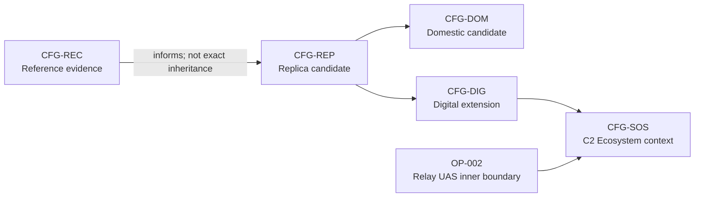

# Low-Cost Attritable Communications Relay UAS

> **Baseline Candidate - Not Approved.** This repository is an exploratory
> architecture model. It is not a build specification, safety case, flight-test
> plan, deployable communications design, or readiness claim.

## What this project is

The project models a small airborne communications-relay platform and the larger C2
ecosystem in which it could participate. Its useful engineering question is whether
extended-range and terrain-masked relay can be achieved while preserving a genuinely
low-cost, attritable platform concept.

The candidate platform is intentionally conventional. The important architecture
decisions are configuration separation, a black-box relay payload, two tightly
controlled platform-to-payload interfaces, and honest treatment of unresolved cost,
mass, power, endurance, evidence, and system-of-systems gaps.

## Model authority

`system.yaml` is the manifest. The structured catalogs referenced by it are
authoritative model data. Markdown documents and generated reports are views of that
model.

The baseline may validate successfully while remaining incomplete and unapproved.
When a view and structured data disagree, the structured data governs and the
difference should be treated as a reconciliation issue.

## Configurations and boundaries

| Configuration | Meaning |
|---|---|
| `CFG-REC` | Recovered-reference evidence boundary; no proposed decomposition is inherited |
| `CFG-REP` | Safe functional-replica candidate architecture |
| `CFG-DOM` | Domestic-supply-chain candidate derived from `CFG-REP` |
| `CFG-DIG` | Future digital-payload extension candidate |
| `CFG-SOS` | Proposed C2 Ecosystem system-of-systems context |



Read the configuration space along two axes:

- Current/reference axis: `CFG-REC -> CFG-REP -> CFG-DOM`.
- Future-extension axis: `CFG-REP -> CFG-DIG -> CFG-SOS`.

Derivation means architectural lineage, not equivalence, inheritance of every
element, physical proof, or approval.

### Inner boundary: Relay UAS

The product boundary contains the candidate airframe, propulsion, power, avionics,
platform command link, payload mount, and relay payload as a black box. For
`CFG-REP`/`CFG-DOM`, only `IFC-INT-003` power and `IFC-INT-007` mechanical retention
cross from platform to payload. `IFC-INT-010` stays inside the payload envelope.

### Outer boundary: C2 Ecosystem

The proposed context includes the operator, ground-control node, remote UAS, future
UGV, radio users, services, authorities, maintenance, and supporting infrastructure.
Those constituents remain independently managed unless a structured source proves
otherwise.

## What is authoritative

- [`system.yaml`](system.yaml): manifest, boundaries, enumerations, and standards posture.
- [`model/architecture.yaml`](model/architecture.yaml): configurations, operational model, functions, resources, interfaces, and modes.
- [`model/assurance.yaml`](model/assurance.yaml): requirements, hazards, controls, verification methods, trade-study register, and decisions.
- [`model/traceability.yaml`](model/traceability.yaml): relationships and explicit gaps only.
- [`.seal/sources.yaml`](.seal/sources.yaml): source registry and authority metadata.
- [`.seal/proof.yaml`](.seal/proof.yaml): the single claim and evidence register.

## Human and generated views

- [`architecture.md`](architecture.md): primary systems-engineering explanation and high-value diagrams.
- [`trade-studies.md`](trade-studies.md): substantive open engineering analysis, especially the coupled TS-002/TS-003 loop.
- [`reports/architecture-views.md`](reports/architecture-views.md): generated detailed diagram atlas and interface inventory.
- [`reports/baseline.md`](reports/baseline.md): generated status, evidence, decisions, gaps, verification, and traceability summary.

## Explicitly out of scope

- RF implementation parameters or detailed network behavior.
- Hardware selection, fabrication, assembly, integration, flight test, or operations instructions.
- Weapons or munitions content.
- Detailed recovered-component mapping.
- Cameo/MagicDraw reconciliation in this work package.
- Claims of MOSA compliance, interoperability, resilience, security, airworthiness,
  safety, operational readiness, or UAF conformance.

Unknown implementation attributes remain unknown by design. They are not omissions
to be filled with plausible values.

## SEAL use

SEAL supplies source, claim, evidence, gap, and decision-governance concepts. It is a
project methodology reference, not technical evidence for any configuration. The
catalogs use JSON-compatible YAML so the validator can remain standard-library only.
Evidence basis and approval status are independent: evidence does not approve a
design, and approval does not turn an inference into an observation.

## Repository map

```text
README.md                 orientation
architecture.md           primary engineering view
trade-studies.md           unique engineering analysis
system.yaml                manifest
model/                     three authoritative model catalogs
.seal/                     source and proof catalogs
reports/                   two generated views
scripts/                   validator and Mermaid generator
.github/workflows/         validation automation
```

## Validation and regeneration

```bash
python scripts/validate-baseline.py
python scripts/validate-baseline.py --write-reports
python scripts/validate-baseline.py --check-generated
```

Optional Mermaid syntax validation uses a locally installed pinned Mermaid CLI:

```bash
python scripts/validate-baseline.py --validate-mermaid
```

## Where to go next

1. Start with [`architecture.md`](architecture.md) for system context and behavior.
2. Use [`reports/baseline.md`](reports/baseline.md) for current decisions and gaps.
3. Follow IDs into the three structured model catalogs for audit work.
4. Use [`trade-studies.md`](trade-studies.md) when working the unresolved physical and economic couplings.
5. Use the generated atlas for detailed interface, sequence, and assurance views.

## Standards posture

The repository currently uses selected UAF 1.2 terminology. UAF 1.3 is the current
OMG formal version, but `DEC-002` / `GAP-STD-001` remains unresolved. No migration or
conformance claim is made. SysML and INCOSE references are informal modeling and
process aids, not certification or compliance assertions.

## License

See [`LICENSE`](LICENSE).
