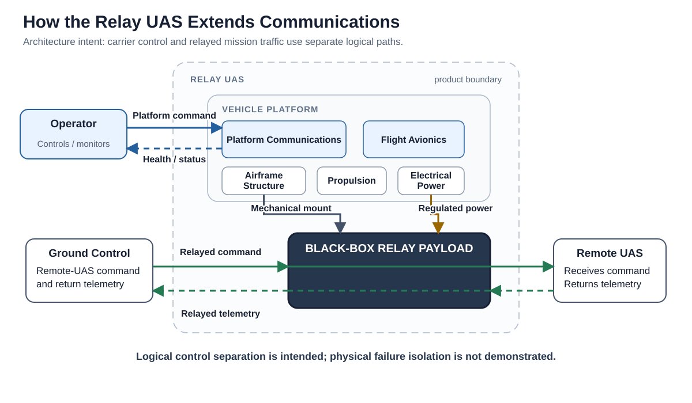

# Low-Cost Communications Relay UAS

A relay aircraft carries a radio to a place where two other systems can communicate more effectively. This repository asks what the **aircraft around that radio** must do, and when a small multirotor can support the resulting mission demands.


## Start with the communications problem

Imagine a ground station communicating with a remote aircraft. An obstruction can block their direct path. Putting a relay above that obstruction may restore a useful path, but creates a second engineering problem: another aircraft must lift, power, and hold the radio in position.

That is the research question: **What architecture lets a small multirotor support airborne relay service, and under what declared mission demands does it remain plausible?**



The picture separates two jobs. The payload passes mission traffic between endpoints. The carrier keeps that payload airborne and supports it. The carrier’s own command path is logically separate from the traffic being relayed.

## Follow the aircraft, then its resources

The proposed mission is **prepare → launch → transit → establish position → relay → monitor → recover**. This is a responsibility sequence, not a demonstrated operating procedure. The calculations cover stationary outbound relay service during hover; transit, return telemetry, recovery energy, and carrier-control performance remain unassessed.

| What moves through the aircraft? | What carries it? | Why it matters |
|---|---|---|
| Mission traffic | The relay payload | Provides the service the aircraft exists to support |
| Aircraft command and health/status | Platform communications and avionics | Positions and monitors the carrier without using the relayed traffic to fly it |
| Electrical energy | Battery, distribution, and regulated branches | Supports propulsion, avionics, and payload demand |
| Mechanical loads | Airframe and payload mounting | Keeps the aircraft and payload physically supported |

The radio is a **black-box payload**: its external resource needs are represented, while its internal implementation is unspecified. The architecture therefore commits to payload retention, regulated electrical support, and logical control separation. These are modeled responsibilities—not verified packaging, electrical compatibility, or fault isolation. Shared power and physical failures can still affect both information paths.

## Walk through one declared example

The reference example places endpoints 10 km apart, with the remote aircraft 100 m above the ground datum. An idealized 80 m opaque screen lies 40% of the way along that separation. A midpoint relay at 120 m clears it. This is a geometric scenario, not terrain data.

Clearance is only the first gate. **Link margin** is the calculated received signal level above an assumed receiver threshold; the two outbound relay hops must both have nonnegative margin. Then the carrier must support the payload for the required **dwell**, meaning time spent at the relay station.

With the primary 0.20 kg payload and constant 14 W sizing allowance, the calibrated carrier gives:

| Dwell | Carrier result | What it tells us |
|---|---|---|
| 30 minutes | 4.7747 kg; passes exploratory physical bounds | The declared link and carrier screens both pass |
| 45 minutes | 15.1456 kg; outside those bounds | A finite calculation is not necessarily a plausible small aircraft |
| 60 minutes | No finite analytical closure | The assumed resource feedback has no finite solution |

**Analytical closure** means that calculated component masses sum consistently to the gross mass used to calculate power. More battery adds mass; more mass needs more hover power; that requires more battery. The large 45-minute result is an extrapolation, not a design proposal. **Exploratory boundaries** are analysis limits used to screen results, not approved aircraft requirements.

Across 90 baseline cases, the ordered counts are **18 physical passes / 6 finite exclusions / 6 nonclosures / 60 connectivity failures**. The +12 dB loss sensitivity gives **6 / 2 / 2 / 80**. These are hierarchical grid counts, not probabilities.

## Headline numbers

The manuscript's reference case reports, for the declared 0.20 kg / 14 W payload:

- Carrier: reaches the exploratory rotor limit at **42.1 minutes**; mathematical closure ends at **52.4 minutes**.
- Link: a midpoint relay at 120 m clears **25.0 km** of endpoint separation at baseline; a 12 dB excess-loss case reduces that to **6.3 km**.
- Grid: of the 90 baseline separation/dwell/altitude cases, **18** pass both the link and carrier screens.

These numbers, plus the revision's calibration-sensitivity variants (single-point refits, estimator variants, coaxial DAx8 hypothesis, aux-power sweep, etc.), are reproduced by `analysis/calibration/sensitivity.py` (see below).

## Read the engineering in order

1. [Architecture](docs/architecture.md): follow the subsystems and four flows.
2. [Feasibility](docs/feasibility.md): follow assumptions through calculations and decision gates.
3. [Engineering Status](docs/engineering-status.md): distinguish evidence from remaining decisions.
4. [Engineering Reference](docs/reference/README.md): inspect requirements, interfaces, sources, and traceability.
5. [Manuscript outline](docs/manuscript-outline.md): develop the paper argument, evidence, and submission priorities.

The model catalogs define architecture records; generators turn them into views. Analysis inputs feed executable models and generated results. Passing checks establishes consistency and reproducibility, not aircraft validation. [The reference guide](docs/reference/README.md) explains this evidence trail and provides regeneration commands.

## Reproduce and validate

From the repository root, using Python’s standard library:

```bash
python -B -m unittest discover -s tests -v
python -B scripts/validate-baseline.py --check-generated
python -B analysis/calibration/calibrate_carrier.py --check
python -B analysis/calibration/boundaries.py --check
python -B analysis/calibration/sensitivity.py --check
python -B analysis/feasibility.py --check
python -B analysis/mission_connectivity.py --check
python -B docs/reference/check-manuscript-evidence.py
```

`analysis/calibration/boundary-results.json` reproduces the headline 42.1/52.4-minute and 25.0/6.3 km numbers directly. `analysis/calibration/sensitivity-results.json` reproduces every calibration-sensitivity variant the revision reports (single-point refits, mean/geometric-mean/quads-only estimators, the coaxial-DAx8 hypothesis, the k_env operating-margin case, the aux-power sweep, and the Matrice 4 specific-energy substitution).

## Scope note

The project establishes a proposed architecture and a conditional service envelope. Affordability, hardware selection, safety, airworthiness, interoperability, physical performance, and operational readiness remain unresolved. The low-order link budget uses declared assumptions; it is not a radio design or spectrum authorization. See [research status](docs/research-status.md) for precise claims and [LICENSE](LICENSE) for licensing.
