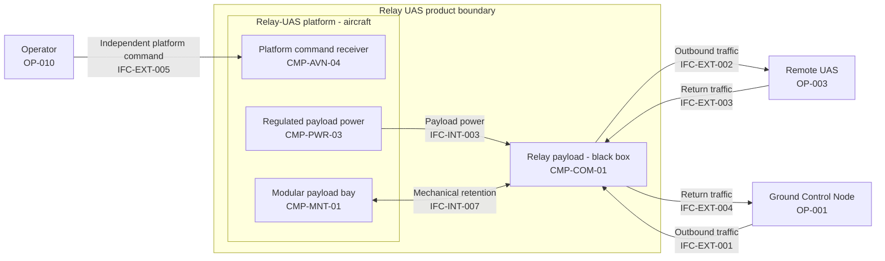

# Low-Cost Attritable Communications Relay UAS

> **Baseline Candidate - Not Approved.** This repository is an exploratory
> architecture model. It is not a build specification, safety case, flight-test
> plan, deployable communications design, or readiness claim.

## System in 60 seconds

This project models a small multirotor that carries a communications relay payload.
The aircraft flies to a useful position and holds that geometry so traffic can pass
between a Ground Control Node and a Remote UAS when direct communication is limited
by range or terrain.

Two paths must not be confused: the operator commands the relay aircraft through its
own platform-command path, while mission traffic passes through the relay payload.
The payload is intentionally a black box. In the current candidate, the aircraft
provides it only regulated power and mechanical retention; no platform-to-payload
data interface is defined. The current architecture is `CFG-REP` / `CFG-DOM`.
Recovered evidence and future ecosystem concepts inform the work but are not the
same baseline.



The Relay UAS boundary contains the airframe and structure, propulsion, battery and
power distribution, flight control and navigation, the independent platform-command
receiver, payload mounting, and the black-box relay payload. Ground control, the
Remote UAS, and the human operator are outside that product boundary.

During the current mission concept the system is prepared in Ground Safe, launches
and navigates to station, holds position while relaying outbound and return traffic,
reports proposed platform health/status, and transitions toward recovery when the
mission ends or the relay function degrades. These are architecture behaviors, not
operating procedures or proven flight behavior.

## Current, reference, and future configurations

| Configuration | Plain-language role | Current implementation scope? |
|---|---|---|
| `CFG-REC` | Recovered/reference evidence | No - evidence only, not the candidate design |
| `CFG-REP` | Functional-replica candidate | Yes - current proposed architecture |
| `CFG-DOM` | Domestic-supply candidate variant | Yes - current architecture, substitutions not selected |
| `CFG-DIG` | Digital-payload extension | No - future concept |
| `CFG-SOS` | Wider C2 system-of-systems context | No - future/context branch |

Configuration derivation means lineage, not exact equivalence, physical proof,
automatic inheritance, or approval. `CFG-REC` does not inherit the proposed product
decomposition, and `CFG-DIG` / `CFG-SOS` do not leak into the current candidate.

## Maturity in one minute

- **Established in the model:** boundaries, major subsystems, current mission and recovery scenarios, function/resource allocations, 22 architecture-level interfaces, explicit resource relationships, requirements, hazards, verification methods, evidence lineage, and traceability.
- **Internally reviewed:** `VER-001` through `VER-007` were executed for the current `0.8.0-baseline-candidate` model in `EVD-013`. The project-owner-accepted verification baseline remains the preserved `0.7.0-baseline-candidate` work package in `EVD-012`; the new review has not received owner acceptance.
- **Quantitatively explored:** a reproducible architecture-level feasibility sweep now bounds the coupled payload, endurance, mass, power, battery, and platform-cost space. It finds a conditional short-dwell feasible region and a strong long-dwell penalty, but approves no target or component.
- **Owner decisions still required:** terminology/version posture (`DEC-002`), the `HAZ-001` safety objective (`DEC-003`), health/status architecture (`DEC-004`), and `CAP-004` semantics (`DEC-005`) all remain proposed.
- **Design inputs still TBD:** cost, endurance, payload service, portability, station-keeping, environmental, retention, reserve/recovery, and sourcing targets remain controlled unknowns under the coupled trade studies and `GAP-BUDGET-001`. Gross mass is a derived model output unless a separate handling, transport, or regulatory boundary is approved.
- **Not established:** physical verification (`VER-008`), external-interface conformance (`VER-009`), safety or airworthiness approval, interoperability, readiness, and technical-baseline approval.
- **Deliberately deferred:** recovered-export reconciliation, unresolved external-hazard applicability, the inactive `HAZ-009` identifier, implementation-level external communications attributes, `TS-009`, and future UGV/sensor-data branches.

A valid model is not a verified aircraft. Validation shows that the repository is
internally structured and honest about its unknowns; it does not close evidence,
authority, safety, or physical-performance gaps.

## Model authority

`system.yaml` is the manifest. The structured catalogs referenced by it are
authoritative model data. Markdown documents and generated reports are views of that
model. When a view and structured data disagree, the structured data governs and the
difference is a defect to correct.

The model intentionally separates three states: model-level internal review,
physical verification, and external conformance. Evidence can support a claim without
approving the design.

## What is authoritative

- [`system.yaml`](system.yaml): manifest, boundaries, enumerations, and standards posture.
- [`model/architecture.yaml`](model/architecture.yaml): configurations, operational model, functions, resources, interfaces, and modes.
- [`model/assurance.yaml`](model/assurance.yaml): requirements, hazards, controls, verification methods, trade-study register, and decisions.
- [`model/traceability.yaml`](model/traceability.yaml): relationships and explicit gaps only.
- [`.seal/sources.yaml`](.seal/sources.yaml): source registry and authority metadata.
- [`.seal/proof.yaml`](.seal/proof.yaml): the single claim and evidence register.

## Human and generated views

- [`architecture.md`](architecture.md): primary systems-engineering explanation and high-value diagrams.
- [`trade-studies.md`](trade-studies.md): substantive open engineering analysis, especially the coupled TS-002/TS-003 loop.
- [`reports/architecture-decision-target-package.md`](reports/architecture-decision-target-package.md): owner-facing recommendations that separate architecture targets from derived and evidence-dependent outputs; no decision in this package is approved.
- [`reports/feasibility-analysis.md`](reports/feasibility-analysis.md): reproducible conditional design-space result, sensitivity ranking, trade-study implications, and owner-input needs; no target or component is selected.
- [`reports/architecture-views.md`](reports/architecture-views.md): generated detailed diagram atlas and interface inventory.
- [`reports/baseline.md`](reports/baseline.md): generated status, evidence, decisions, gaps, verification, and traceability summary.

## Explicitly out of scope

- RF implementation parameters or detailed network behavior.
- Hardware selection, fabrication, assembly, integration, flight test, or operations instructions.
- Weapons or munitions content.
- Exact recovered-component replication or implementation-level physical reconstruction.
- Cameo/MagicDraw reconciliation in this work package.
- Claims of MOSA compliance, interoperability, resilience, security, airworthiness,
  safety, operational readiness, or UAF conformance.

Unknown implementation attributes remain unknown by design. They are not omissions
to be filled with plausible values.

## SEAL use

SEAL supplies source, claim, evidence, gap, and decision-governance concepts. It is a
project methodology reference, not technical evidence for any configuration. The
catalogs use JSON-compatible YAML so the validator can remain standard-library only.
Evidence basis and approval status are independent: evidence does not approve a
design, and approval does not turn an inference into an observation.

## Repository map

```text
README.md                 orientation
architecture.md           primary engineering view
trade-studies.md           unique engineering analysis
system.yaml                manifest
model/                     three authoritative model catalogs
.seal/                     source and proof catalogs
reports/                   generated views plus owner and feasibility reports
analysis/                  feasibility inputs, executable model, data, and plots
scripts/                   validator and Mermaid generator
.github/workflows/         validation automation
```

## Validation and regeneration

```bash
python scripts/validate-baseline.py
python scripts/validate-baseline.py --write-reports
python scripts/validate-baseline.py --check-generated
python analysis/feasibility.py --check
```

Optional Mermaid syntax validation uses a locally installed pinned Mermaid CLI:

```bash
python scripts/validate-baseline.py --validate-mermaid
```

## Where to go next

1. Start with [`architecture.md`](architecture.md) for system context and behavior.
2. Use [`reports/architecture-decision-target-package.md`](reports/architecture-decision-target-package.md) for the current owner decisions and minimum target set.
3. Read [`reports/feasibility-analysis.md`](reports/feasibility-analysis.md) before setting targets or authorizing component-class research.
4. Use [`reports/baseline.md`](reports/baseline.md) for current decisions and gaps.
5. Follow IDs into the three structured model catalogs for audit work.
6. Use [`trade-studies.md`](trade-studies.md) when working the unresolved physical and economic couplings.
7. Use the generated atlas for detailed interface, sequence, and assurance views.

## Standards posture

The repository currently uses selected UAF 1.2 terminology. UAF 1.3 is the current
OMG formal version, but `DEC-002` / `GAP-STD-001` remains unresolved. No migration or
conformance claim is made. SysML and INCOSE references are informal modeling and
process aids, not certification or compliance assertions.

## License

See [`LICENSE`](LICENSE).
