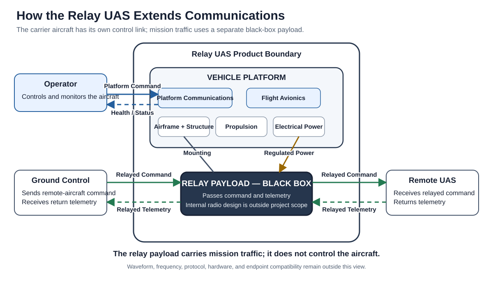
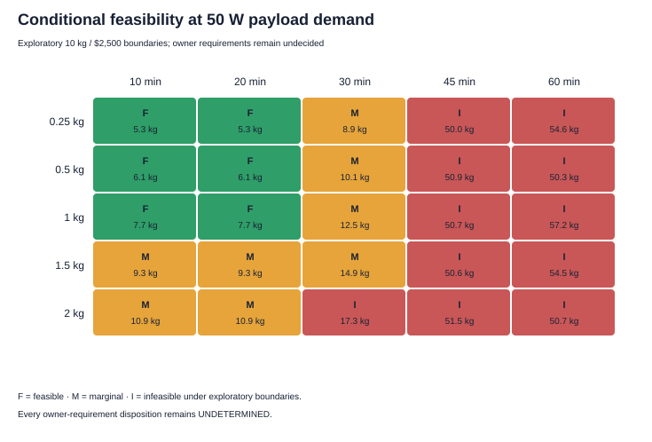
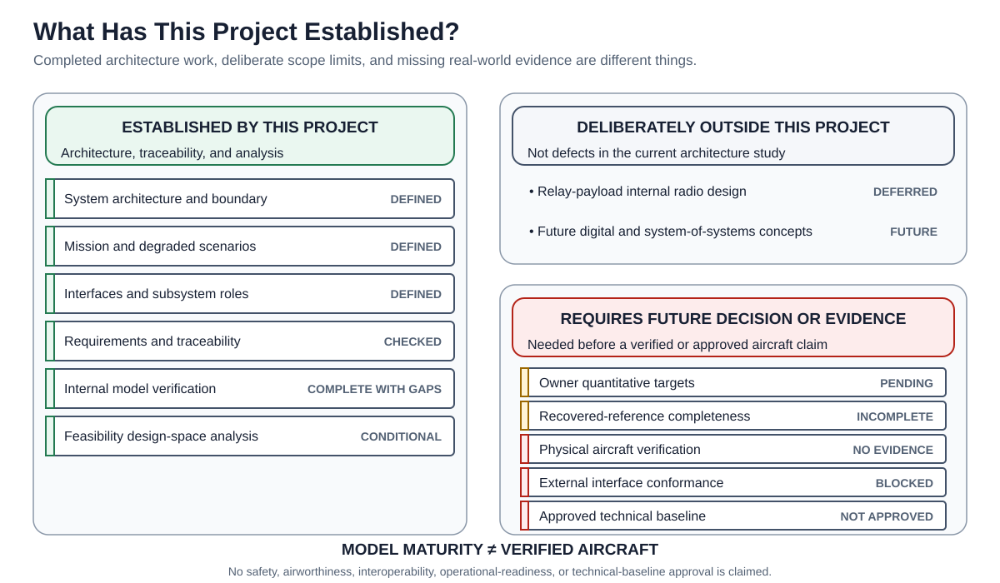

# Low-Cost Attritable Communications Relay UAS

> **Architecture baseline candidate — not an approved aircraft.** This repository
> defines and analyzes a system concept. It is not a build specification, safety
> case, flight-test plan, deployable communications design, or readiness claim.

## What this project is

A Relay UAS is a multirotor aircraft that carries a communications relay payload.
It flies to a useful position and holds that geometry so a ground-control system can
exchange command and telemetry with a remote aircraft when the direct path is too
long or blocked by terrain.

The aircraft has its own command link so an operator can position and recover it.
That platform-control link is deliberately separate from the mission traffic passing
through the relay payload. Losing relay service therefore does not automatically
mean losing control of the relay aircraft.

This project studies the aircraft, its boundaries, major subsystems, information and
power flows, mission behavior, requirements, evidence, and feasibility. It treats the
internal radio-frequency implementation of the relay payload as a black box.

## The project in one picture



The blue path controls the Relay UAS itself. The green paths carry command and
telemetry for the remote aircraft. They are separate by design.

## How the system works

1. The Relay UAS is prepared in a ground-safe state.
2. Its operator launches it and commands it to a useful airborne station.
3. The aircraft holds that position using its flight-control and navigation system.
4. Ground-originated remote-aircraft command passes through the black-box relay
   payload.
5. Remote-aircraft telemetry returns through the same payload in the opposite
   direction.
6. Aircraft health and operating status support repositioning or recovery decisions.
7. If relay service is degraded, the architecture intends to preserve the independent
   aircraft-control path and transition toward recovery. Exact recovery logic and
   physical performance are not yet established.

## What is on the drone

| Subsystem group | Plain-language role |
|---|---|
| Airframe and structure | Carries the aircraft, propulsion system, avionics, and payload support hardware. |
| Propulsion | Produces and controls lift through motors, controllers, and propellers. |
| Electrical power | Stores energy, distributes main-bus power, and provides regulated branches. |
| Flight avionics | Stabilizes and navigates the aircraft, receives platform command, and supports health/status reporting. |
| Payload support | Provides mechanical retention and regulated electrical power to the payload. |
| Relay payload | Passes mission communications between external endpoints; its internal RF design remains outside this project. |

The proposed platform-to-payload boundary has only two crossings: regulated power
and mechanical retention. No platform-to-payload data connection is part of the
current candidate.

## What the project found

### Architecture result

The current candidate has a coherent system boundary, mission thread, subsystem
decomposition, power and information paths, modes, requirements, hazards,
verification methods, evidence lineage, and end-to-end traceability. Internal model
reviews found no structural model failure, while retaining known gaps.

### Feasibility result

The concept appears physically and economically plausible in a limited region:
comparatively short dwell and modest payload under reference-or-better assumptions.
Increasing endurance creates a reinforcing battery–mass–power penalty. In the
reference analysis, the evaluated 45–60 minute cases fall outside the conditional
credible region.



This is not an exact aircraft prediction. The boundaries are exploratory, owner
targets remain unset, packaging geometry is unresolved, and the model uses broad
component-class ranges rather than selected hardware.

### Verification result

The repository has undergone documented internal architecture verification and a
reproducible feasibility analysis. It has **not** undergone physical aircraft
verification or external-interface conformance testing.

## What is not finished

- Owner targets for payload service, endurance, affordability, portability,
  operating environment, reserve/recovery policy, and domestic sourcing.
- Physical evidence for flight behavior, performance, structural retention,
  electrical behavior, recovery, or safety.
- External authority, specifications, and evidence for interface compatibility.
- Detailed relay-payload implementation, including RF parameters and antenna design.
- Exact reconstruction of the recovered reference article from incomplete source
  evidence.
- Future digital-payload, UGV, radio-user, network-service, and broader
  system-of-systems branches.
- Technical-baseline, safety, airworthiness, interoperability, or operational
  approval.

## Engineering status at a glance



“Model established” means the architecture is internally coherent and traceable. It
does not mean the aircraft is physically proven or approved.

---

## Engineering detail and traceability

The sections above are the five-minute orientation. From here, names remain primary
but stable model identifiers are shown for engineering audit and handoff.

### Reference, current, and future configurations

| Role | Configuration | Meaning |
|---|---|---|
| Reference evidence | Recovered Reference (`CFG-REC`) | Records what the available teardown sources support. It is not the design baseline and does not automatically pass architecture into the candidate. |
| Current candidate | Current Replica Candidate (`CFG-REP`) | Proposed architecture-level functional replica; not an exact clone and not approved. |
| Current variant | Domestic Candidate (`CFG-DOM`) | Proposed low-cost sourcing variant; domestic-content rules and substitutions remain unresolved. |
| Future branch | Digital Extension (`CFG-DIG`) | Possible payload-management and multi-platform extension; not part of the current candidate. |
| Future context | System-of-Systems (`CFG-SOS`) | Possible UGV, radio-user, service, authority, and infrastructure context; not current implementation scope. |

### Requirement intent in ordinary language

The detailed catalog contains 28 stable `REQ-*` records. At a glance, they require
the candidate to relay command and telemetry, maintain and recover the aircraft,
support a replaceable payload with power and retention, preserve independent
platform command and health/status, remain portable and affordable subject to
owner-set targets, and maintain basic ground and stored-energy safeguards. RF
implementation, spectrum authorization, contested-spectrum mechanisms, and export
review remain deferred or externally owned.

See [architecture.md](architecture.md#8-key-requirements) for the grouped translation
and `model/assurance.yaml` for authoritative wording and metadata.

### One traceability example

In plain language:

`Extend remote control reach → provide an airborne relay → relay outbound command → allocate that behavior to the black-box payload → cross the external relay path → review the architecture now and verify external compatibility later`

The corresponding audit trace is:

`NEED-001 → CAP-001 → SCN-003 → OA-004 → FUN-REL-01 → CMP-COM-01 → IFC-EXT-001/002 → REQ-FUN-001 → VER-001/009`

Two more representative threads appear in
[architecture.md](architecture.md#9-representative-traceability-threads). The full
relationship set remains in `model/traceability.yaml`.

## Where the authoritative model lives

`system.yaml` is the manifest. Structured catalogs are authoritative; Markdown and
generated figures are views. If a view disagrees with the catalogs, the view is
defective.

- [`model/architecture.yaml`](model/architecture.yaml): configurations, mission
  context, scenarios, functions, components, interfaces, and modes.
- [`model/assurance.yaml`](model/assurance.yaml): requirements, hazards, controls,
  verification methods, trade studies, and decisions.
- [`model/traceability.yaml`](model/traceability.yaml): relationships and explicit
  gaps.
- [`.seal/sources.yaml`](.seal/sources.yaml): source and authority registry.
- [`.seal/proof.yaml`](.seal/proof.yaml): claim and evidence registry.

## Human and generated views

- [`architecture.md`](architecture.md): progressive engineering explanation and the
  core communication figures.
- [`trade-studies.md`](trade-studies.md): substantive engineering trade reasoning.
- [`reports/feasibility-analysis.md`](reports/feasibility-analysis.md): detailed
  coupled feasibility model, assumptions, results, and limitations.
- [`reports/architecture-decision-target-package.md`](reports/architecture-decision-target-package.md):
  owner decision and target package; unresolved recommendations are not approvals.
- [`reports/architecture-views.md`](reports/architecture-views.md): generated
  ID-rich engineering audit views and complete interface inventory.
- [`reports/baseline.md`](reports/baseline.md): generated status, decisions, gaps,
  verification, and traceability summary.

## Repository map

```text
README.md                 five-minute entry point
architecture.md           progressive engineering explanation
trade-studies.md          engineering trade reasoning
system.yaml               model and presentation manifest
model/                    authoritative architecture and assurance catalogs
.seal/                    authoritative source, claim, and evidence catalogs
analysis/                 feasibility inputs, executable model, data, and plots
reports/figures/          generated human-readable architecture figures
reports/                   detailed human and generated reports
scripts/                   validation and deterministic view generators
.github/workflows/         CI validation
```

## Validation and regeneration

```bash
python scripts/generate-communication-views.py
python scripts/generate-mermaid-views.py
python scripts/validate-baseline.py --write-reports
python scripts/validate-baseline.py --check-generated
python analysis/feasibility.py --check
```

Optional Mermaid rendering uses a locally installed pinned Mermaid CLI:

```bash
python scripts/validate-baseline.py --validate-mermaid
```

## Explicit scope boundaries

This repository does not provide RF implementation parameters, antenna design,
component selection, fabrication, assembly, integration, operating instructions,
flight-test instructions, weapons content, exact recovered-component replication,
or claims of MOSA compliance, interoperability, resilience, security, airworthiness,
safety, operational readiness, or UAF conformance.

The model uses selected UAF terminology but does not claim full UAF or DoDAF
conformance. The terminology/version decision remains open.

## License

See [`LICENSE`](LICENSE).
