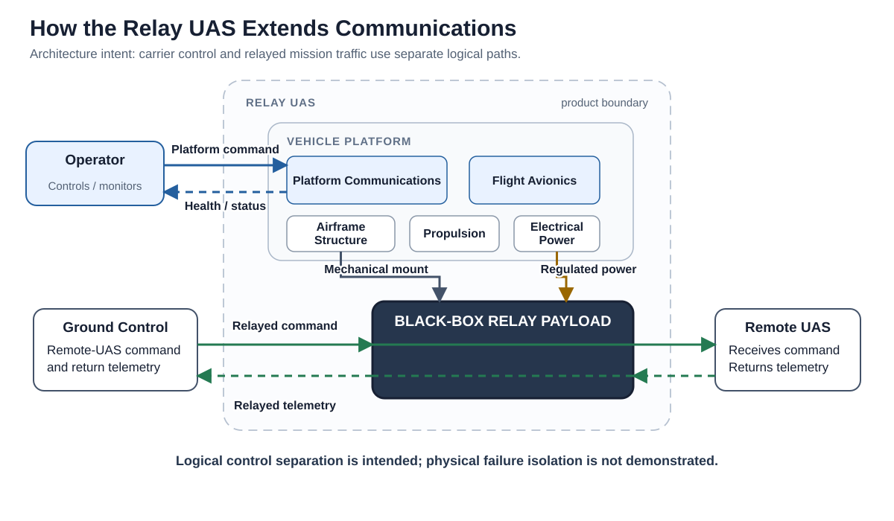

# Communications Relay Drone: Student Engineering Project

This student engineering project explores how a small multirotor could carry a communications relay. It combines a system architecture with simple link and aircraft-sizing models to ask where a relay could be useful and how long the aircraft could stay in place.

The repository contains the model, declared assumptions, generated results, diagrams, and engineering notes. The calculations are a feasibility study, not a built or flight-tested drone. Run the checks below to reproduce the results and inspect which sampled missions fail the link check, the aircraft check, or both.

## Project materials

Start with the [architecture](docs/architecture.md), [feasibility analysis](docs/feasibility.md), and [engineering status](docs/engineering-status.md). The `model/` directory holds the system description; `analysis/` holds inputs, calculations, and saved results; `tests/` checks the model. A [project report PDF](submission/relay_uas_aeroconf.pdf) brings the study together. Its accompanying LaTeX file is an earlier working draft and does not reproduce that PDF. The [assessment workflow](submission/figs/architecture_assessment_workflow.mmd) and [four-flow diagram](submission/figs/four_flow_architecture.mmd) are editable diagram sources.

Examination of a recovered relay aircraft motivated the project; the analysis does not reconstruct that aircraft or claim its performance. “Low-cost” is a design objective, not an established result.

## Start with the communications problem

A relay can restore a path blocked by an obstruction if its carrier can lift, power, and hold the radio in position.

That is the research question: **What architecture lets a small multirotor support airborne relay service, and under what declared mission demands does it remain plausible?**



The picture separates two jobs. The payload passes mission traffic between endpoints. The carrier keeps that payload airborne and supports it. The carrier’s own command path is logically separate from the traffic being relayed.

## Follow the aircraft, then its resources

The proposed mission is **prepare → launch → transit → establish position → relay → monitor → recover**. This is a responsibility sequence, not a demonstrated operating procedure. The calculations cover stationary outbound relay service during hover; transit, return telemetry, recovery energy, and carrier-control performance remain unassessed.

| What moves through the aircraft? | What carries it? | Why it matters |
|---|---|---|
| Mission traffic | The relay payload | Provides the service the aircraft exists to support |
| Aircraft command and health/status | Platform communications and avionics | Positions and monitors the carrier without using the relayed traffic to fly it |
| Electrical energy | Battery, distribution, and regulated branches | Supports propulsion, avionics, and payload demand |
| Mechanical loads | Airframe and payload mounting | Keeps the aircraft and payload physically supported |

The radio is a **black-box payload**: its external resource needs are represented, while its internal implementation is unspecified. The architecture therefore commits to payload retention, regulated electrical support, and logical control separation. These are modeled responsibilities—not verified packaging, electrical compatibility, or fault isolation. Shared power and physical failures can still affect both information paths.

## Walk through one declared example

The reference example places endpoints 10 km apart, with the remote aircraft 100 m above the ground datum. An idealized 80 m opaque screen lies 40% of the way along that separation. A midpoint relay at 120 m clears it. This is a geometric scenario, not terrain data.

Clearance is only the first gate. **Link margin** is the calculated received signal level above an assumed receiver threshold; the two outbound relay hops must both have nonnegative margin. Then the carrier must support the payload for the required **dwell**, meaning time spent at the relay station.

With the primary 0.20 kg payload and constant 14 W sizing allowance, the calibrated carrier gives:

| Dwell | Carrier result | What it tells us |
|---|---|---|
| 30 minutes | 4.7747 kg; passes exploratory physical bounds | The declared link and carrier screens both pass |
| 45 minutes | 15.1456 kg; outside those bounds | A finite calculation is not necessarily a plausible small aircraft |
| 60 minutes | No finite analytical closure | The assumed resource feedback has no finite solution |

**Analytical closure** means that calculated component masses sum consistently to the gross mass used to calculate power. More battery adds mass; more mass needs more hover power; that requires more battery. The 45-minute result is an extrapolation outside the exploratory envelope, not a design proposal. **Exploratory boundaries** are analysis limits used to screen results, not approved aircraft requirements.

Across 90 baseline cases, the ordered counts are **18 physical passes / 6 finite exclusions / 6 nonclosures / 60 connectivity failures**. The +12 dB loss sensitivity gives **6 / 2 / 2 / 80**. These are hierarchical grid counts, not probabilities.

## Read the engineering in order

1. [Architecture](docs/architecture.md): follow the subsystems and four flows.
2. [Feasibility](docs/feasibility.md): follow assumptions through calculations and decision gates.
3. [Engineering Status](docs/engineering-status.md): distinguish evidence from remaining decisions.
4. [Engineering Reference](docs/reference/README.md): inspect requirements, interfaces, sources, and traceability.
5. [Project report](submission/relay_uas_aeroconf.pdf): read the complete study and its limitations.

## Reproduce and validate

From the repository root, using Python’s standard library:

```bash
python -B -m unittest discover -s tests -v
python -B scripts/validate-baseline.py --check-generated
python -B analysis/calibration/calibrate_carrier.py --check
python -B analysis/calibration/boundaries.py --check
python -B analysis/calibration/sensitivity.py --check
python -B analysis/feasibility.py --check
python -B analysis/mission_connectivity.py --check
python -B docs/reference/check-manuscript-evidence.py
```

`analysis/calibration/boundary-results.json` reproduces the headline 42.1/52.4-minute and 25.0/6.3 km numbers directly. `analysis/calibration/sensitivity-results.json` reproduces every calibration-sensitivity variant the revision reports (single-point and combined hover stresses, estimator variants, the auxiliary-power sweep, and the Matrice 4 battery substitution).

## Scope note

The analysis supports a proposed architecture and conditional service envelope. Hardware performance and operational readiness remain open. See [research status](docs/research-status.md) and [LICENSE](LICENSE).
