# Relay-UAS Architecture

> **Baseline Candidate - Not Approved.** This is the primary human-readable view of
> the structured model. Follow IDs into `model/architecture.yaml`,
> `model/assurance.yaml`, `.seal/proof.yaml`, and `model/traceability.yaml` for
> authoritative records and complete metadata.

## 1. Architecture Purpose

The concept places a bidirectional communications-relay payload on a conventional
small UAS so a ground-control node and remote UAS can exchange mission traffic when
their direct path is too long or obstructed. The platform is valuable because of
where it can hold station, not because the airframe is novel.

Three principles organize the model:

- Reference evidence, current candidate designs, and future extensions are separate configurations.
- The relay payload remains a black box behind a narrow platform boundary.
- Platform command is separate from the traffic relayed for another vehicle.

No diagram is approval evidence. `[PROPOSED]`, `[TBD]`, `[DEFERRED]`, and
`[UNVERIFIED]` state maturity explicitly.

## Current architecture at a glance

The current system under study is the **Relay UAS** (`OP-002`) in `CFG-REP` and
`CFG-DOM`. It contains the aircraft structure, propulsion, stored and regulated
power, flight-control and navigation resources, an independent platform-command
receiver, a modular payload bay, and a communications payload treated as a black
box. The human operator, Ground Control Node, Remote UAS, maintenance personnel,
and external authorities remain outside the product boundary.

| Question | Current architecture answer |
|---|---|
| What does it do? | Positions and holds a communications payload so outbound and return mission traffic can pass between ground control and a Remote UAS. |
| How is the aircraft controlled? | The operator uses a separate platform-command path (`IX-001`, `IFC-EXT-005`) that does not pass through the relay payload. |
| What crosses the payload boundary? | Regulated payload power (`IFC-INT-003`) and mechanical retention (`IFC-INT-007`) only. |
| What are the major aircraft subsystems? | Structure and mounting (`CMP-AFR-*`, `CMP-MNT-01`), propulsion (`CMP-PRP-*`), power (`CMP-PWR-*`), avionics (`CMP-AVN-*`), and black-box communications payload (`CMP-COM-*`). |
| What traffic is relayed? | Outbound traffic uses `IX-002` / `IX-003`; return traffic uses `IX-004` / `IX-005`. External implementation attributes remain undefined. |
| What modes matter now? | Ground Safe, Transit, Station Keeping, Relay Degraded, and Return / Recovery (`MODE-005`, then `MODE-001` through `MODE-004`). |
| What is future? | The digital payload-management interface in `CFG-DIG` and the broader UGV, radio-user, service, and infrastructure context in `CFG-SOS`. |

The current structured model is internally reviewable and has undergone a fresh
0.8.0 model-level check (`EVD-013`), but it is neither a physically verified system
nor an approved technical baseline. Read the next sections to inspect configuration
and behavior, then use the assurance and traceability sections to audit maturity.

## 2. Configuration Baselines

The current/reference axis is `CFG-REC -> CFG-REP -> CFG-DOM`. The future-extension
axis is `CFG-REP -> CFG-DIG -> CFG-SOS`.

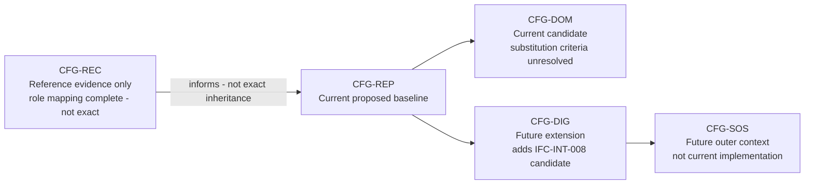

**Reference evidence — `CFG-REC`.** This boundary describes what the registered
sources say about the recovered article. It does not inherit candidate components,
interfaces, requirements, modes, controls, or verification claims.

**Current candidate architecture — `CFG-REP` / `CFG-DOM`.** These configurations
carry the present Relay-UAS decomposition and the two-interface payload boundary.
`CFG-DOM` currently changes supply-chain intent only; no component substitution or
domestic-content criterion has been selected.

**Future extensions — `CFG-DIG` / `CFG-SOS`.** These add a proposed digital payload
management path and broader independently managed performers. They do not silently
modify the current candidate.

## Recovered Reference vs Candidate Architecture

The controlled reconciliation contains 24 recovered-item records and 10 recovered-
connection records, plus reverse coverage for all 19 current candidate components
and all 22 interfaces. It records role correspondence, limitations, confidence, and
configuration scope. It does not claim identical hardware, exact recovered
connectivity, candidate approval, or inheritance from `CFG-REC`.

The registered PDF and workbook passed checksum verification and were reviewed in
full for architecture-relevant content. The current local DOCX does not match its
registered checksum; it was inspected only for change awareness and was not used to
strengthen technical claims. In this model, `physically_observed` means documented as
an observation in an integrity-accepted registered record, not direct inspection by
the model author or automation.

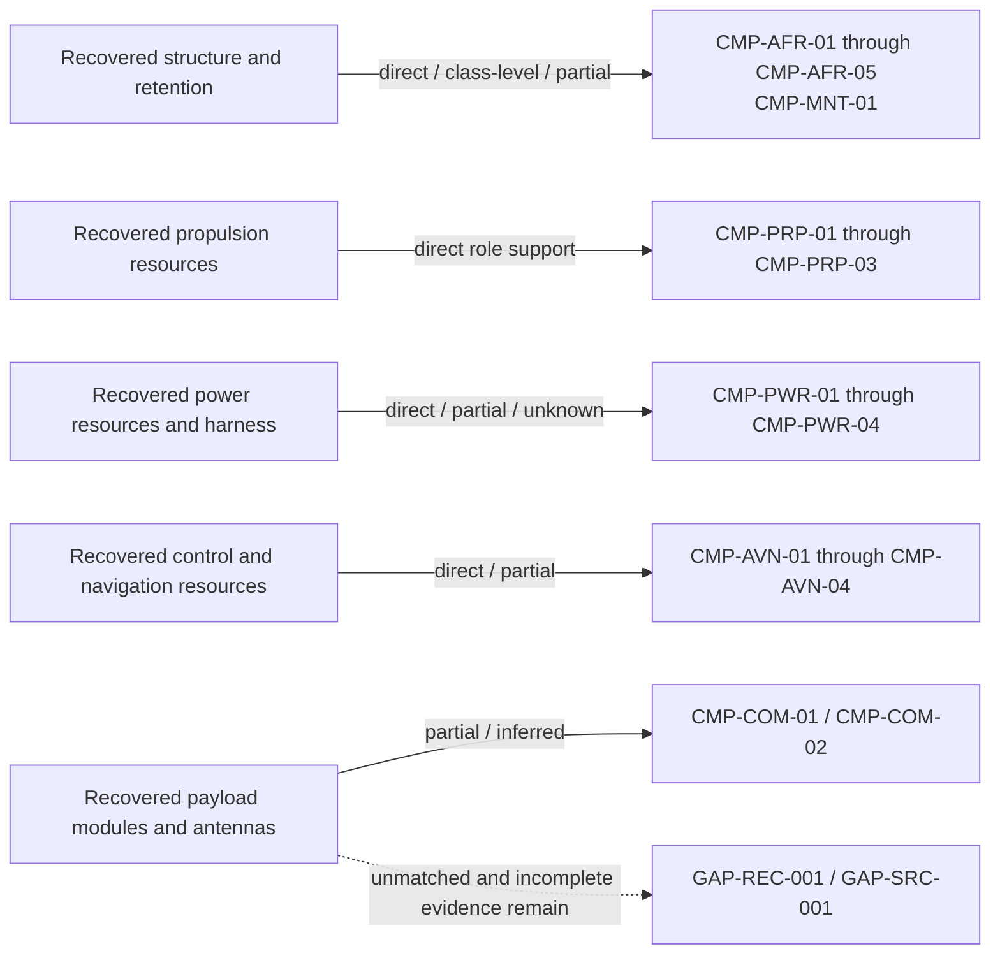

The recovered package supports a physically distinct payload, a power relationship,
retention, and payload-internal antenna coupling, but it does not prove that the
candidate's two modeled platform-to-payload crossings are the only recovered
crossings. It indirectly supports a separate carrier-command resource, while the
complete command path remains ambiguous. It does not establish the proposed end-to-
end health/status return or maintenance/configuration interface.

The model-completion audit disposition is explicit:

- `REC-CHG-001`: the explicit implementation-neutral source-power interface `IFC-INT-011` was added as a model-local completeness correction under `SRC-DEC-006`; it remains proposed and every electrical implementation attribute remains unknown.
- `REC-CHG-002`: keep the candidate unchanged unless the operator concept establishes a need for a separate carrier-view feedback resource and path.

## 3. System Boundaries

The inner product boundary is the Relay UAS. The outer context is the C2 Ecosystem.

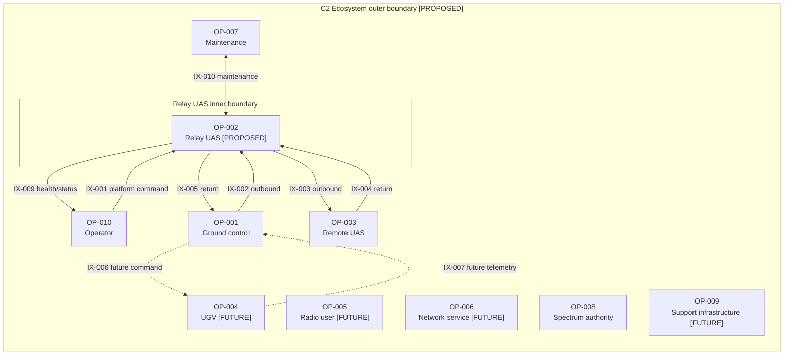

External performers remain independently managed. The context does not imply
interoperability, authority, security, or implementation responsibility.

## 4. Capability and Operational Context

`CAP-001` addresses distance; `CAP-002` addresses obstructed geometry. They remain
separate because one can bind without the other. The concept hypothesis is the
intersection of those two capabilities with `CAP-004` low-cost attritability.

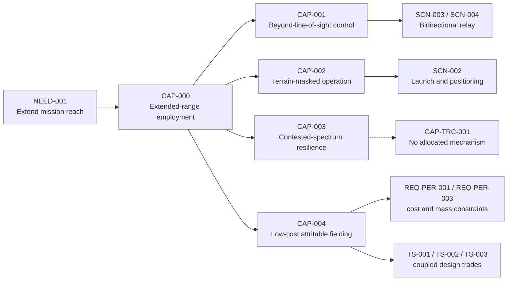

`CAP-003` remains deliberately unallocated because every potential mechanism is
inside deferred payload work (`TS-009`). `CAP-004` is explicitly cross-cutting: it
constrains requirements, trade studies, configurations, and resource choices rather
than creating a meaningless operational activity (`DEC-005`).

The current mission thread keeps Relay-UAS platform command separate from relayed
traffic:

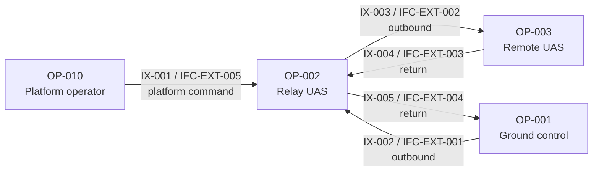

The relay is bidirectional, positional, and logically transparent at this level. No
frequency, protocol, data-rate, or waveform behavior is asserted.

## 5. Relay-UAS Logical/Physical Architecture

The physical architecture is a conventional multicopter decomposition. Representative
resources show subsystem ownership without reproducing the complete component catalog.

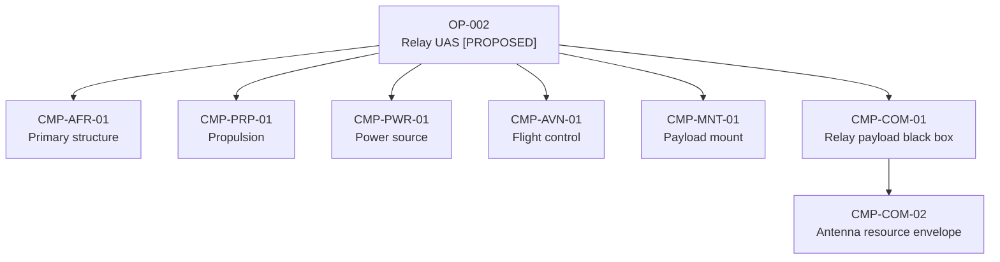

Four-corner propulsion sets are symmetric in the candidate design. Platform novelty
is avoided because added complexity competes directly with `CAP-004`. Component
selection remains open in the `TS-*` register.

Two decisions dominate the decomposition:

1. `CMP-COM-01` couples to the platform only through power and retention.
2. `CMP-AVN-04` controls the Relay UAS; it does not perform `FUN-REL-01` or `FUN-REL-02`.

## 6. Interfaces

The current interface architecture makes the payload boundary explicit while keeping
external paths implementation-neutral.

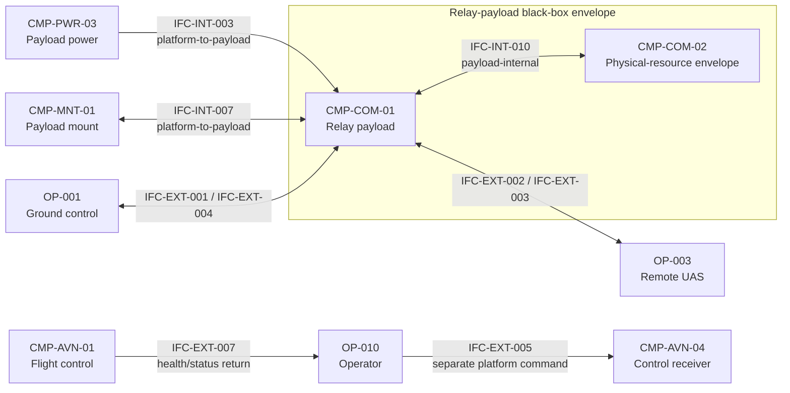

Only `IFC-INT-003` and `IFC-INT-007` cross the current platform-to-payload boundary.
`IFC-INT-010` records physical coupling inside the payload envelope; it does not
define another platform interface or any antenna characteristic. `IFC-INT-008` is a
future `CFG-DIG`/`CFG-SOS` payload-management candidate and is absent from the current
architecture.

The complete 22-interface inventory, including internal power, control, health,
navigation, external traffic, and maintenance groups, is generated in the diagram
atlas. Every external interface now has model-review allocation, but real conformance
still requires external authority, specifications, and evidence (`VER-009` /
`GAP-IFC-001`). Implementation attributes remain intentionally out of scope
(`GAP-IFC-002`). Internal battery-state telemetry (`IFC-INT-006`) is an input to the
health function, not a substitute for the external `IFC-EXT-007` status return.

The completeness audit added five implementation-neutral internal interfaces that
were previously absent or represented only as diagram associations: battery source
to distribution (`IFC-INT-011`), GNSS/heading data (`IFC-INT-012`), propulsion-
controller output to motor (`IFC-INT-013`), motor drive to propeller
(`IFC-INT-014`), and distribution power to regulators (`IFC-INT-015`). These records
define architecture connectivity and failure meaning while leaving voltage, current,
connector, timing, load, sizing, and other implementation attributes unknown.

## 7. Operational Behavior

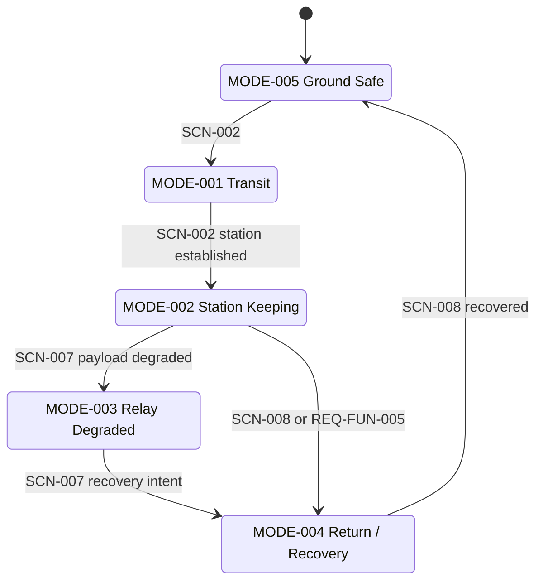

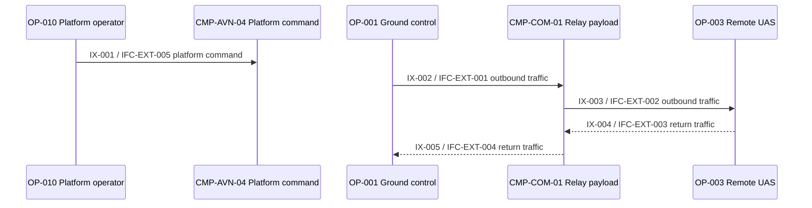

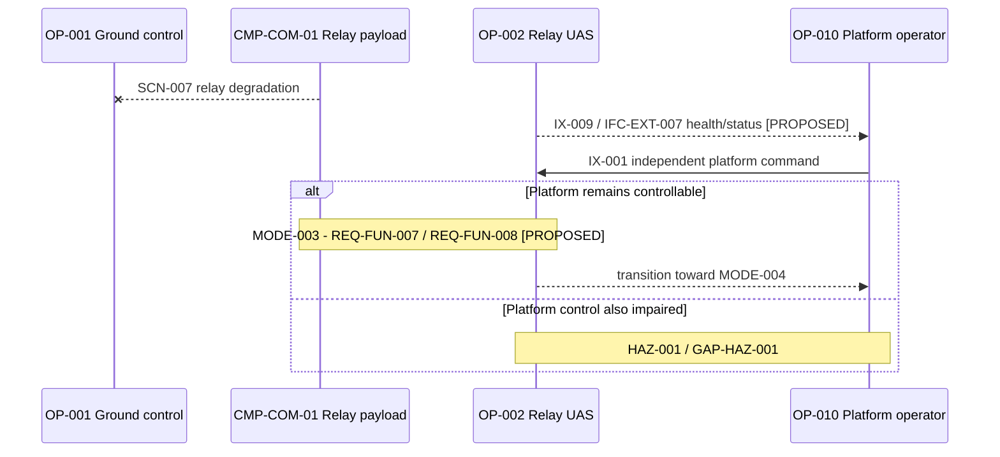

`SCN-001` now maps to `OA-007` Prepare Relay UAS for operation, supported by
`FUN-CFG-01` and `FUN-HLT-01`, while the system remains in `MODE-005`. This is an
architecture thread, not a startup checklist. The degraded branch still ends at
explicit safety and evidence gaps rather than inventing a recovery behavior. UGV and
sensor/video threads remain future extensions.

## 8. Requirements and Constraints Summary

The 28 `REQ-*` records are authoritative in `model/assurance.yaml`. They cover relay
function, station keeping and recovery, unresolved performance envelopes, payload
interfaces, basic safety controls, project constraints, and explicitly deferred
items.

Bracketed `[TBD]` values are load-bearing unknowns with trade-study ownership. They
must not be replaced with borrowed figures. In particular:

- `REQ-IFC-003`: the platform-to-payload interface is limited to `IFC-INT-003` power and `IFC-INT-007` mechanical retention.
- `REQ-FUN-008`: proposed mode and health/status visibility supports setup and recovery decisions without defining implementation.
- `REQ-CON-003`: the project excludes weapons and munitions; it is not a recovered-article observation.
- `REQ-DEF-001..005`: deferred or externally owned topics, not requirements claimed satisfied here.

Mass, unit cost, power, endurance, and payload envelopes form one coupled open problem
(`GAP-BUDGET-001`), not five independent blanks. The worked TS-002/TS-003 analysis is
preserved in `trade-studies.md`.

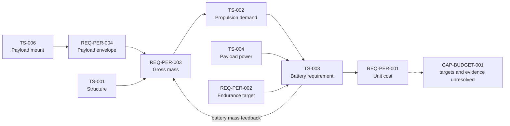

## 9. Hazards and Controls Summary

The hazard catalog is preliminary architecture reasoning, not a safety assessment.
No authoritative severity/probability scheme or risk-acceptance authority exists.

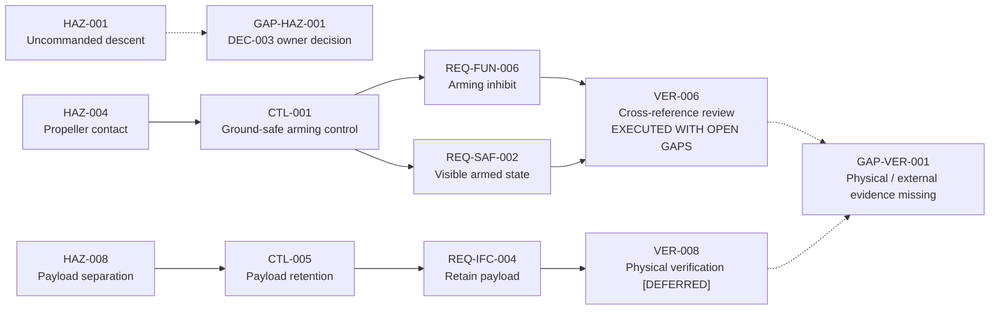

`HAZ-005` is only partially addressed: `REQ-FUN-007` preserves platform control but
does not restore relay service. `HAZ-009` is a reserved inactive identifier, not an
active deficiency. External hazards stay deferred pending employment context.

The current austere/non-populated employment narrative is an assumption, not an
enforceable requirement. No flight-termination or geofence function is modeled, so
`HAZ-001` remains openly unmitigated.

## 10. Verification Approach

The project owner accepted the internal architecture verification work package for
`0.7.0-baseline-candidate` as the current working verification baseline
(`SRC-DEC-005`, `EVD-012`). This disposition accepts the work and its evidence only;
it does not approve the technical baseline, physical verification, safety,
external-interface conformance, or `DEC-002` through `DEC-005`.

`VER-*` entries distinguish method readiness from execution. The accepted 0.7.0
execution trail remains in `EVD-008` through `EVD-012`. `VER-001` through `VER-007`
were re-executed against `0.8.0-baseline-candidate` in `EVD-013` after the
model-completeness corrections. That fresh review is not owner acceptance. Both
cycles establish model consistency only; neither demonstrates physical performance,
safety, external compatibility, or technical approval.

`VER-008` remains unexecuted and dependent on future physical evidence. `VER-009`
remains blocked by absent external authority, specifications, and conformance
evidence. A passing repository validator cannot substitute for either activity.

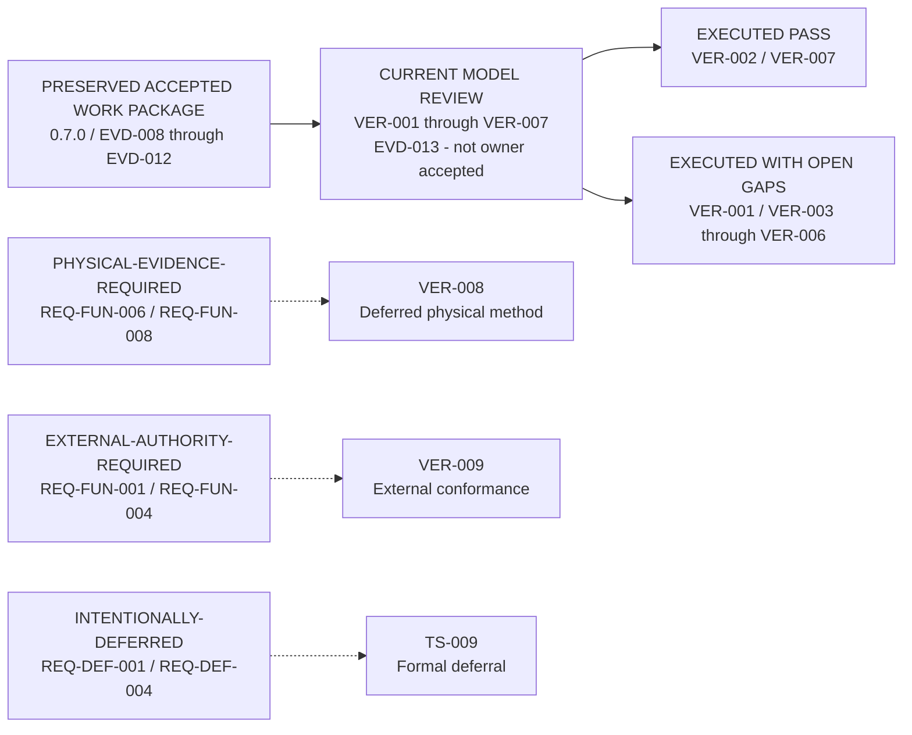

## 11. Key Traceability Threads

- Mission relay: `NEED-001 -> CAP-001 -> SCN-003 -> OA-004 -> IX-002 / IX-003 -> FUN-REL-01 -> CMP-COM-01 -> IFC-EXT-001 / IFC-EXT-002 -> REQ-FUN-001 -> VER-001 / VER-009`.
- Return telemetry: `SCN-004 -> OA-005 -> IX-004 / IX-005 -> FUN-REL-02 -> CMP-COM-01 -> IFC-EXT-003 / IFC-EXT-004 -> REQ-FUN-002 -> VER-001 / VER-009`.
- Station keeping: `CAP-002 -> SCN-002 -> OA-003 -> FUN-FLT-03 -> CMP-AVN-01 / CMP-AVN-02 / CMP-AVN-03 -> REQ-FUN-003 / REQ-CON-004 -> VER-001 / VER-008`.
- Ground safety: `HAZ-004 -> CTL-001 -> REQ-FUN-006 / REQ-SAF-002 -> VER-004 / VER-006 -> GAP-VER-001`.
- Payload retention: `HAZ-008 -> CTL-005 -> REQ-IFC-004 -> VER-005 / VER-008 -> GAP-VER-001`.
- Relay loss and recovery: `SCN-007 -> MODE-003 -> HAZ-005 -> CTL-004 -> REQ-FUN-007 -> FUN-FLT-01 / FUN-FLT-04 -> VER-006 / VER-008 -> GAP-VER-001`.
- Health/status: `SCN-007 -> IX-009 -> FUN-HLT-01 -> CMP-AVN-01 -> IFC-EXT-007 -> REQ-FUN-008 -> VER-005 / VER-008 / VER-009`.

The full relationship set belongs only in `model/traceability.yaml`; the generated
baseline report presents gap-oriented summaries rather than another matrix copy.

## 12. Open Architecture Gaps

The principal retained gaps are exact recovered-to-candidate equivalence and missing
or integrity-mismatched source evidence; unsupported `CAP-003`; unmitigated `HAZ-001`; external-interface
conformance authority; future UGV and sensor/video integration; unresolved
mass/cost/power/endurance targets; physical evidence; and the UAF-version decision.

This pass closes the SCN-001 activity mismatch and the health/status architecture
coverage gap. It reclassifies the former CAP-004 activity warning as a false-positive
model-health gap. External conformance, physical evidence, and owner decisions remain
open rather than being hidden behind those model improvements.

Cameo reconciliation is deferred future work outside this package and is not a
principal active deficiency. No Cameo content was used to close any gap.

## 13. Project-owner decisions required

`REC-CHG-001` is no longer an owner-decision blocker: `SRC-DEC-006` explicitly
authorized model-local completeness correction, so `IFC-INT-011` now records the
already intended battery-to-distribution energy path without selecting any technical
values or approving it. `REC-CHG-002` remains an owner-review question because adding
a carrier-view feedback resource would introduce new architecture intent. It is not
an approved `DEC-*` record.

### DEC-003 - HAZ-001 safety objective

- **Decision question:** Should `HAZ-001` receive a generic recovery or containment control and requirement?
- **Why it matters:** The current candidate has no architecture-level response when platform command/control is lost and recovery may still be possible.
- **Affected IDs:** `HAZ-001`, `GAP-HAZ-001`, `SCN-002`, `SCN-008`.
- **Option A:** Add a generic proposed `CTL-*` and `REQ-*` path without prescribing implementation.
- **Option B:** Retain `HAZ-001` as explicitly unmitigated.
- **Option C:** Defer the safety objective until a designated safety authority supplies criteria.
- **Codex recommendation:** Option A, with exact wording reviewed before new control and requirement records are created.
- **What changes if accepted:** A proposed hazard-control-requirement-verification path is added.
- **What remains open either way:** Physical behavior, acceptance criteria, execution evidence, and safety authority.

### DEC-004 - Explicit health/status return

- **Decision question:** Should `FUN-HLT-01`, `IFC-EXT-007`, and `REQ-FUN-008` remain in the current candidate architecture?
- **Why it matters:** Setup, mode awareness, and recovery decisions already depend on more than internal battery-state telemetry.
- **Affected IDs:** `IX-009`, `IFC-INT-006`, `FUN-HLT-01`, `IFC-EXT-007`, `REQ-FUN-008`.
- **Option A:** Accept the proposed architecture-level health/status thread.
- **Option B:** Return `IX-009` to an unresolved exchange with no current-system realization.
- **Option C:** Limit the current model to battery state and remove broader status claims.
- **Codex recommendation:** Option A because it makes the existing scenario logic explicit without selecting implementation.
- **What changes if accepted:** The proposed logical thread remains the candidate basis for later design and verification.
- **What remains open either way:** Minimum status content, transport, external authority, physical behavior, and conformance evidence.

### DEC-005 - CAP-004 semantics

- **Decision question:** Should `CAP-004` remain a cross-cutting affordability and attritability constraint rather than receive a dedicated operational activity?
- **Why it matters:** A forced mission activity would misrepresent cost and logistics as operational behavior.
- **Affected IDs:** `CAP-004`, `REQ-PER-001`, `REQ-PER-003`, `REQ-PER-004`, `REQ-PER-005`, `REQ-CON-001`, `REQ-CON-002`, `TS-001`, `TS-002`, `TS-003`, `TS-004`, `TS-006`.
- **Option A:** Confirm the cross-cutting treatment.
- **Option B:** Add a lifecycle activity later only if affordability management is deliberately modeled as behavior.
- **Option C:** Restore the prior coverage warning.
- **Codex recommendation:** Option A; do not create a synthetic activity merely for checker coverage.
- **What changes if accepted:** `GAP-TRC-002` remains reclassified and closed.
- **What remains open either way:** All numeric targets, component choices, and physical/economic evidence.

## 14. Standards Posture

The repository uses a small UAF vocabulary subset:

- Strategic concepts for needs and capabilities.
- Operational concepts for performers, activities, scenarios, and exchanges.
- Resource concepts for functions, components, and interfaces.

This keeps capability, operational context, and resource allocation connected in one
model—something plain SysML would otherwise leave partly in prose—without adopting a
full acquisition-framework apparatus. UAF draws on UML/SysML and earlier architecture
framework concepts; this repository does not claim full UAF or DoDAF conformance.

UAF 1.2 terminology remains in use. UAF 1.3 is the current OMG formal version, but
`DEC-002` / `GAP-STD-001` leaves retention, version-neutral wording, or later migration
for owner decision. This refactor is not a UAF migration.
