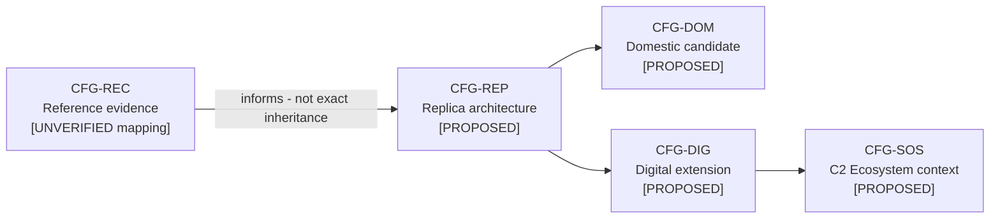
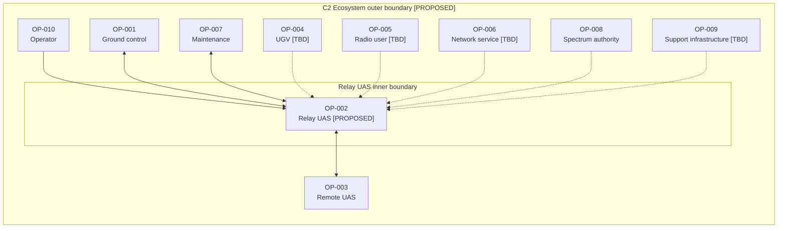
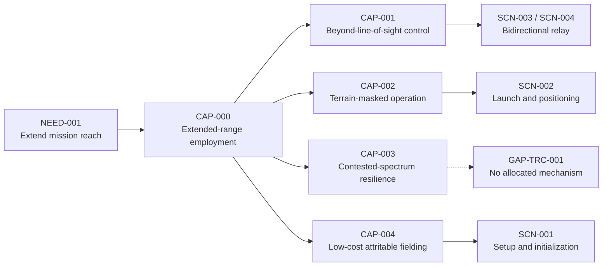
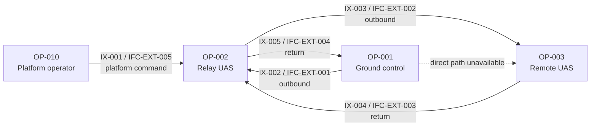
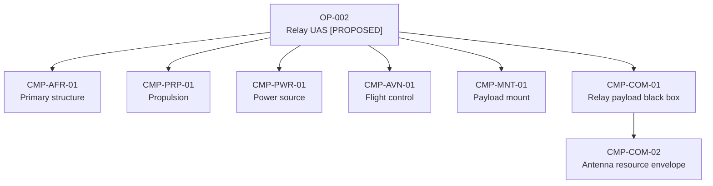
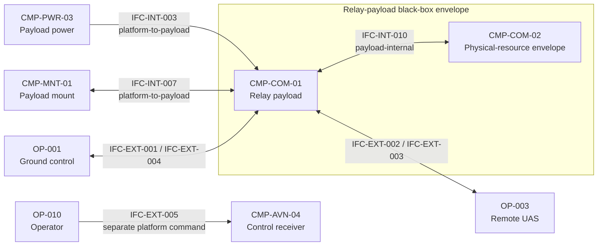
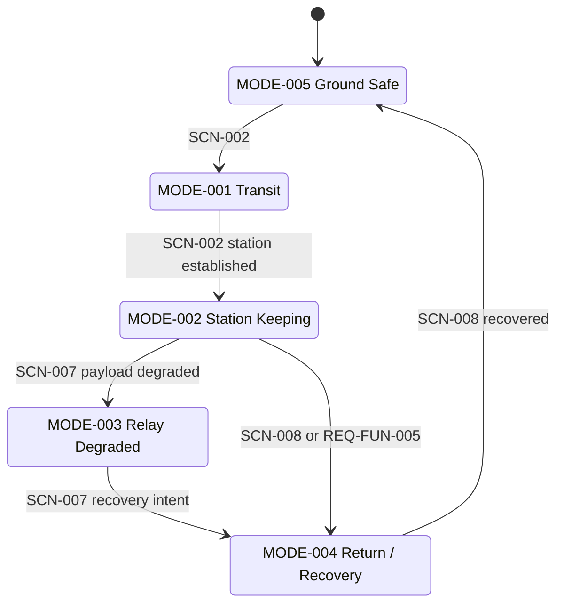
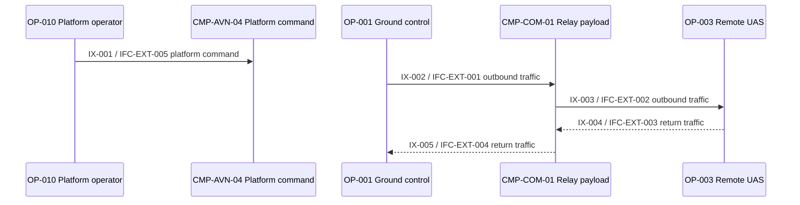
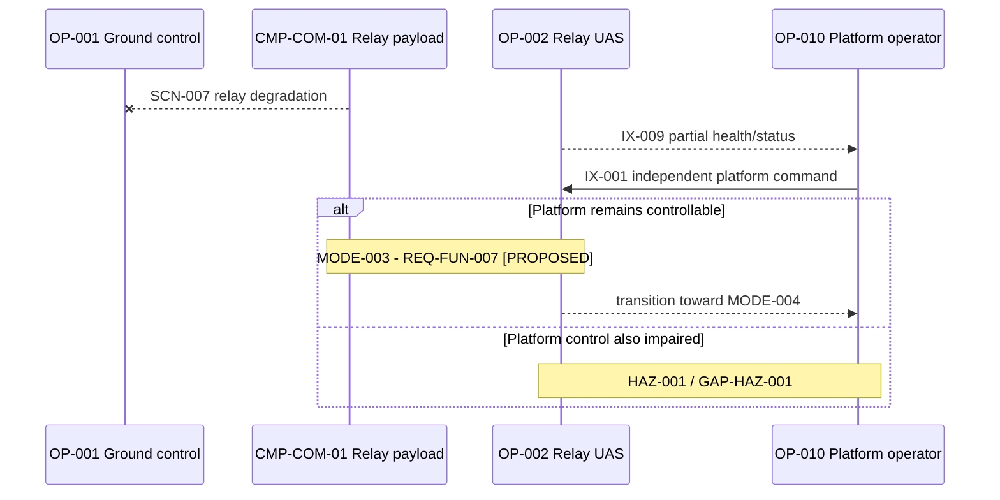
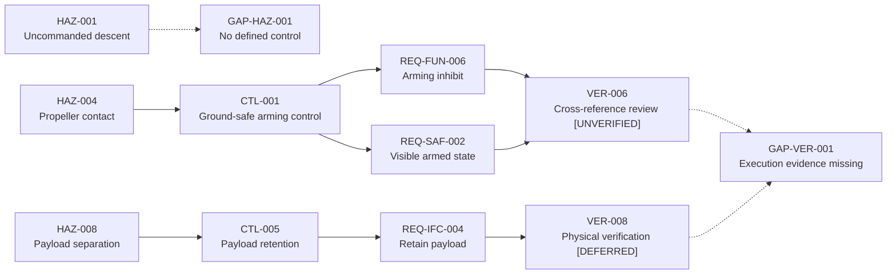

# Relay-UAS Architecture

> **Baseline Candidate - Not Approved.** This is the primary human-readable view of
> the structured model. Follow IDs into `model/architecture.yaml`,
> `model/assurance.yaml`, `.seal/proof.yaml`, and `model/traceability.yaml` for
> authoritative records and complete metadata.

## 1. Architecture Purpose

The concept places a bidirectional communications-relay payload on a conventional
small UAS so a ground-control node and remote UAS can exchange mission traffic when
their direct path is too long or obstructed. The platform is valuable because of
where it can hold station, not because the airframe is novel.

Three principles organize the model:

- Reference evidence, current candidate designs, and future extensions are separate configurations.
- The relay payload remains a black box behind a narrow platform boundary.
- Platform command is separate from the traffic relayed for another vehicle.

No diagram is approval evidence. `[PROPOSED]`, `[TBD]`, `[DEFERRED]`, and
`[UNVERIFIED]` state maturity explicitly.

## 2. Configuration Baselines

The current/reference axis is `CFG-REC -> CFG-REP -> CFG-DOM`. The future-extension
axis is `CFG-REP -> CFG-DIG -> CFG-SOS`.

**Reference evidence — `CFG-REC`.** This boundary describes what the registered
sources say about the recovered article. It does not inherit candidate components,
interfaces, requirements, modes, controls, or verification claims.

**Current candidate architecture — `CFG-REP` / `CFG-DOM`.** These configurations
carry the present Relay-UAS decomposition and the two-interface payload boundary.

**Future extensions — `CFG-DIG` / `CFG-SOS`.** These add a proposed digital payload
management path and broader independently managed performers. They do not silently
modify the current candidate.

## 3. System Boundaries

The inner product boundary is the Relay UAS. The outer context is the C2 Ecosystem.

External performers remain independently managed. The context does not imply
interoperability, authority, security, or implementation responsibility.

## 4. Capability and Operational Context

`CAP-001` addresses distance; `CAP-002` addresses obstructed geometry. They remain
separate because one can bind without the other. The concept hypothesis is the
intersection of those two capabilities with `CAP-004` low-cost attritability.

`CAP-003` remains deliberately unallocated because every potential mechanism is
inside deferred payload work (`TS-009`). `CAP-004` is currently a cross-cutting
constraint rather than a dedicated operational activity.

The current mission thread keeps Relay-UAS platform command separate from relayed
traffic:

The relay is bidirectional, positional, and logically transparent at this level. No
frequency, protocol, data-rate, or waveform behavior is asserted.

## 5. Relay-UAS Logical/Physical Architecture

The physical architecture is a conventional multicopter decomposition. Representative
resources show subsystem ownership without reproducing the complete component catalog.

Four-corner propulsion sets are symmetric in the candidate design. Platform novelty
is avoided because added complexity competes directly with `CAP-004`. Component
selection remains open in the `TS-*` register.

Two decisions dominate the decomposition:

1. `CMP-COM-01` couples to the platform only through power and retention.
2. `CMP-AVN-04` controls the Relay UAS; it does not perform `FUN-REL-01` or `FUN-REL-02`.

## 6. Interfaces

The current interface architecture makes the payload boundary explicit while keeping
external paths implementation-neutral.

Only `IFC-INT-003` and `IFC-INT-007` cross the current platform-to-payload boundary.
`IFC-INT-010` records physical coupling inside the payload envelope; it does not
define another platform interface or any antenna characteristic. `IFC-INT-008` is a
future `CFG-DIG`/`CFG-SOS` payload-management candidate and is absent from the current
architecture.

The complete 16-interface inventory, including internal power, control, health,
navigation, external traffic, and maintenance groups, is generated in the diagram
atlas. External-interface authority and verification remain open (`GAP-IFC-001`),
while implementation attributes remain intentionally out of scope (`GAP-IFC-002`).

## 7. Operational Behavior

The degraded branch ends at explicit gaps rather than inventing a recovery behavior.
UGV, sensor/video, and broader health/status threads are future extensions, not
current-system behavior.

## 8. Requirements and Constraints Summary

The 27 `REQ-*` records are authoritative in `model/assurance.yaml`. They cover relay
function, station keeping and recovery, unresolved performance envelopes, payload
interfaces, basic safety controls, project constraints, and explicitly deferred
items.

Bracketed `[TBD]` values are load-bearing unknowns with trade-study ownership. They
must not be replaced with borrowed figures. In particular:

- `REQ-IFC-003`: the platform-to-payload interface is limited to `IFC-INT-003` power and `IFC-INT-007` mechanical retention.
- `REQ-CON-003`: the project excludes weapons and munitions; it is not a recovered-article observation.
- `REQ-DEF-001..005`: deferred or externally owned topics, not requirements claimed satisfied here.

Mass, unit cost, power, endurance, and payload envelopes form one coupled open problem
(`GAP-BUDGET-001`), not five independent blanks. The worked TS-002/TS-003 analysis is
preserved in `trade-studies.md`.

## 9. Hazards and Controls Summary

The hazard catalog is preliminary architecture reasoning, not a safety assessment.
No authoritative severity/probability scheme or risk-acceptance authority exists.

`HAZ-005` is only partially addressed: `REQ-FUN-007` preserves platform control but
does not restore relay service. `HAZ-009` is a reserved inactive identifier, not an
active deficiency. External hazards stay deferred pending employment context.

The current austere/non-populated employment narrative is an assumption, not an
enforceable requirement. No flight-termination or geofence function is modeled, so
`HAZ-001` remains openly unmitigated.

## 10. Verification Approach

`VER-*` entries allocate analysis, review, inspection, demonstration, or deferred
physical methods. Allocation is not execution. `EVD-*` records describe available
repository, source, decision, and validation evidence; none demonstrates physical
performance or safety.

The near-term admissible work is model review, trace inspection, and source/evidence
governance. Hardware-dependent evidence remains deferred and must not be inferred
from a passing repository validator.

## 11. Key Traceability Threads

- Mission: `NEED-001 -> CAP-001 -> SCN-003 -> OA-004 -> FUN-REL-01 -> CMP-COM-01 -> REQ-FUN-001 -> VER-001`.
- Ground safety: `HAZ-004 -> CTL-001 -> REQ-FUN-006 / REQ-SAF-002 -> VER-004 / VER-006 -> GAP-VER-001`.
- Payload retention: `HAZ-008 -> CTL-005 -> REQ-IFC-004 -> VER-005 / VER-008 -> GAP-VER-001`.
- Standards: `DEC-002 -> CFG-REP / CFG-DOM / CFG-DIG / CFG-SOS -> GAP-STD-001`.

The full relationship set belongs only in `model/traceability.yaml`; the generated
baseline report presents gap-oriented summaries rather than another matrix copy.

## 12. Open Architecture Gaps

The principal retained gaps are recovered-to-candidate mapping and missing source
evidence; `CAP-003`; `HAZ-001`; external-interface verification authority; UGV and
sensor/video integration; health/status coverage; the mass/cost/power/endurance
coupling; physical verification evidence; and the unresolved UAF-version decision.

Cameo reconciliation is deferred future work outside this package and is not a
principal active deficiency. No Cameo content was used to close any gap.

## 13. Standards Posture

The repository uses a small UAF vocabulary subset:

- Strategic concepts for needs and capabilities.
- Operational concepts for performers, activities, scenarios, and exchanges.
- Resource concepts for functions, components, and interfaces.

This keeps capability, operational context, and resource allocation connected in one
model—something plain SysML would otherwise leave partly in prose—without adopting a
full acquisition-framework apparatus. UAF draws on UML/SysML and earlier architecture
framework concepts; this repository does not claim full UAF or DoDAF conformance.

UAF 1.2 terminology remains in use. UAF 1.3 is the current OMG formal version, but
`DEC-002` / `GAP-STD-001` leaves retention, version-neutral wording, or later migration
for owner decision. This refactor is not a UAF migration.
