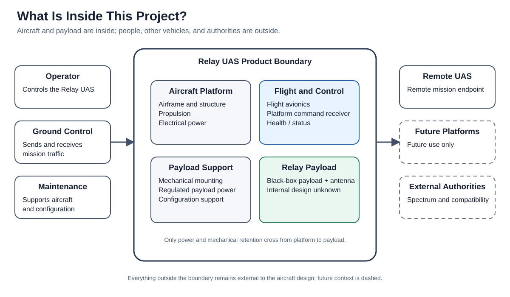
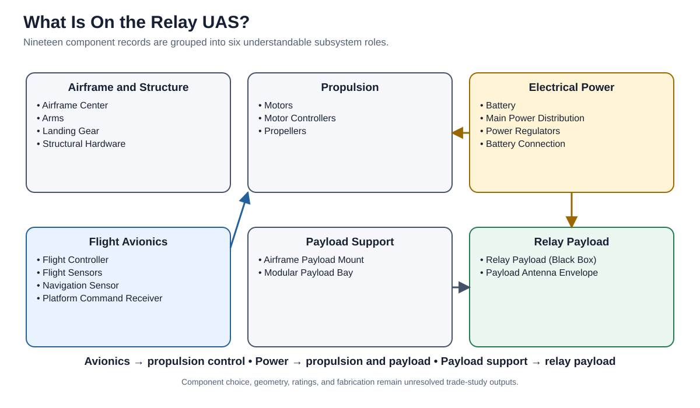
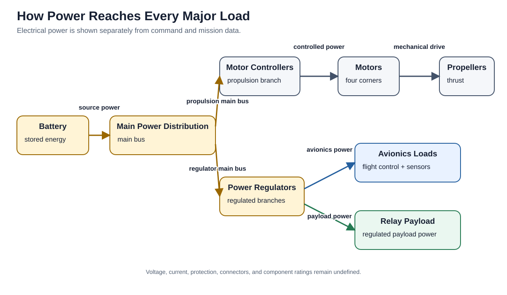
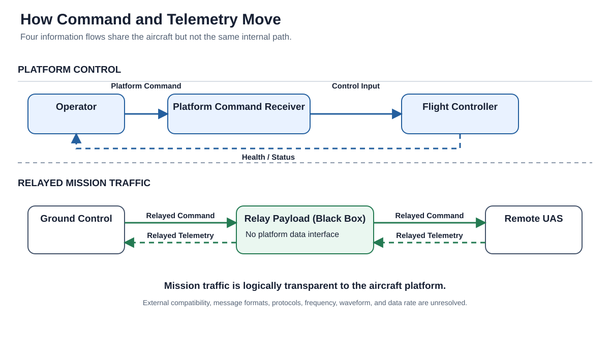
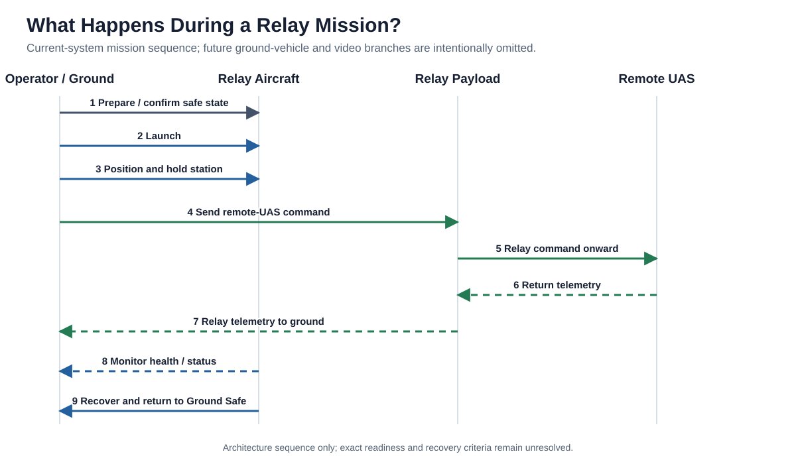
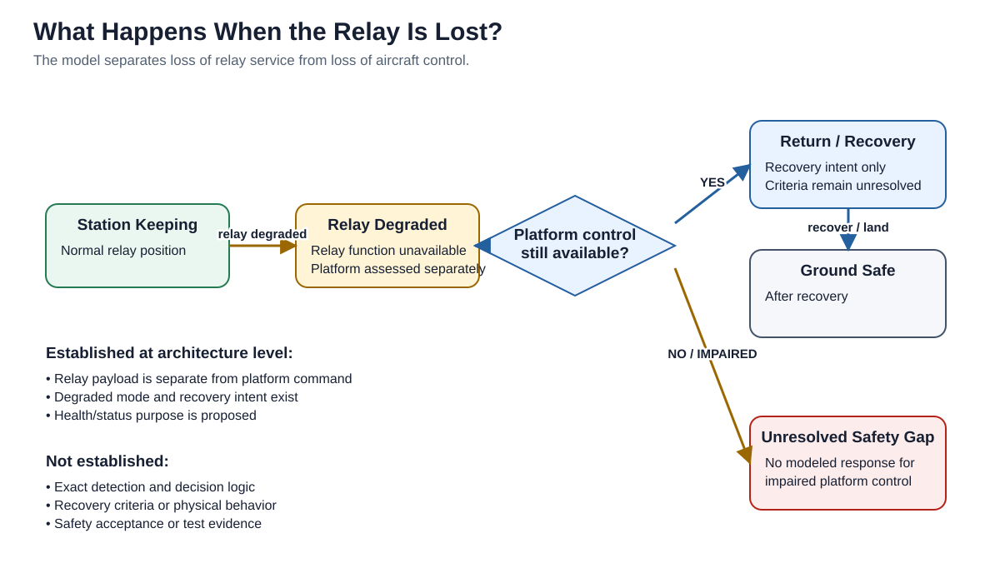
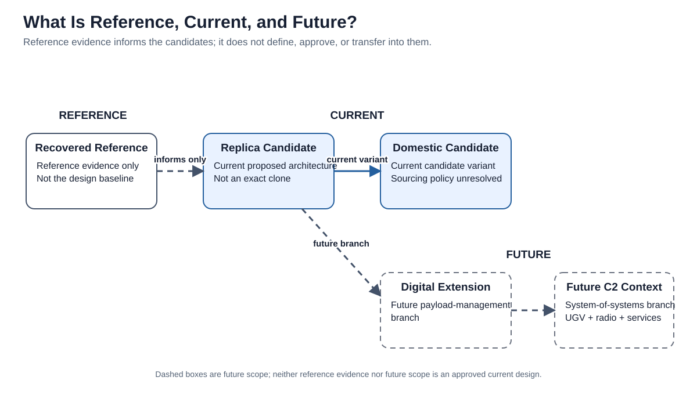

# Relay-UAS Architecture

> **Baseline candidate — not approved.** This document bridges the five-minute
> orientation in `README.md` and the authoritative structured catalogs. Plain names
> come first; stable model IDs appear where they help engineering traceability.

## 1. System overview

The system under study is a small multirotor that carries a communications relay
payload to a useful airborne position. Ground control sends remote-aircraft command
through the payload, and remote-aircraft telemetry returns through it. The aircraft
does not interpret that mission traffic at this architecture level.

The Relay UAS also needs its own independent control path. An operator uses that
path to launch, position, monitor, and recover the carrier aircraft. This separation
is central: a failed relay payload can remove mission service without necessarily
removing control of the aircraft carrying it.

The current candidate consists of conventional aircraft support subsystems plus a
black-box payload. The project defines their relationships and analyzes whether a
credible mass–power–endurance–cost region exists. It does not design the payload's
internal RF implementation or select aircraft hardware.

The figure derives from the current actors and information exchanges: Operator,
Ground Control, Relay UAS, Remote UAS, platform command, relayed command, and relayed
telemetry. IDs are intentionally absent from the visible figure; they remain in its
generated metadata and the structured model.

## 2. System context

The **Relay UAS product boundary** contains:

- airframe, structure, propulsion, and electrical power;
- flight control, navigation, platform-command reception, and health/status support;
- payload mounting and regulated payload power; and
- the relay payload and its antenna resources as a black box.

The operator, ground-control system, remote aircraft, maintenance personnel, other
mission platforms, external services, and authorities remain outside the product
boundary. They are independently managed unless a structured source establishes
otherwise.

The model also contains a broader future C2 ecosystem context. That outer context
does not imply current interoperability, responsibility, authority, or interface
conformance.

**Engineering references:** inner/outer boundaries in `system.yaml`; Relay UAS
performer `OP-002`; current external performers `OP-001`, `OP-003`, `OP-007`, and
`OP-010`.

## 3. Current physical architecture

The 19 authoritative component records group naturally into six subsystem roles:

| Group | Architecture content | Design state |
|---|---|---|
| Airframe and structure | Center structure, arms, landing gear, payload-side structure, and hardware (`CMP-AFR-*`) | Architecture role defined; material, geometry, loads, and construction remain trade outputs. |
| Propulsion | Motors, motor controllers, and propellers (`CMP-PRP-*`) | Functional chain defined; sizing and hardware remain unresolved. |
| Electrical power | Battery, distribution, regulators, and source connection (`CMP-PWR-*`) | Resource paths defined; voltage, current, capacity, protection, and hardware remain unresolved. |
| Flight avionics | Flight controller, flight sensors, navigation sensor, and platform-command receiver (`CMP-AVN-*`) | Roles and key interfaces defined; device and implementation choices remain unresolved. |
| Payload support | Airframe mount and modular payload bay (`CMP-AFR-04`, `CMP-MNT-01`) | Mounting role defined; envelope, geometry, margin, and evidence remain unresolved. |
| Relay payload | Payload module and antenna resource envelope (`CMP-COM-*`) | Black-box boundary defined; internal implementation deliberately deferred. |

Four-corner propulsion symmetry is part of the candidate concept, but no motor,
controller, propeller, battery, frame, flight controller, mount, radio, or antenna is
selected. The grouped view is an orientation layer; the complete ID-level resource
connectivity remains in the generated architecture views.

## 4. How information and power move

### Power and physical resource flow

Stored battery energy reaches main distribution. One branch supplies propulsion
controllers, motors, and propellers. Another reaches regulators that support flight
avionics and the black-box relay payload. Mechanical drive is shown separately from
electrical flow.

The authoritative path is recorded by `IFC-INT-011`, `IFC-INT-001`,
`IFC-INT-013`, `IFC-INT-014`, `IFC-INT-015`, `IFC-INT-002`, and `IFC-INT-003`.
Those interfaces establish architecture connectivity and failure meaning without
assigning electrical values or implementation details.

### Command, status, and mission data

The top lane controls the Relay UAS. Platform command enters through the dedicated
receiver and reaches flight control; proposed health/status returns toward the
operator. The bottom lane is remote-aircraft mission traffic passing through the
relay payload.

The current platform-to-payload interface remains limited to regulated power and
mechanical retention (`IFC-INT-003`, `IFC-INT-007`). The payload-internal antenna
coupling (`IFC-INT-010`) does not create a third platform crossing. The proposed
digital payload-management interface (`IFC-INT-008`) belongs only to future
configurations.

No figure defines frequency, waveform, protocol, power, data rate, message format,
antenna characteristics, endpoint compatibility, or external conformance authority.

## 5. How the mission works

The current mission is a sequence of architecture outcomes rather than an operating
procedure:

1. **Prepare.** Establish a safe state, candidate configuration, and available
   readiness information while the aircraft remains Ground Safe (`SCN-001`).
2. **Launch and position.** Use the independent platform-command path to transit and
   hold a useful relay station (`SCN-002`).
3. **Relay outbound command.** Ground-originated traffic passes through the payload
   toward the remote UAS (`SCN-003`).
4. **Relay return telemetry.** Remote-UAS traffic passes back through the payload
   toward ground control (`SCN-004`).
5. **Monitor.** Proposed aircraft health/status supports readiness and recovery
   decisions. Minimum content and transport remain unresolved.
6. **Recover.** Normal termination or a defined low-battery condition transitions
   the aircraft toward return, recovery, and Ground Safe (`SCN-008`).

The future UGV and video/sensor-data scenarios are intentionally absent from this
current-system mission picture.

## 6. Modes and degradation behavior

The current candidate uses five modes:

| Plain-language state | Model record | Meaning |
|---|---|---|
| Ground Safe | `MODE-005` | Aircraft is not in an active flight mode; arming inhibition is a proposed requirement. |
| Transit | `MODE-001` | Aircraft moves toward or away from its relay station. |
| Station Keeping | `MODE-002` | Aircraft holds the intended relay geometry; tolerance remains unset. |
| Relay Degraded | `MODE-003` | Relay service is lost or degraded while platform control is treated separately. |
| Return / Recovery | `MODE-004` | Architecture expresses recovery intent; exact criteria and behavior remain unresolved. |

The degraded scenario (`SCN-007`) expects the aircraft to remain controllable and
move toward recovery when only the payload function is lost. If platform control or
recovery is also impaired, the model stops at explicit safety and evidence gaps. It
does not invent geofencing, flight termination, autonomous containment, or another
unapproved consequence-management behavior.

`REQ-FUN-007` and `REQ-FUN-008` express proposed controllability and status intent.
`GAP-HAZ-001` retains the unresolved safety objective, and `VER-008` retains the
absence of physical recovery evidence.

## 7. Configurations: reference, current, and future

### Reference evidence

The Recovered Reference (`CFG-REC`) records what registered teardown sources support.
It is a descriptive evidence boundary, not a proposed product decomposition. It does
not automatically inherit or confer candidate components, interfaces, requirements,
modes, controls, verification, or approval.

The controlled reconciliation includes recovered-item and recovered-connection
records plus reverse coverage of all current candidate components and interfaces.
That supports role correspondence, not exact hardware identity or exact recovered
connectivity. The registered PDF and workbook passed integrity checks; the local
DOCX revision remains mismatched to its registered checksum.

### Current candidates

The Current Replica Candidate (`CFG-REP`) is an architecture-level functional
derivation, not an exact clone. The Domestic Candidate (`CFG-DOM`) preserves the
same current architecture while adding unresolved sourcing intent. Neither is an
approved design.

### Future branches

The Digital Extension (`CFG-DIG`) introduces a possible payload-management path.
The System-of-Systems context (`CFG-SOS`) adds possible UGV, radio-user, network,
authority, and infrastructure relationships. These branches do not modify the
current candidate unless future owner action and engineering work explicitly do so.

## 8. Key requirements

The authoritative catalog contains 28 requirement records. This translation groups
their intent so readers understand the design before inspecting individual IDs.

| Requirement area | Plain-language intent | Authoritative records |
|---|---|---|
| Relay function | Carry outbound remote-UAS command and return telemetry through the airborne payload. | `REQ-FUN-001`, `REQ-FUN-002` |
| Flight and positioning | Accept aircraft command, navigate, hold a station, and return on an owner-defined low-battery condition without assuming continuous GNSS availability. | `REQ-FUN-003..005`, `REQ-CON-004` |
| Payload support | Provide a payload-independent mount, defined accommodation envelope, regulated power, a two-crossing platform boundary, and retention under future load criteria. | `REQ-PER-004`, `REQ-IFC-001..004` |
| Electrical power | Support regulated payload service and basic battery protection/retention. Values and evidence remain unresolved. | `REQ-IFC-002`, `REQ-SAF-001` |
| Command and status | Keep platform command independent of the relay payload and make proposed aircraft mode/health information available to the operator. | `REQ-FUN-004`, `REQ-FUN-008` |
| Portability and affordability | Remain compatible with owner-set cost, endurance, gross-mass, payload, and single-operator handling objectives while preferring commercially available components. | `REQ-PER-001..005`, `REQ-CON-001`, `REQ-CON-002` |
| Safety and recovery | Inhibit arming in Ground Safe, show armed state, preserve recovery intent after relay loss, retain stored energy and payload, and exclude weapons. | `REQ-FUN-005..007`, `REQ-SAF-001..002`, `REQ-IFC-004`, `REQ-CON-003` |
| Deferred or external topics | Leave RF design, antennas, spectrum authorization, contested-spectrum mechanisms, and export review outside current technical definition. | `REQ-DEF-001..005` |

Bracketed `[TBD]` values are controlled unknowns, not placeholders for values copied
from another aircraft. Requirement wording, classification, provenance, allocation,
verification, and TBD governance remain in `model/assurance.yaml`.

## 9. Representative traceability threads

Complete traceability remains machine-readable. Three representative threads show
how the architecture connects intent to verification without presenting a giant ID
graph.

### Extend remote command reach

**Human thread:** Need more reach → provide an airborne relay → relay outbound
command → allocate the behavior to the black-box payload → cross the external relay
path → review architecture completeness now → verify endpoint compatibility later.

**Audit trace:** `NEED-001 → CAP-001 → SCN-003 → OA-004 → IX-002/003 → FUN-REL-01 → CMP-COM-01 → IFC-EXT-001/002 → REQ-FUN-001 → VER-001/009 → GAP-IFC-001`

### Hold useful relay geometry

**Human thread:** Terrain or distance creates a need for position → launch and
position the aircraft → hold station → allocate stabilization/navigation to flight
avionics → define station behavior → inspect the model now → demonstrate it later.

**Audit trace:** `CAP-002 → SCN-002 → OA-003 → FUN-FLT-03 → CMP-AVN-01/02/03 → REQ-FUN-003 + REQ-CON-004 → VER-001/008 → GAP-BUDGET-001 + GAP-VER-001`

### Recover after relay degradation

**Human thread:** Relay service degrades → enter a degraded state → preserve the
independent aircraft-control path → expose health/status → transition toward
recovery → retain unresolved safety and physical-evidence needs.

**Audit trace:** `SCN-007 → MODE-003 → FUN-CMD-01 + FUN-FLT-04 + FUN-HLT-01 → CMP-AVN-04 + CMP-AVN-01 → IFC-EXT-005/007 → REQ-FUN-007/008 → VER-006/008/009 → GAP-HAZ-001 + GAP-VER-001`

The complete relationship catalog is `model/traceability.yaml`. The ID-rich generated
atlas provides engineering drill-down without making those IDs the primary
orientation language.

## 10. Feasibility implications

The deterministic analysis iterated gross mass, induced hover power, propulsion
mass, structure, and the larger of energy-limited or power-limited battery mass. It
evaluated 225 grid cases and 4,096 sensitivity samples without selecting hardware.

The result is conditional but useful:

- A short-dwell, modest-payload region appears physically and economically plausible
  under reference-or-better assumptions.
- Endurance is the dominant sensitivity, followed by rotor performance, disk
  loading, environmental power burden, and battery performance.
- Short-dwell cases can be battery-power-limited; longer dwell becomes
  energy-limited and reinforces the battery–mass–power loop.
- The reference 45–60 minute region is infeasible under the exploratory boundaries.
- Payload volume, station tolerance, operating geometry, external compatibility,
  recovery behavior, and owner targets remain undetermined.

The analysis scopes component-**class** evidence collection for propulsion, battery,
structure, mounting, and power conversion. It does not justify product comparison or
selection. See `reports/feasibility-analysis.md` for equations, sources, ranges,
limitations, plots, and complete trade-study implications.

## 11. Verification and maturity

The project separates three kinds of evidence:

| Evidence layer | Current meaning |
|---|---|
| Internal model verification | Architecture structure, references, scenarios, interfaces, allocations, traceability, configuration applicability, and generated artifacts have been reviewed. Some methods passed; others passed with known gaps. |
| Physical verification | Not executed. Aircraft behavior, performance, electrical characteristics, loads, retention, recovery, and safety-relevant physical claims require future evidence (`VER-008`). |
| External conformance | Blocked. External authorities, specifications, endpoint criteria, and execution evidence are absent (`VER-009`). |

The owner accepted the preserved 0.7.0 internal verification work package as a
working verification baseline. A later `0.8.0-baseline-candidate` model review
remains model-level evidence, not technical approval. The constrained feasibility
work package was approved for repository inclusion, but its analysis boundaries and
owner targets remain unapproved.

`TS-009` remains formally deferred, physical verification remains unavailable,
external conformance remains blocked, and the technical baseline remains
`baseline_candidate_not_approved`.

## 12. Detailed engineering reference

Use the layers in this order:

1. `README.md` — five-minute concept, result, and status.
2. This document — architecture explanation, grouped requirements, and example
   traceability.
3. `reports/architecture-views.md` — generated technical diagrams and complete
   interface inventory.
4. `reports/baseline.md` — generated decisions, gaps, verification, and status.
5. `reports/feasibility-analysis.md` and `analysis/` — quantitative assumptions,
   executable model, results, and plots.
6. `trade-studies.md` — engineering trade reasoning and remaining inputs.
7. `model/*.yaml`, `.seal/*.yaml`, and `system.yaml` — authoritative model data.

The rendering layer chooses grouping, layout, abbreviation, and detail level. It
does not create connections, allocations, interfaces, functions, configuration
applicability, verification results, or approval state. Generated communication
figures carry their source record IDs in SVG metadata and are checked against the
catalogs during generation and repository validation.

The repository uses selected UAF terminology to connect strategic intent,
operational context, resources, and assurance. It does not claim full UAF, DoDAF,
SysML, MOSA, safety, airworthiness, interoperability, or operational conformance.
