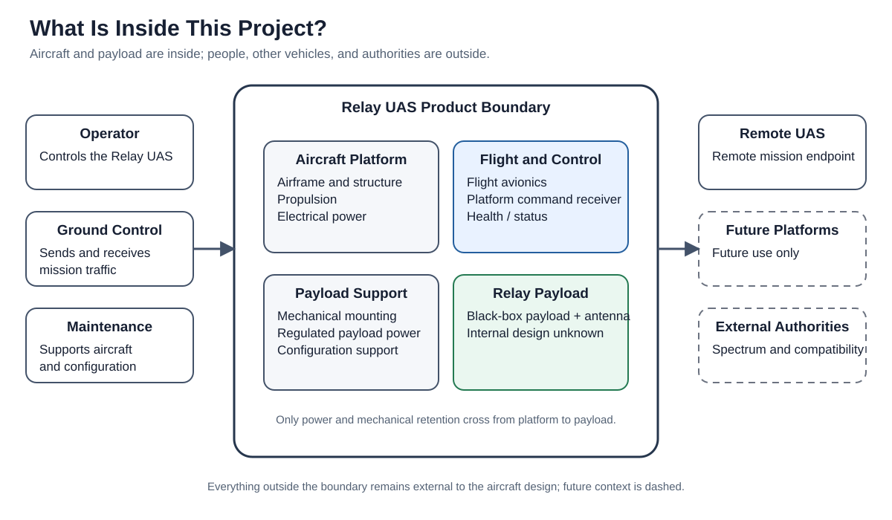
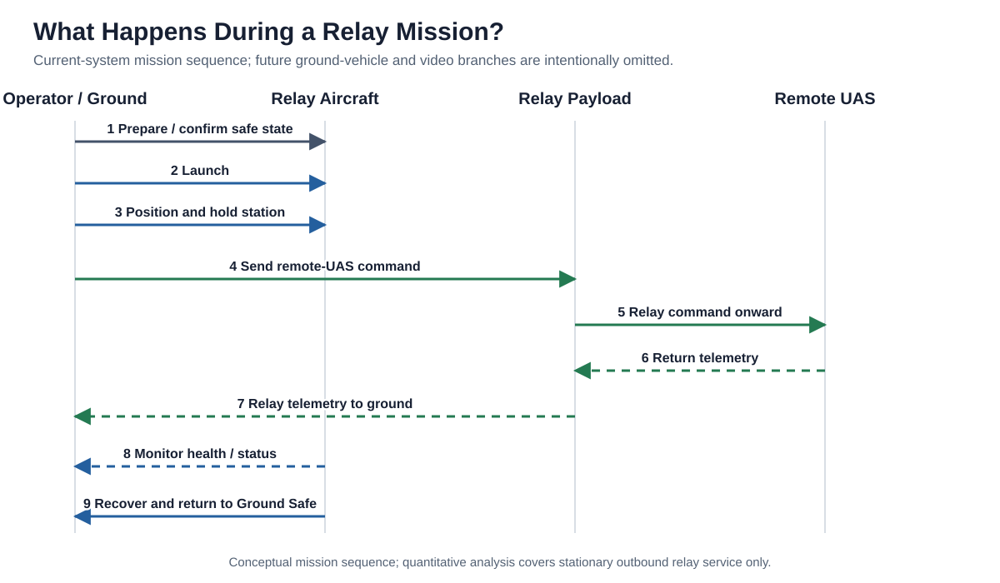
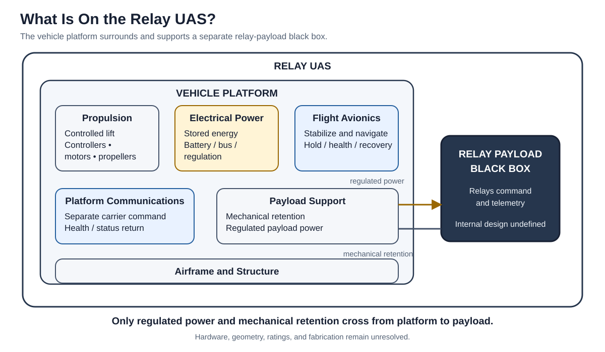
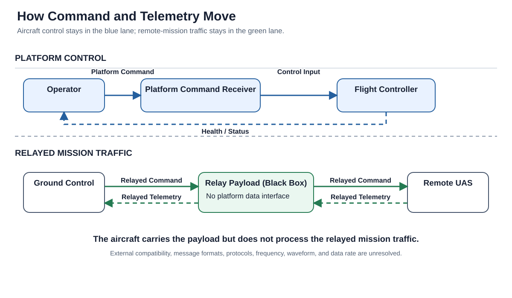
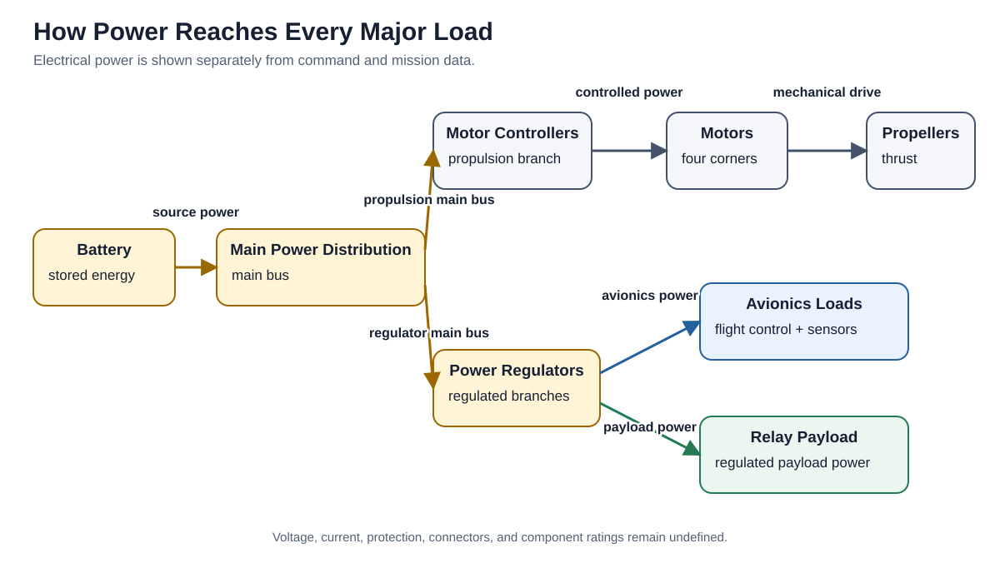
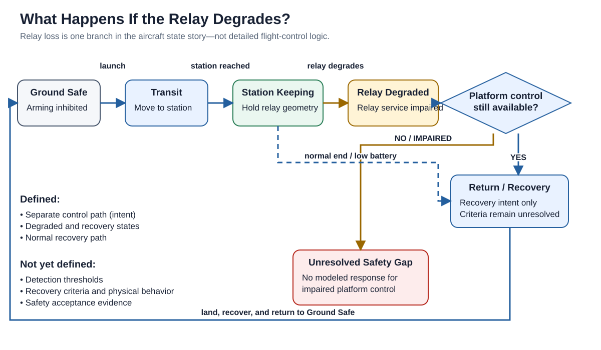

# Architecture

[Overview](../README.md) · **Architecture** · [Feasibility](feasibility.md) · [Engineering Status](engineering-status.md) · [Reference](reference/README.md)

The Relay UAS is a small multirotor that positions a modular communications relay payload where airborne geometry can help a blocked or distant path. The proposed architecture assigns different jobs to the aircraft and payload: the aircraft provides flight, power, payload support, and recovery functions; the payload relays mission traffic as a black box. Three commitments organize the assessment: black-box payload abstraction, explicit mechanical/electrical support, and logical separation of carrier control from relay traffic.

Read this page after the [overview](../README.md). Its purpose is to explain which part of the aircraft does each job. “Black box” means the payload is described by its external interfaces and resource needs, not its internal radio implementation.

## Follow four flows

Start with the 10 km, 120 m relay example in the overview. The payload carries the outbound message; the aircraft must hold the payload where both hops can work. These responsibilities connect through four different flows:

1. **Mission traffic:** ground endpoint → relay payload → remote endpoint. Return traffic belongs to the conceptual architecture but is not calculated by the outbound link model.
2. **Carrier control:** operator → platform communications → flight avionics → propulsion control. Navigation and health information support this intended behavior; performance is unverified.
3. **Electrical energy:** battery → distribution → propulsion and regulated avionics/payload branches. The payload's constant DC allowance enters the hover-resource calculation.
4. **Mechanical loads:** payload → mount → airframe → propulsion-supported aircraft. Mass allowances represent this burden; they are not a load or stress analysis.

The following views separate those concerns. Read arrows as the named connection or intended flow, not as proof of implemented behavior.

## System boundary

The product boundary contains the carrier aircraft, its payload-support hardware, and the relay payload. The carrier includes structure, propulsion, stored energy and power distribution, flight avionics, navigation, platform communications, and payload mounting. The payload is inside the boundary as a bounded physical resource, but its radio implementation is not defined here.

Operators, ground equipment, the remote aircraft, maintenance personnel, external services, spectrum authorities, and future platforms are outside the product boundary. Examination of a recovered article is background motivation only; the paper does not depend on its provenance, exact reconstruction, or measured performance. Replica and domestic-sourcing candidate identifiers are preserved as repository configuration history and remain unapproved; they do not organize the paper's argument.

## Mission behavior

The normal mission is conceptual rather than procedural. The operator prepares and launches the aircraft, moves it to a useful relay position, holds that position, relays outbound command and return telemetry, monitors aircraft health, then recovers the aircraft. The sequence explains intended responsibility and information flow. Quantitative evidence covers stationary, one-way Ground → Relay → Remote dwell only; it does not establish transit/recovery energy, return telemetry, station-keeping accuracy, or carrier-control performance.

## Major physical architecture

| Subsystem | Role in the concept |
|---|---|
| Airframe and structure | Carries aircraft loads and supports propulsion, avionics, energy storage, and the payload mount. |
| Propulsion | Produces lift through motor controllers, motors, and propellers. |
| Electrical power | Stores energy, distributes main power, and provides regulated branches. |
| Flight avionics | Stabilizes, navigates, holds station, manages aircraft modes, and reports health/status. |
| Platform communications | Provides the intended carrier-command path, logically separate from relay traffic. |
| Payload support | Retains the payload and provides its regulated electrical interface. |
| Relay payload | Passes mission traffic between the external endpoints without being specified internally. |

These are roles, not selected products. The model intentionally does not select a frame, battery, motor, controller, radio, antenna, or mount.

## Keep aircraft control separate from relay traffic

The upper lane controls the carrier aircraft. The operator sends platform command to the dedicated receiver and flight avionics; aircraft mode and detected health/status return toward the operator.

The lower lane carries remote-aircraft mission traffic. Ground-originated command enters the relay payload and is passed toward the remote aircraft. Return telemetry follows the reverse path. The carrier transports and powers that payload, but does not use the relayed traffic to fly itself.

This logical separation is an architecture commitment, not demonstrated failure isolation. Shared power and physical dependencies can still affect both paths; no quantitative control-link or common-cause failure assessment has been performed. The current carrier-to-payload boundary has two crossings: regulated payload power and mechanical retention. A later digital payload-management connection is a future configuration, not part of the current candidate.

## Power and resources

Stored energy feeds main distribution. The main bus serves the propulsion branch and regulated branches for avionics and payload support. Motor controllers, motors, and propellers convert electrical power into lift.

The diagram establishes the resource path and why a payload-power loss differs from an avionics-power loss. It does not define voltage, current, connectors, protection, wire sizing, thermal limits, or component ratings.

## Degraded behavior

Relay degradation is distinct from loss of aircraft control. If relay service is impaired while the separate platform-control path remains available, the architecture calls for return and recovery. If platform control is also impaired, the model records an unresolved safety gap instead of assuming a response.

The study has not established detection thresholds, detailed control behavior, recovery criteria, or physical recovery performance. Those require an accepted safety objective and later evidence.

## Architecture choices and limits

The architecture deliberately keeps the relay payload as a black box. It specifies the support the carrier must provide—mass and volume accommodation, regulated power, and mechanical retention—without defining the payload's internal radio design.

The current study also does not define component selections, electrical ratings, connector families, packaging geometry, external endpoint compatibility, spectrum authorization, detailed operational procedures, or a safety or airworthiness case. These are open decisions, evidence needs, or intentionally out-of-scope topics—not hidden assumptions.

## Architecture-to-evidence assessment

Architecture definitions establish responsibilities; calculations test selected resource and service assumptions. They are different forms of evidence.

| Architecture commitment | Modeled support | Quantitative evidence | Unresolved limitation |
|---|---|---|---|
| Black-box relay payload | Relay payload and antenna envelope in the [architecture catalog](../model/architecture.yaml); fixed payload cases in the [payload inputs](../analysis/relay-payloads.yaml) | Primary 0.20 kg / 14 W case enters carrier sizing; fixed RF assumptions enter the connectivity screen | Representative payload is a resource proxy, not identification of the examined radio; throughput, compatibility, and actual operating consumption are unverified |
| Explicit mechanical and electrical payload support | Regulated power `IFC-INT-003` and retention `IFC-INT-007`, documented in the [interface reference](reference/interfaces.md) | Existing carrier calculation propagates payload mass/DC demand into mass, power, energy, and exploratory rotor/span checks | No retention-load analysis, packaging fit, thermal assessment, or qualified electrical interface |
| Logical separation of carrier control and relay traffic | Platform-command path, avionics, and distinct information lanes in the architecture catalog | No quantitative verification of this commitment; connectivity calculations cover the relayed outbound path only | No proven fault isolation, carrier-control availability, reverse-link performance, or recovery capability |

The [integrated results](../analysis/results/integrated-tradespace-summary.json) assess a declared mission envelope for this architecture. They do not validate every subsystem responsibility. Fixed payload assumptions connect the link and carrier calculations; the model does not resize radio equipment from link margin.

## Go deeper

Use the reference layer when an engineering question needs complete inventories or identifiers:

- [Requirements](reference/requirements.md) for the system-level commitments and deferred topics.
- [Interfaces](reference/interfaces.md) for the logical interface inventory and open attributes.
- [Traceability](reference/traceability.md) for requirement and evidence relationships.
- [Decisions and Gaps](reference/decisions-and-gaps.md) for the work that must be resolved next.
- [Architecture Atlas](reference/architecture-atlas.md) and the structured [architecture model](../model/architecture.yaml) for detailed audit views.

Next: read [Feasibility](feasibility.md) to see what the coupled aircraft concept can plausibly support, or [Engineering Status](engineering-status.md) to see the next engineering phase.
