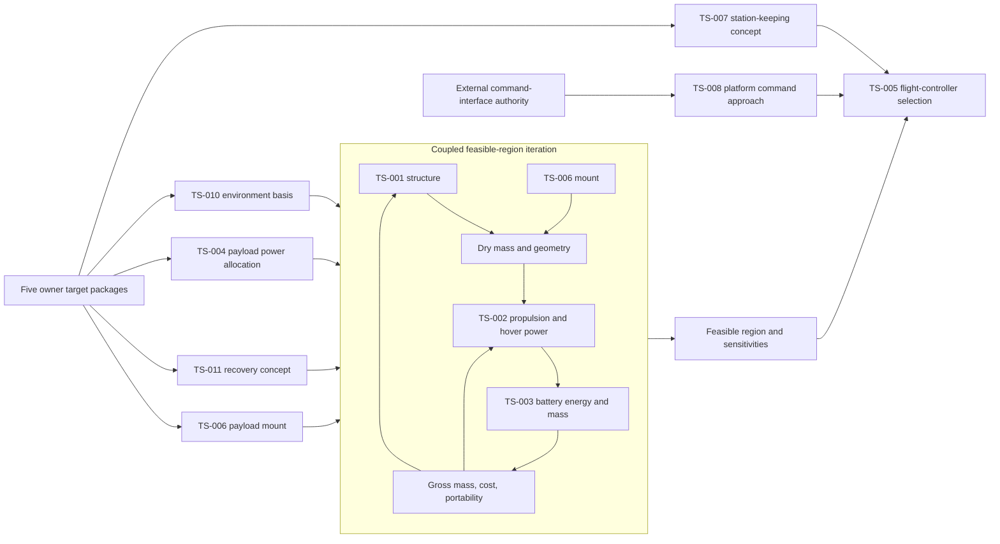

# Architecture Decision and Target Package

> **Historical work-package record.** Current decision and gap dispositions are generated in [Decisions and Gaps](../reference/decisions-and-gaps.md) from the structured model.

> **Owner review package — no decision approved.** This analysis applies to
> `CFG-REP` and `CFG-DOM` in `0.8.0-baseline-candidate`. It does not approve the
> technical baseline, establish physical performance, close external conformance,
> select components, or change the deferral of `TS-009`.

## A. Executive Finding

`0.8.0-baseline-candidate` is mature enough to begin disciplined physical
trade-space engineering, but not yet point-design or component-selection work. The
model already defines the current boundary, behavior, resources, interfaces,
requirements, assurance paths, and configuration applicability. The blocker is no
longer structural architecture completeness. It is the absence of a small number of
owner-controlled objectives against which the open trades can be evaluated.

The minimum owner action is **nine dispositions**: the four existing architecture
decisions (`DEC-002` through `DEC-005`) and five coherent target packages. The five
target packages are not five scalar values. They are the minimum sets of related
thresholds, objectives, ranges, and policies needed to define useful design space:
payload accommodation; relay-station service; affordability/loss/recovery;
single-operator portability; and `CFG-DOM` sourcing.

After those dispositions, the project should establish an **architecture target
baseline candidate** and execute a constrained feasibility loop. It should not jump
directly to hardware selection. `GAP-BUDGET-001` is primarily an owner-target and
engineering-analysis dependency, not a physical-evidence gap. `VER-008`, `VER-009`,
and the other preserved evidence and authority gaps remain separate.

## B. Decisions Ready for Disposition

All four proposed decisions are ready for owner disposition. Remaining uncertainty
is downstream implementation, evidence, or exact wording rather than an unresolved
architecture question.

### DEC-002 — Select UAF terminology and version posture

- **Decision statement:** Select whether the repository will intentionally retain
  UAF 1.2 terminology, use version-neutral UAF concepts, or plan a later UAF 1.3
  migration while continuing to make no UAF conformance claim.
- **Why the decision exists:** `GAP-STD-001` records a governance ambiguity: the
  repository names UAF 1.2 while `SRC-EXT-003` identifies UAF 1.3 as the current
  formal version. The ambiguity does not invalidate the model, but it leaves its
  standards posture intentionally unresolved.
- **Current evidence:** `model/system.yaml` standards posture; `SRC-EXT-003`;
  `EVD-013`; `GAP-STD-001`; the limited Strategic, Operational, and Resources
  vocabulary used by the current model.
- **Options reviewed:** intentionally retain UAF 1.2 terminology; use
  version-neutral UAF concepts; plan a later UAF 1.3 migration.
- **Engineering recommendation:** **Use version-neutral UAF concepts.** The model
  uses a small architecture vocabulary and claims no conformance. Version-neutral
  wording preserves the useful viewpoint structure without creating a migration
  obligation that does not improve Relay-UAS decisions. Retaining 1.2 is coherent
  but needlessly time-bound; migrating now would add work without changing the
  architecture.
- **Consequences if accepted:** `DEC-002` becomes approved project-method intent;
  standards statements in `model/system.yaml`, `README.md`, and `architecture.md` are
  revised; `GAP-STD-001` closes as a governance gap. No configuration, requirement,
  interface, or physical design changes.
- **Residual uncertainty:** No UAF conformance is established. A future contractual
  or external-authority need could still require a formal profile/version decision.
- **Decision readiness:** **READY FOR OWNER DECISION**.

### DEC-003 — Select HAZ-001 architecture-level safety objective

- **Decision statement:** Decide whether the current candidate will include a
  generic loss-of-platform-command recovery or containment objective, retain
  `HAZ-001` as explicitly unmitigated, or defer the objective to a designated safety
  authority.
- **Why the decision exists:** `HAZ-001` has no architecture-level control or
  mitigating requirement. That leaves the current candidate without a stated
  response objective for an event that could lead to uncommanded descent or crash.
- **Current evidence:** `HAZ-001`; `GAP-HAZ-001`; `SCN-002`, `SCN-007`, and
  `SCN-008`; `IFC-EXT-005`; `FUN-CMD-01`; the independent platform-command boundary;
  `VER-006`; `EVD-013`.
- **Options reviewed:** add a generic proposed recovery/containment control and
  requirement; retain the hazard as explicitly unmitigated; defer the objective
  pending a designated safety authority.
- **Engineering recommendation:** **Add a generic architecture-level
  recovery/containment objective**, with exact wording reviewed after the owner also
  sets the loss/recovery policy in Section D. A current candidate should express an
  intended bounded response without prescribing a flight-control implementation or
  claiming safety credit.
- **Consequences if accepted:** a proposed `HAZ-001 -> CTL-* -> REQ-* -> VER-*`
  path is added; `GAP-HAZ-001` closes as an architecture-coverage gap; `TS-011` gains
  a governing safety objective; relevant recovery and degraded-state traces are
  updated.
- **Residual uncertainty:** The safe state, trigger criteria, authority, physical
  behavior, operational acceptability, and evidence remain unresolved. Safety and
  airworthiness approval remain explicitly absent, and physical closure stays under
  `VER-008` / `GAP-VER-001`.
- **Decision readiness:** **READY FOR OWNER DECISION**.

### DEC-004 — Accept explicit Relay-UAS health/status architecture

- **Decision statement:** Decide whether `FUN-HLT-01`, `IFC-EXT-007`, and
  `REQ-008` remain part of the current `CFG-REP` / `CFG-DOM` candidate.
- **Why the decision exists:** Setup, mode awareness, degraded-state recognition,
  and recovery decisions require more than the internal battery-state signal, but
  the minimum external status service is not yet owner-accepted.
- **Current evidence:** `SCN-001`, `SCN-007`, and `SCN-008`; `IX-009`;
  `IFC-INT-006`; `FUN-HLT-01`; `IFC-EXT-007`; `REQ-008`; closed
  `GAP-SOS-003`; open `GAP-IFC-001` and `GAP-VER-001`; `EVD-013`.
- **Options reviewed:** accept the proposed logical health/status thread; return
  `IX-009` to an unresolved exchange; limit current status to battery state and
  remove broader recovery-decision claims.
- **Engineering recommendation:** **Accept the proposed logical thread.** It is the
  minimum implementation-neutral architecture needed to make existing setup and
  recovery behavior coherent.
- **Consequences if accepted:** the current health/status chain becomes accepted
  architecture intent and remains the basis for later content, interface, and
  verification definition. `GAP-SOS-003` remains closed.
- **Residual uncertainty:** Minimum status content, transport, update behavior,
  endpoint authority, physical behavior, and conformance remain unresolved under
  `GAP-IFC-001`, `GAP-VER-001`, `VER-008`, and `VER-009`.
- **Decision readiness:** **READY FOR OWNER DECISION**.

### DEC-005 — Confirm CAP-004 cross-cutting semantics

- **Decision statement:** Decide whether `CAP-004` remains a cross-cutting
  affordability and attritability constraint rather than receiving a synthetic
  operational activity.
- **Why the decision exists:** Affordability and attritability constrain the design,
  but they are not mission behavior. Treating checker coverage as a reason to invent
  an activity would misstate the architecture.
- **Current evidence:** `CAP-004`; `REQ-009`, `REQ-011` through
  `REQ-013`, `REQ-020`, and `REQ-021`; `TS-001` through `TS-004` and
  `TS-006`; closed `GAP-TRC-002`; `VER-002`; `EVD-013`.
- **Options reviewed:** confirm the cross-cutting treatment; add a lifecycle
  activity later if affordability management is deliberately modeled as behavior;
  restore the prior coverage warning.
- **Engineering recommendation:** **Confirm the cross-cutting treatment.** No
  dedicated operational activity is semantically justified.
- **Consequences if accepted:** `CAP-004` becomes accepted cross-cutting intent;
  `GAP-TRC-002` remains closed; its downstream requirements and trade criteria can
  be governed by the affordability/loss policy in Section D.
- **Residual uncertainty:** Unit-cost target, loss tolerance, recovery policy,
  component cost, logistics evidence, gross mass, and endurance remain unresolved.
- **Decision readiness:** **READY FOR OWNER DECISION**.

## C. Decisions Not Ready

None of `DEC-002` through `DEC-005` needs another technical input before owner
disposition. `DEC-003` should be dispositioned jointly with the loss/recovery policy
below, but that policy is an owner choice rather than missing engineering evidence.
Exact control and requirement wording should follow the decision; it is not a reason
to delay the architecture decision.

## D. Minimum Owner Target Set

| Owner Target | Form | Why Owner Must Set It | Unlocks | If Not Set |
| ------------ | ---- | --------------------- | ------- | ---------- |
| Relay-payload accommodation envelope | Allowable range plus maxima for payload mass, volume, and electrical demand | The black-box payload is the service load the platform exists to carry; platform analysis cannot infer the intended payload class | `REQ-012`, `REQ-015`, `TS-004`, `TS-006`, and the coupled mass/power loop | Structure, mount, rail, battery, and gross-mass trades have no common load case |
| Relay-station service envelope | Threshold and objective for on-station endurance; allowable station tolerance and operating/environmental/GNSS conditions; required platform operating geometry as an architecture objective | Mission usefulness and acceptable operating conditions are stakeholder judgments, not outputs of propulsion sizing | `REQ-010`, `REQ-003`, `TS-002`, `TS-003`, `TS-007`, `TS-008`, `TS-010`, and `SCN-002` through `SCN-004` | The model can compare parts but cannot judge whether any design provides useful relay service |
| Affordability, attritability, and loss/recovery policy | Maximum recurring unit cost plus architecture policy for recover, replace, or mixed loss disposition and desired energy-reserve philosophy | Engineering can calculate cost and recovery burden but cannot decide what loss is acceptable or what “low cost” means to the owner | `CAP-004`, `REQ-009`, `REQ-005`, `TS-003`, `TS-011`, `SCN-007`, `SCN-008`, and `DEC-003` wording | Cost has no acceptance basis and the design cannot rationally trade recovery features against replacement value |
| Single-operator portability and handling envelope | Confirmed categorical policy plus maximum/preferred handling range for transport, carry, launch, and recovery context | Human-use context defines acceptable handling; gross mass and packed geometry should then be derived | `REQ-013`, `TS-001`, `TS-002`, `TS-006`, and feasibility filtering of the coupled loop | “Single operator” remains too qualitative to reject physically impractical candidates |
| `CFG-DOM` sourcing policy | Architecture policy and categorical choice defining “domestic,” evidence expected, exceptions, and approval authority | Domestic-content meaning is a governance objective; component research cannot define it after the fact | `CFG-DOM` candidate filtering and later `TS-001` through `TS-008` component comparisons | `CFG-REP` analysis may proceed, but `CFG-DOM` cannot be distinguished or evaluated defensibly |

These are target **packages**, not instructions to fill every bracketed TBD with one
number. Each should be recorded with threshold/objective or allowable-range semantics
and a source/authority. The platform-command part of the relay-station envelope does
not authorize RF implementation work; `TS-008` still requires an external endpoint
and conformance authority.

Important unresolved items classify as **A. OWNER TARGET REQUIRED NOW** as follows:

- Payload service load: `REQ-012`, `REQ-015`, `IFC-INT-003`,
  `IFC-INT-007`, `TS-004`, and `TS-006`.
- Mission-effective dwell and station service: `REQ-010`, `REQ-003`,
  `SCN-002` through `SCN-004`, `TS-007`, and the owner-context portion of `TS-010`.
- Affordability and loss disposition: `CAP-004`, `REQ-009`, `REQ-005`,
  `SCN-007`, `SCN-008`, and `TS-011`.
- Portability: `REQ-013` and its constraints on `TS-001`, `TS-002`, and
  `TS-006`.
- Configuration-specific sourcing: the domestic-content criterion and authority
  recorded as unresolved in `CFG-DOM`.

## E. What Should Be Derived Instead

The following are **B. SHOULD BE DERIVED**, not independent owner targets:

- **Gross mass (`REQ-011`).** Derive it from the payload envelope, structural
  concept, propulsion, battery, margins, and portability envelope. Add an independent
  hard maximum only if a handling, transport, regulatory, or other owner constraint
  supplies a real basis.
- **Dry mass and structural dimensions.** Derive them through `TS-001` and `TS-006`
  from load cases, payload accommodation, rotor clearance, and portability.
- **Hover/station power, thrust margin, and achieved endurance.** Derive them through
  the `TS-002` / `TS-003` loop for each point in the owner-approved service envelope.
- **Battery energy, mass, reserve, chemistry, cell topology, and low-battery trigger.**
  Derive them from the power model, endurance objective, recovery policy, and
  selected battery architecture. The owner sets acceptable service and reserve
  policy, not a pack capacity or low-battery number.
- **Payload-rail implementation.** The owner supplies the black-box electrical
  demand envelope; `TS-004` derives allocation, regulator burden, protection, and
  the resulting battery impact.
- **Flight-load basis and retention margin (`REQ-017`).** Derive the load basis
  from mass, maneuver/environment assumptions, and the selected mount. Select margin
  from an applicable safety/engineering basis, not owner preference.
- **Actual recurring cost and cost breakdown.** Calculate these from source-backed
  candidate inputs and the recovery/reuse boundary. Compare the result with the
  owner ceiling.
- **Packed geometry and handling mass.** Derive them from the design and verify them
  against the owner portability envelope.

The following are **D. COMPONENT-SELECTION OUTPUTS** and should remain unknown until
the architecture trades narrow the candidate set: bus voltages and currents;
connectors and wiring; motor, ESC, and propeller ratings; regulator topology;
flight-controller I/O; navigation sensor details; internal signal formats and
timing; attachment methods; and the corresponding internal-interface attributes in
`IFC-INT-001` through `IFC-INT-007`, `IFC-INT-009`, and `IFC-INT-011` through
`IFC-INT-015`.

## F. Trade-Study Dependency Sequence

No active physical trade study is executable to a defensible selection **now**. The
model can prepare methods and candidate-data templates, but evaluation criteria are
not yet anchored by owner targets.

| Trade Study | Readiness | Governing dependencies |
| ----------- | --------- | ---------------------- |
| `TS-001` Airframe material/construction | **EXECUTABLE AFTER OWNER TARGET** | Payload, portability, cost/loss policy, environment; iterates with `TS-002`, `TS-003`, and `TS-006` |
| `TS-002` Propulsion sizing | **EXECUTABLE AFTER ANOTHER TRADE STUDY** | Initial `TS-001` / `TS-006` dry-mass and geometry bounds plus `TS-010`; iterates with `TS-003` |
| `TS-003` Battery architecture | **EXECUTABLE AFTER ANOTHER TRADE STUDY** | `TS-002` power demand, `TS-004` payload load, endurance target, and `TS-011` reserve/recovery policy; feeds mass back to `TS-002` |
| `TS-004` Payload power allocation | **EXECUTABLE AFTER OWNER TARGET** | Relay-payload electrical-demand envelope; output feeds `TS-003` |
| `TS-005` Flight-controller selection | **EXECUTABLE AFTER ANOTHER TRADE STUDY** | `TS-007` navigation/station concept, `TS-008` command interface basis, power/I/O needs, and constrained cost/mass region |
| `TS-006` Payload mount standard | **EXECUTABLE AFTER OWNER TARGET** | Payload mass/volume envelope, portability, environmental/load basis; iterates with `TS-001` |
| `TS-007` Station-keeping approach | **EXECUTABLE AFTER OWNER TARGET** | Station tolerance, GNSS-availability policy, and `TS-010` operating envelope |
| `TS-008` Platform command link approach | **EXECUTABLE AFTER EXTERNAL INPUT** | Owner operating geometry plus designated endpoint/interface authority and authoritative interface basis |
| `TS-010` Environmental envelope | **EXECUTABLE AFTER OWNER TARGET** | Owner operating context, followed by authoritative environmental data and analysis; constrains `TS-001`, `TS-002`, `TS-006`, and `TS-007` |
| `TS-011` Recovery approach | **EXECUTABLE AFTER OWNER TARGET** | Affordability/loss policy and `DEC-003`; exact energy reserve follows `TS-003` |

`TS-009` remains intentionally deferred and is not part of this sequence.

The loop should sweep owner-approved ranges rather than converge immediately on one
point. For each payload/endurance/environment candidate: estimate dry mass and rotor
geometry; size propulsion; calculate station power; size battery and reserve; feed
battery mass back into gross mass; iterate to convergence or divergence; calculate
cost and handling burden; then reject infeasible points. The result is a
multidimensional feasible region or an evidence-backed finding that no acceptable
intersection exists.

## G. Requirements Affected

| Requirement | Correct role | Recommended governance after owner disposition |
| ----------- | ------------ | ----------------------------------------------- |
| `REQ-003` | Requirement waiting for an owner service value | Owner sets horizontal/vertical service tolerance and environment; `TS-007` selects the approach. `TS-009` has no dependency role. |
| `REQ-009` | Stakeholder affordability constraint | Keep a maximum only after defining the recurring-unit cost boundary and loss/reuse accounting policy. Trades calculate compliance. |
| `REQ-010` | Architecture objective becoming a threshold requirement | Record threshold and, preferably, objective/utility semantics. Do not let `TS-002` or `TS-003` decide mission-useful dwell. |
| `REQ-011` | Derived design constraint or trade output | Remove its treatment as an independent owner-set value unless portability, transport, or another authoritative ceiling provides a basis. |
| `REQ-012` | Payload service-interface requirement | Owner governs payload mass/volume envelope; `TS-006` derives mount implementation. |
| `REQ-013` | Existing owner-level portability objective | Owner confirms the operational handling context; engineering derives mass and geometry limits. |
| `REQ-015` | Payload service-interface requirement | Owner supplies electrical-demand envelope; `TS-004` derives rail allocation and implementation. |
| `REQ-017` | Safety/design constraint and later verification criterion | Derive load basis and margin from selected architecture and applicable engineering/safety authority, then require physical evidence. |
| `REQ-005` | Recovery behavior with a derived trigger | Owner sets recovery/reserve policy; `TS-003` and `TS-011` derive the low-battery threshold and response allocation. |

`REQ-023` should remain an architecture policy: continuous GNSS availability is
not assumed. `TS-007` selects a solution consistent with it. `REQ-018`,
`REQ-020`, and `REQ-021` remain valid selection/design constraints; their
physical or component-specific closure occurs later.

## H. Remaining Non-Owner Dependencies

### E. PHYSICAL EVIDENCE REQUIRED

- `VER-008` and the physical portion of `GAP-VER-001`: actual mass, power,
  endurance, station keeping, controllability, recovery behavior, retention, thermal
  behavior, and handling cannot close at model level.
- `GAP-SRC-001` and the physical-reconstruction portion of `GAP-REC-001`: original
  teardown photographs, measurements, inspection records, and the registered DOCX
  revision remain unavailable or mismatched. These do not block generic
  `CFG-REP` design-space analysis.
- Source-backed candidate performance, cost, and availability data are required to
  evaluate the feasible region. They are evidence inputs, not owner-selected design
  answers.

### F. EXTERNAL AUTHORITY REQUIRED

- `GAP-IFC-001`, `VER-009`, and `IFC-EXT-001` through `IFC-EXT-007`: endpoint
  specifications, interface ownership, compatibility criteria, and conformance
  acceptance remain external.
- `TS-008`: the platform-command approach requires a nominated endpoint and
  interface authority. Architecture objectives alone cannot establish conformance.
- `HAZ-EXT-001` through `HAZ-EXT-003` / `GAP-CFG-002`: applicability, employment
  assumptions, and responsibility allocation require an external safety or operating
  authority before activation.
- Spectrum authorization, export-control review, and any formal safety,
  airworthiness, or standards-conformance authority remain outside model authority.

### Recovered evidence

`CFG-REC`, `GAP-REC-001`, and `GAP-SRC-001` remain a descriptive evidence lineage.
They may inform candidate roles but cannot establish exact equivalence, ratings, or
candidate target values. `REC-CHG-002` remains an owner-review question and is not an
approved current architecture addition.

### G. INTENTIONALLY DEFERRED / FUTURE

- `TS-009`, `DEF-001`, `DEF-002`, and `GAP-IFC-002`: relay-payload RF,
  waveform, protocol, antenna, and detailed communications implementation.
- `CAP-003`, `DEF-004`, and `GAP-TRC-001`: contested-spectrum resilience has no
  current mechanism and no partial-satisfaction claim.
- `CFG-DIG`, `CFG-SOS`, `SCN-005`, `SCN-006`, `GAP-SOS-001`, and `GAP-SOS-002`:
  future UGV and sensor/video branches.
- `GAP-CFG-001`: Cameo/MagicDraw reconciliation.
- `HAZ-009` / `GAP-HAZ-002`: preserved inactive identifier.

Closed model-health gaps (`GAP-TRC-002`, `GAP-SCN-001`, and `GAP-SOS-003`) should
remain closed. `GAP-BUDGET-001` should remain open but be described as a mixed
owner-target / derived-output / trade-study dependency rather than a physical or
external evidence gap.

## I. Recommended Next Work Package

**Work-package title: Constrained Design-Space Definition and Feasibility Sweep**

Start only after the owner records dispositions for `DEC-002` through `DEC-005` and
the five target packages. The work package should:

1. Translate each target package into controlled threshold, objective, allowable
   range, or architecture-policy records with explicit sources and authority.
2. Scope `TS-010`, `TS-007`, `TS-011`, and `TS-004` so they provide the operating,
   recovery, navigation, and payload-power boundary conditions for physical trades.
3. Execute `TS-001`, `TS-002`, `TS-003`, and `TS-006` as one iterative parametric
   loop using source-backed candidate-class inputs, not preselected components.
4. Produce feasibility boundaries, sensitivities, dominant cost/mass/power drivers,
   and a Pareto set across payload, endurance, cost, portability, and recovery burden.
5. State whether a non-empty feasible region exists. Do not select a point design
   unless a later owner decision authorizes concept selection.
6. Keep `TS-008` on a parallel external-authority track and execute `TS-005` only
   after navigation, command, I/O, mass, power, and cost constraints are available.

Success is measurable: every evaluated variable is an approved input, a documented
engineering assumption, or a calculated output; the coupled loop converges or is
shown infeasible over the approved ranges; and each trade result traces back to the
mission objective, architecture requirement, evaluation criterion, candidate
comparison, and eventual decision.

The appropriate next maturity is an **architecture target baseline candidate**,
followed by a **constrained design-space baseline candidate** after the feasibility
sweep. Neither state is a technical-baseline approval or permission to build. The
model should advance beyond `0.8.0-baseline-candidate` only when owner dispositions
and target authority are recorded, requirement/TBD governance reflects input/output
semantics, trade dependencies are updated, and the full validator and generated-view
checks pass.

## J. Proposed Model Changes

The following changes should occur **after owner approval** of the corresponding
decision or target:

1. Record the owner disposition source and update `DEC-002` through `DEC-005`
   individually. Do not infer blanket technical-baseline approval.
2. Represent the five approved target packages using the existing requirement and
   TBD-governance structures, with explicit threshold/objective/range/policy form and
   source authority. Avoid creating a separate documentation framework.
3. Reclassify `REQ-011` as a derived output unless the owner supplies an
   independent mass-limit basis. Reassign `REQ-012` and `REQ-015` to the
   owner payload envelope; assign `REQ-017` margin to derived engineering/safety
   criteria.
4. Rewrite `GAP-BUDGET-001` governance and next action so payload/service/cost policy
   are inputs while gross mass, propulsion, battery, achieved performance, and actual
   cost are outputs of the coupled loop.
5. If `DEC-003` accepts the recommended option, add the minimum generic
   `HAZ-001 -> CTL-* -> REQ-* -> VER-*` path and retain all safety/evidence caveats.
6. If `DEC-004` is accepted, mark the existing health/status logical thread as
   owner-accepted architecture intent while leaving content, physical behavior, and
   external conformance unresolved.
7. If `DEC-005` is accepted, retain `CAP-004` as cross-cutting and keep
   `GAP-TRC-002` closed.
8. Change active trade studies from `open` to `scoped` only when their approved
   inputs, options, criteria, evidence requirements, and dependencies are recorded.
   Do not mark any study resolved merely because its method is defined.

This pass makes one objective, non-decisional correction now: `TS-009` is removed
from `REQ-003` TBD ownership because deferred relay-payload characterization has
no role in selecting a station-keeping tolerance. All owner decisions, target values,
component choices, evidence-dependent gaps, and baseline approval remain unchanged.
