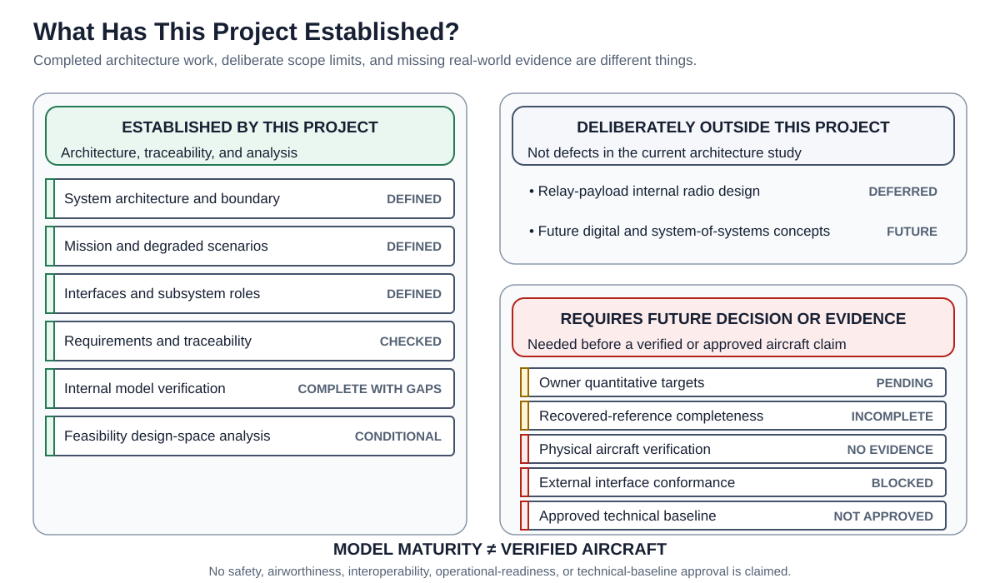

# Engineering Status

[Overview](../README.md) · [Architecture](architecture.md) · [Feasibility](feasibility.md) · **Engineering Status** · [Reference](reference/README.md)

The project has a coherent model-level architecture, logical interfaces, traceable requirements, and a reproducible exploratory feasibility analysis. It is not a selected, verified, or approved aircraft.

## What this study establishes

| Area | Established by this project | Still not established |
|---|---|---|
| System concept | Carrier, payload boundary, external actors, and mission behavior | An approved operating concept or procedure |
| Architecture | Functions, component roles, power paths, information flows, and degraded-state intent | Selected components, ratings, packaging, or detailed control behavior |
| Requirements and interfaces | A traceable logical set with explicit unknowns and deferred topics | Approved quantitative targets or endpoint compatibility |
| Feasibility | Conditional mass–power–battery–endurance–cost behavior | A point design or predicted aircraft performance |
| Evidence | Internal model review and reproducible analysis | Prototype, physical verification, or external conformance evidence |

Passing repository checks confirms structural consistency and generated-artifact freshness. It does not demonstrate safety, airworthiness, performance, interoperability, operational readiness, or approval.

## Decisions that unblock the next phase

The central owner decision is a coupled target package: payload service, endurance, portability, affordability, operating environment, reserve, and recovery policy must be set together. These choices define the design space; they should not be decided independently.

Other decisions remain open:

- the safety objective for uncontrolled descent and the responsible authority;
- the purpose, minimum content, and acceptance of aircraft health/status reporting;
- the terminology and standards posture used by the project; and
- the sourcing policy for the domestic-sourcing candidate.

The detailed decision records and their current dispositions are in [Decisions and Gaps](reference/decisions-and-gaps.md).

## Evidence the project still needs

No physical prototype verification has been performed. A future candidate would need evidence for measured mass and packaging fit, propulsion and hover performance, power regulation and thermal behavior, payload retention, station keeping, low-battery and payload-loss recovery, armed-state indication, and single-operator handling.

The external logical interfaces also need an authoritative endpoint basis and accepted conformance method before the project can claim compatibility. Relay radio implementation, spectrum authorization, antenna characteristics, and export-control review remain outside this study or owned externally.

## Important boundaries

The repository does not provide payload RF implementation, hardware selection, fabrication or assembly instructions, operating procedures, flight-test instructions, weapon integration, or a deployable communications-system specification. Future digital-payload, ground-vehicle, and broader system-of-systems ideas remain future work rather than implied parts of the current design.

## Recommended next engineering phase

1. Obtain owner decisions on the coupled target package and the outstanding safety, health/status, terminology, and sourcing questions.
2. Re-run the feasibility model against those authorized targets with supported component-class evidence.
3. Define payload packaging, electrical-service, retention, and operating-environment envelopes.
4. Develop a physical candidate and verification plan with clear safety and interface authorities.
5. Gather physical and external evidence before considering a technical-baseline approval.

For detailed requirements, verification activities, interfaces, traceability, decisions, and evidence records, use the [Engineering Reference](reference/README.md).
