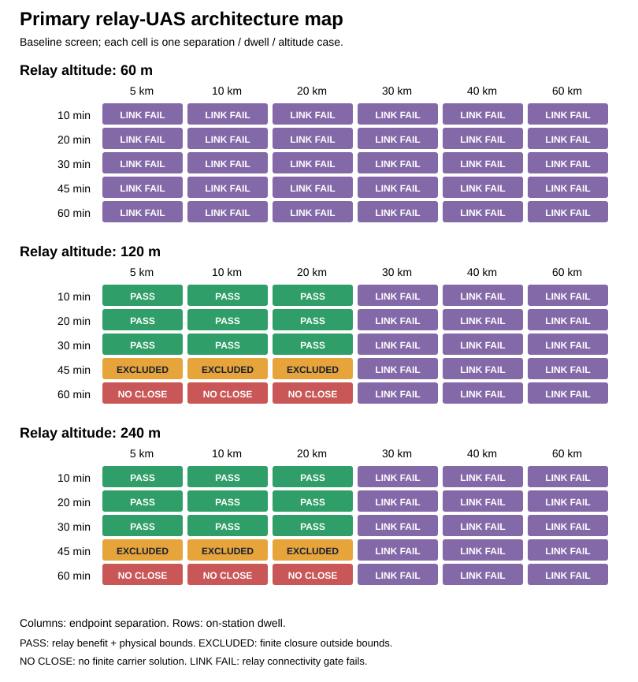

# Feasibility

[Overview](../README.md) · [Architecture](architecture.md) · **Feasibility** · [Engineering Status](engineering-status.md) · [Reference](reference/README.md)

## The question

Under what declared mission demands can the proposed small relay-UAS architecture provide useful connectivity while supporting its payload within exploratory physical bounds? The integrated analysis addresses that question; the broader carrier sweep explains supporting resource sensitivities. Neither sizes a selected aircraft.

For the mission-architecture result, the model covers Ground → Relay → Remote service during stationary hover dwell at constant atmospheric density under declared stylized visibility, link, and exploratory vehicle-boundary assumptions. It does not model transit, climb, descent, return, reverse-link service, full mission energy, bidirectional operational performance, or physical aircraft validation.

## Current model status

The carrier model is a conceptual, reproducible sizing representation. `reserve_fraction` is the fraction withheld from the energy remaining after the permitted depth-of-discharge limit, so usable energy is `depth_of_discharge × (1 − reserve_fraction)`. Its branch-aware affine calculation is authoritative for finite closure and physical-state reporting; fixed-point iteration is an independent numerical diagnostic. A numerical mass guard is reported as a guard event, not as mathematical nonclosure or a predicted aircraft mass. Nonclosing cases have no finite analytical model state or physical mass, power, energy, battery, rotor, or cost result.

The model also reports total disk area, equivalent rotor diameter, and a two-diameter quadrotor footprint proxy against explicitly unapproved practical analysis boundaries. A point may mathematically close yet fail those boundaries.

## Why endurance is coupled

Longer hover time is not a battery-only problem:

1. Payload and dry-aircraft mass set a starting gross mass.
2. Gross mass and rotor loading determine hover power.
3. Hover power and dwell time determine required battery energy.
4. Battery energy and the modeled peak-power allowance determine battery mass.
5. The larger battery increases gross mass, so hover power and battery demand rise again.

The relaxed iteration diagnoses the coupled loop, while a branch-aware affine calculation determines whether a finite analytical closure exists. As dwell time grows, the feedback becomes stronger: the battery must carry energy for both the aircraft and the additional battery mass caused by the endurance target.

For each fixed battery-sizing branch, the existing constant-disk-loading model has the form

$$
m = a m + b, \qquad m^* = \frac{b}{1-a}.
$$

Here `a` is the dimensionless resource-feedback coefficient and `b` is a fixed mass contribution. With the positive intercepts used here, a positive finite solution requires `a < 1` and consistency with the controlling energy- or power-sizing branch. Payload mass and DC demand change `b`; dwell and carrier assumptions can change `a`. A candidate from the wrong battery branch is not a valid closure.

As `a` approaches one from below, mass can exceed exploratory physical bounds while still remaining mathematically finite. If neither branch has a positive branch-consistent solution, relaxing a mass ceiling cannot restore closure. These are consequences of the existing conceptual equations, not new rotorcraft theory or validated aircraft limits.

## Primary relay-UAS result

The primary case uses the existing 0.20 kg payload and constant 14 W sizing allowance. For the 90 baseline screen cases, the ordered results are **18 physical-boundary passes / 6 finite practical exclusions / 6 mathematical nonclosures / 60 connectivity failures**. With +12 dB excess loss they are **6 / 2 / 2 / 80**. Classification applies connectivity before carrier gates, so these are mutually exclusive grid labels rather than independent failure frequencies.

The existing baseline cases at 10 km endpoint separation and 120 m relay altitude isolate the dwell limitation:

| Dwell | Analytical carrier result | Implication for the small relay UAS |
|---|---|---|
| 30 min | 8.6203 kg; exploratory physical-boundary pass | The declared outbound relay service and physical screening bounds are jointly satisfied; no operational or affordability approval follows |
| 45 min | 106.2456 kg; finite practical exclusion | A finite solution can lie far outside the small-carrier envelope; this is an extrapolation, not an aircraft proposal |
| 60 min | Mathematical nonclosure | Changing only an allowable mass ceiling cannot create a finite carrier solution |

| Governing limitation | Architecture decision implication |
|---|---|
| Connectivity failure | Extra dwell capacity cannot restore the modeled link; geometry or link assumptions would have to change |
| Finite practical exclusion | The declared resource demand and carrier assumptions are incompatible with the exploratory physical envelope; a larger allowable mass alone does not address rotor/span limits |
| Mathematical nonclosure | Dwell or carrier parameters governing resource feedback must change; practical-boundary relaxation is insufficient |

The 15 kg mass, 0.75 m rotor, and 1.5 m span boundaries are exploratory, not owner requirements. Span is twice equivalent rotor diameter, so rotor and span checks are redundant. Integrated physical pass is different from the standalone carrier cost/battery-fraction acceptance classes below. See [research status](IEEE_AERO_2027_RESEARCH_STATUS.md) for scenario assumptions, counting precedence, and limitations.

## Supporting carrier sensitivity inputs

The analysis varies payload mass and electrical demand, on-station endurance, battery performance, rotor loading and efficiency, environmental power margin, reserve, structural and propulsion allowances, and broad carrier-cost factors. It also checks conditional mass, cost, battery-fraction, and discharge boundaries.

| Input | Evaluated range | Interpretation |
|---|---|---|
| Payload mass | 0.25–2.0 kg | Unapproved payload sensitivity range |
| Payload power | 0–120 W | Black-box demand, not a selected radio |
| On-station endurance | 10–60 min | Unapproved mission sensitivity range |
| Installed battery specific energy | 130–220 Wh/kg | Component-class range; the upper end is optimistic |
| Rotor disk loading | 40–100 N/m² | Architecture variable |
| Environmental power margin | 1.0–1.3 | Generic operating-condition sensitivity |

The versioned [analysis inputs](../analysis/feasibility-inputs.yaml) identify the other assumptions, sources, and limitations. None is selected hardware or an approved target.

## What comes out

The model calculates finite-closure disk area, hover power, required and installed battery energy, battery mass, propulsion and structure allowances, gross mass, cost, convergence behavior, and a conditional feasibility class. It evaluates 225 deterministic grid cases and 4,096 low-discrepancy sensitivity candidates; physical mass and cost rankings exclude candidates without finite analytical closure.

## Supporting carrier sweep

The standalone carrier sweep finds a conditional region for short dwell and modest payload under reference-or-better assumptions. Endurance is the strongest ranked input in the finite-closure sensitivity subset. As dwell rises, the battery–mass–power feedback increases gross mass, installed energy, propulsion demand, and cost rapidly.

| Assumption bundle | Feasible | Marginal | Infeasible |
|---|---:|---:|---:|
| Favorable | 73 | 2 | 0 |
| Reference | 18 | 22 | 35 |
| Adverse | 0 | 0 | 75 |

In the reference 50 W payload-power slice, shorter dwell cases are generally feasible or marginal, 30-minute cases reach a payload-sensitive knee, and every evaluated 45- and 60-minute case is infeasible under the model's analysis boundaries.

“Feasible,” “marginal,” and “infeasible” are conditional analysis classes. They do not show compliance with an owner requirement, because no quantitative owner targets have been approved.

## What changes the region

For finite analytical closures, endurance is the strongest ranked input; battery specific power, payload mass, rotor figure of merit, disk loading, structural growth, and environmental margin also affect the conditional region. The ranking is conditional on the declared ranges and exploratory boundaries.

The analysis shows two battery regimes. At short dwell, the pack can be limited by the modeled peak-power allowance. At longer dwell, energy capacity dominates. The sampled reference battery branch switches between 20 and 30 minutes. The steep mass growth between 30 and 45 minutes is a separate approach to analytical nonclosure, not the battery-branch switch or a universal aircraft limit.

## Engineering implications

- Set payload service, endurance, portability, affordability, operating environment, reserve, and recovery policy together.
- Treat gross mass as a coupled output, not an independent value chosen before propulsion and battery sizing.
- Consider propulsion and battery classes together; efficiency, disk loading, specific energy, and specific power interact.
- Close packaging geometry and payload electrical and retention envelopes before treating the mass-only region as a physical design.
- Re-run the model with authorized targets and supported component-class evidence before selecting hardware.

The evidence supports conditional plausibility of short-dwell relay service within the examined assumptions. It does not establish readiness for a demonstration. Longer hover duration cannot be assumed to follow from a simple battery-capacity increase.

## What this does not establish

The model does not establish a point design, exact flight time, packaging fit, structural adequacy, thermal behavior, wind performance, battery safety, payload compatibility, spectrum authority, production cost, physical verification, or technical-baseline approval. The representative points are illustrations of the design space, not recommended aircraft.

For equations, sources, convergence behavior, detailed results, and limitations, read the [detailed feasibility analysis](reference/feasibility-analysis.md). To reproduce the artifacts, run [analysis/feasibility.py](../analysis/feasibility.py).

Next: read [Engineering Status](engineering-status.md) for the decisions and evidence needed before this design space can become a physical candidate.
