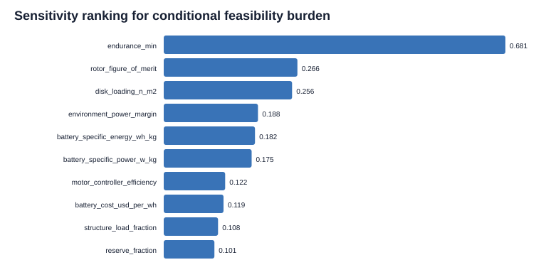
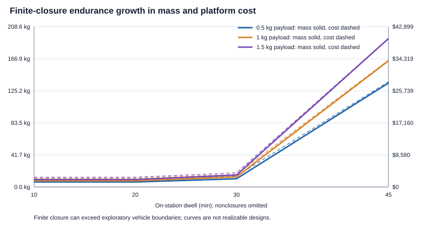

# Constrained Relay-UAS Design-Space Feasibility

[Overview](../../README.md) · [Architecture](../architecture.md) · [Feasibility](../feasibility.md) · [Engineering Status](../engineering-status.md) · [Reference index](README.md)

> **Conditional engineering analysis — not an approved design.** This report applies
> to `CFG-REP` / `CFG-DOM` in `0.9.0-baseline-candidate` and preserves the numerical
> analysis introduced at parent commit `e7a84d2`. The identifier/documentation
> migration did not change equations, inputs, or classifications. No owner target value, `DEC-*` record, component, technical baseline,
> physical verification, external conformance, RF implementation, build activity, or
> test activity is approved by this analysis.

## A. Executive Finding

A credible Relay-UAS physical design region exists, but it is **narrow under the
reference assumptions and highly sensitive to endurance and propulsion efficiency**.
The architecture is plausible for comparatively short dwell and modest payloads. It
is not yet credible to claim that a portable, low-cost multirotor can provide long
sustained dwell across the full explored payload range.

The deterministic sweep evaluated 225 grid points: 75 each under favorable,
reference, and adverse assumption bundles. Against the explicitly unapproved
10 kg / $2,500 reference classification boundaries:

| Assumption bundle | Feasible | Marginal | Infeasible |
| ----------------- | -------: | -------: | ---------: |
| Favorable | 73 | 2 | 0 |
| Reference | 18 | 22 | 35 |
| Adverse | 0 | 0 | 75 |

This spread is itself the central result. The concept does not fail universally, but
its feasibility is not robust to poor rotor performance, high disk loading, low
battery performance, structural growth, or environmental power burden. Under the
reference bundle, 10–20 minute cases are the credible core, 30-minute cases are
mostly marginal, and the 45–60 minute region generally becomes infeasible through
the coupled battery/mass/power feedback.

Every owner-requirement disposition remains **UNDETERMINED** because the project
owner has supplied no approved numeric target. The labels above are conditional
engineering classifications, not requirement-compliance results.

## B. Analysis Inputs

### Owner-controlled inputs

The five target packages are preserved exactly from the Architecture Decision and
Target Package.

| Owner target package | Status | Quantitative treatment in this sweep |
| -------------------- | ------ | ------------------------------------ |
| Relay-payload accommodation envelope | **ANALYSIS BOUNDARY CAN BE EXPLORED** | Payload mass `0.25–2.0 kg` and payload demand `0–120 W` are unapproved sweep bounds; volume remains undetermined |
| Relay-station service envelope | **ANALYSIS BOUNDARY CAN BE EXPLORED** | Endurance `10–60 min` and environmental power multiplier `1.00–1.30` are sensitivities; station tolerance and operating geometry remain undetermined |
| Affordability, attritability, and loss/recovery policy | **ANALYSIS BOUNDARY CAN BE EXPLORED** | Cost boundaries `$1,000–$5,000` and energy reserve `10–30%` are sensitivities, not requirements |
| Single-operator portability and handling envelope | **ANALYSIS BOUNDARY CAN BE EXPLORED** | Gross-mass boundaries `5–15 kg` are sensitivities; packed geometry and handling evidence remain undetermined |
| `CFG-DOM` sourcing policy | **OWNER VALUE NOT YET AVAILABLE** | No quantitative treatment is responsible until “domestic,” evidence, exceptions, and authority are defined |

No target package is **OWNER VALUE AVAILABLE**.

### Sourced engineering ranges

| Parameter | Range | Class and evidence use |
| --------- | ----- | ---------------------- |
| Installed battery specific energy | `130–220 Wh/kg` | **B. Exogenous evidence input.** Lower/reference values are anchored by NASA installed-pack observations; the upper bound is an optimistic cell-to-pack extrapolation, not a guaranteed pack value |
| Continuous battery specific power | `400–1,800 W/kg` | **B. Exogenous evidence input.** Broad energy-cell to power-cell range; pack-level validation is still required |
| Rotor figure of merit | `0.50–0.74` | **B. Exogenous evidence input.** Corrects ideal momentum power to shaft power |
| Motor/controller efficiency | `0.75–0.90` | **B. Exogenous evidence input.** Applied separately from rotor figure of merit |
| Installed propulsion specific power | `1.5–3.1 kW/kg` | **B. Exogenous evidence input.** Generic motor/controller-group range, not a product requirement |
| Sea-level density / gravity | `1.225 kg/m³` / `9.80665 m/s²` | **B. Exogenous evidence input.** Standard atmosphere constants |
| Avionics mass and cost | `0.25–0.65 kg`, `$200–$600` | **B. Exogenous evidence input.** Generic allowance bounded by representative official data; no controller selected |
| Battery and propulsion cost factors | `$0.30–$1.20/Wh`, `$180–$650/kW` | **B. Exogenous evidence input.** Low-volume class sensitivity; not a quote or BOM |

Primary evidence anchors are the [NASA small-UAS conceptual-design study](https://ntrs.nasa.gov/api/citations/20180008701/downloads/20180008701.pdf?attachment=true),
[NASA rotorcraft theory reference](https://rotorcraft.arc.nasa.gov/Publications/files/NASA%20TP-2009-215402-app3.pdf),
[NASA battery state-of-the-art review](https://www.nasa.gov/smallsat-institute/sst-soa/power-subsystems/),
[Molicel power-cell data](https://www.molicel.com/wp-content/uploads/INR21700P45B_1.2_Product-Data-Sheet-of-INR-21700-P45B-80109.pdf),
[NASA standard-atmosphere data](https://appel.nasa.gov/wp-content/uploads/2018/08/NASA-SP-367-Intro-to-Aero-of-Flight.pdf),
[NASA small-multicopter test program](https://rotorcraft.arc.nasa.gov/Research/Programs/UAS_Performance_Test.html),
[T-MOTOR class-level market data](https://store.tmotor.com/),
[Holybro class-level avionics data](https://holybro.com/products/pixhawk-6c), and the
[DOE production-scale battery-cost floor](https://www.energy.gov/cmei/vehicles/articles/fotw-1354-august-5-2024-electric-vehicle-battery-pack-costs-light-duty).
Representative commercial records are evidence anchors only and are not candidate
selections.

### Swept engineering design variables

The **C. Engineering design variables** are total disk loading, environmental power
margin, thrust margin, rotor mass allowance, base structure mass, structural growth
factor, disk-area structural penalty, avionics and power-electronics allowances,
mount allowance, auxiliary power, regulator efficiency, battery power margin, and
class-level cost factors.

### Derived outputs

The **D. Derived outputs** are total disk area and equivalent rotor diameter, ideal
induced power, estimated electrical hover power, required and installed battery
energy, energy- or power-limited battery mass, propulsion-group mass, structural
mass, gross mass, battery fraction, discharge margin, achieved endurance, cost by
architecture category, convergence status, and conditional feasibility class.
Gross mass is never independently specified by the solver.

## C. Quantitative Model

The model is implemented in `analysis/feasibility.py` with inputs in
`analysis/feasibility-inputs.yaml`. It uses only the Python standard library and
produces deterministic JSON, CSV, and SVG artifacts.

For gross mass `m`, gravitational acceleration `g`, air density `ρ`, and swept disk
loading `DL`:

```text
W = m g
A_total = W / DL
P_ideal = W^(3/2) / sqrt(2 ρ A_total)
P_propulsion = P_ideal / (FM η_drive) × k_environment
P_total = P_propulsion + P_auxiliary + P_payload / η_regulator
```

`P_ideal` is ideal momentum-theory induced power. Dividing by rotor figure of merit
and drive efficiency, then applying the environment sensitivity, produces an
architecture-level estimate of electrical propulsion power. It is not treated as
measured vehicle power.

Battery sizing uses the greater of the energy-limited and continuous-power-limited
mass:

```text
E_required = P_total × endurance / (depth_of_discharge × (1 - reserve))
m_energy = E_required / installed_specific_energy
m_power = P_peak × battery_power_margin / continuous_specific_power
m_battery = max(m_energy, m_power)

Here, `reserve` is the fraction withheld from the energy remaining after the permitted depth-of-discharge limit; it is not a fraction of nominal pack energy.
```

Propulsion-group mass grows with installed peak power and rotor area. Structural
mass contains a base allowance, a carried-mass growth factor, and a disk-area/arm
penalty. Battery, propulsion, structure, and gross mass are recalculated until the
relative gross-mass change is at most `1×10^-7`, with relaxation `0.55`, a limit of
200 iterations, and a 50 kg numerical-analysis guard. The guard is reported separately from mathematical finite closure and is not a predicted mass.

Conditional feasibility requires finite analytical closure and evaluates gross mass, platform
cost, battery fraction, and discharge margin against analysis-only boundaries. Numerical convergence is diagnostic only and cannot change the finite-state burden or class. These standalone carrier labels differ from the integrated mission classifier, which gates relay benefit, closure, and exploratory physical boundaries.
Platform cost covers structure, propulsion, avionics, battery, power electronics,
mount, and other carrier hardware. It excludes the black-box relay payload,
external systems, labor, integration, shipping, verification, and lifecycle cost.

Important limitations:

- This is a comparative conceptual model, not a rotor design, stress analysis,
  thermal analysis, stability analysis, detailed packaging model, or flight model.
- Disk loading and efficiency compress rotor geometry and detailed propeller behavior
  into architecture variables.
- The sweep holds each sampled disk-loading value while allowing total rotor area to
  grow with gross mass. The standalone conditional class does not enforce rotor diameter or footprint; the integrated mission classifier separately applies exploratory 15 kg mass, 0.75 m rotor, and 1.5 m span limits. Neither establishes packed geometry or owner-approved portability.
- Structure and cost are parametric. They require candidate-class evidence before
  supporting selection.
- Environmental burden is a generic sensitivity multiplier, not a wind requirement.
- Payload volume, station tolerance, command-link geometry, external conformance,
  and `CFG-DOM` sourcing are not quantitatively resolved.

## D. Feasible Design Region


The reference slice at 50 W payload demand shows three regions:

### FEASIBLE

- The conditional reference core is approximately `0.25–1.0 kg` payload and
  `10–20 min` dwell under the current generic ranges.
- A representative `0.5 kg`, `25 W`, `20 min` point converges in 49 iterations to
  `6.43 kg` gross mass, `2.13 kg` battery mass, `750 W` estimated station power,
  `362 Wh` installed energy, and `$2,075` platform-only cost.
- That representative pack is power-limited rather than energy-limited, illustrating
  that short dwell does not eliminate the peak-power constraint.

### MARGINAL

- Most reference `30 min` points are marginal: battery fraction approaches
  approximately `46–48%`, and cost or portability crosses the reference boundary.
- The representative `1.0 kg`, `50 W`, `30 min` point converges in 82 iterations to
  `13.18 kg`, `6.16 kg` battery mass, `1.51 kW` station power, `1,048 Wh` installed
  energy, and `$3,371` platform-only cost.
- Reference `1.5–2.0 kg` payload cases are already marginal at short dwell because
  platform mass and cost approach or exceed the exploratory boundaries.

### INFEASIBLE

- At `45 min`, finite reference solutions exceed analysis boundaries; at `60 min`, the reference model has mathematical nonclosure. The numerical guard is diagnostic and does not determine either class.
- The representative `1.5 kg`, `100 W`, `45 min` point is beyond the practical analysis boundaries. The analytical closure remains the reported physical state even when iteration reaches its limit. This remains a conditional architecture result, not a component sizing result.
- The adverse assumption bundle makes every grid point infeasible. This rules out
  claiming robust feasibility without bounding efficiency and structural quality.

### UNDETERMINED

- Compliance with owner requirements is undetermined for every point because no
  owner values are approved.
- Payload volume/packaging, station tolerance, actual environmental envelope,
  command-link geometry/conformance, recovery behavior, and `CFG-DOM` sourcing
  cannot be classified by this model.

## E. Dominant Sensitivities

The model evaluates 4,096 deterministic Halton samples across 17 variables. Physical mass, cost, and burden rankings use the 2,605 samples with finite analytical closure; 1,491 nonclosures are excluded rather than treated as physical values. Rankings are the root-mean-square of absolute Spearman relationships with gross mass, platform cost, and conditional feasibility burden.

| Rank | Variable | Sensitivity score | Direction of effect |
| ---: | -------- | ----------------: | ------------------- |
| 1 | Endurance | `0.576` | Higher endurance increases finite-closure mass, cost, and burden |
| 2 | Battery specific power | `0.221` | Higher specific power reduces finite-closure mass, cost, and burden |
| 3 | Payload mass | `0.198` | Higher payload mass increases finite-closure mass, cost, and burden |
| 4 | Analysis cost boundary | `0.126` | Changes the conditional burden boundary, not physical closure |
| 5 | Rotor figure of merit | `0.126` | Higher figure of merit reduces finite-closure mass, cost, and burden |
| 6 | Disk loading | `0.124` | Higher disk loading increases finite-closure mass, cost, and burden |
| 7 | Analysis portability mass | `0.105` | Changes the conditional burden boundary, not physical closure |
| 8 | Structural growth factor | `0.102` | Added carried-mass penalty increases finite-closure mass and cost |
| 9 | Environmental power margin | `0.096` | Higher margin increases finite-closure mass, cost, and burden |
| 10 | Structure base mass | `0.077` | Higher base mass increases finite-closure mass, cost, and burden |

The finite-closure ranking is conditional on excluding nonclosures and on the explored ranges. Payload mass and power remain owner-controlled boundary conditions; the ranking does not support payload selection or physical-aircraft predictions.



## F. Mass-Power-Endurance Finding

The battery/mass/hover-power feedback is real, coupled, piecewise, and produces a
clear knee in the explored design space.
The reference model is power-limited at short dwell: a minimum battery mass is needed
to supply peak propulsion demand, so reducing the endurance target from 20 minutes
to 10 minutes does not necessarily reduce pack mass. As endurance increases, sizing
switches to energy-limited behavior. Near 30 minutes the battery becomes roughly
half of gross mass, and beyond that point extra endurance increases battery mass,
gross mass, disk area, structure, propulsion power, and then battery mass again.



The analysis therefore establishes two different battery regimes:

1. **Short-dwell power-limited region:** battery specific power and propulsion peak
   demand matter as much as energy density.
2. **Longer-dwell energy-limited region:** specific energy, rotor efficiency, disk
   loading, and structural growth control analytical closure and its finite mass.

The 30-to-45-minute transition is the current reference-model knee, not a requirement
or universal aircraft limit. Its location moves substantially with the sourced and
engineering ranges.

## G. Cost and Attritability Finding

Low cost and useful endurance are compatible only in a conditional, limited region.
For the representative 30-minute point, the platform-only cost contributors rank:

| Category | Estimated cost |
| -------- | -------------: |
| Propulsion | `$1,158` |
| Battery | `$734` |
| Structure | `$629` |
| Avionics | `$350` |
| Other carrier hardware | `$225` |
| Power electronics | `$150` |
| Mount | `$125` |

Propulsion, battery, and structure dominate. The finding refines the earlier belief
that battery alone would necessarily dominate reusable cost: in the reference model,
the installed propulsion class is the largest cost category, while battery becomes
dominant as endurance grows. Because all cost factors are class-level ranges and the
relay payload is excluded, this is a sensitivity finding rather than a budget claim.

The attritable objective is credible for short-dwell, modest-payload cases under
reference or better assumptions. It is not credible across the long-dwell reference
region. The owner must define recurring-unit cost, payload inclusion, reusable/lost
hardware boundary, and recovery policy before `REQ-009` can be evaluated.

## H. Trade-Study Implications

### TS-001 — Airframe material and construction

- **Established:** structural growth is a meaningful but secondary sensitivity, and
  it amplifies battery feedback.
- **Ruled out:** treating structure as a fixed afterthought independent of battery,
  rotor area, and payload.
- **Unresolved:** material, manufacturing method, detailed load basis, damage
  tolerance, and `CFG-DOM` sourcing.
- **Component-level research:** class-level structural concepts and mass models are
  justified; product/material selection is not.
- **Next input:** owner portability envelope and payload volume/mount geometry.

### TS-002 — Propulsion sizing

- **Established:** within the finite-closure sensitivity subset, endurance is the strongest ranked input; battery specific power, payload mass, rotor figure of merit, disk loading, structural growth, and environmental margin also affect the conditional region.
- **Ruled out:** high disk loading with mediocre efficiency as a robust basis for
  long dwell.
- **Unresolved:** actual rotor geometry, thrust distribution, control margin,
  component ratings, and environmental load.
- **Component-level research:** performance-map collection by propulsion class is
  justified; actual motor/propeller/ESC comparison waits on owner targets.
- **Next input:** service/endurance and environmental envelope.

### TS-003 — Battery architecture

- **Established:** battery sizing must use the greater of energy and power limits;
  the controlling regime changes with endurance.
- **Ruled out:** single-pass energy-only sizing and the assumption that shorter dwell
  always reduces battery mass.
- **Unresolved:** chemistry, topology, pack overhead, thermal behavior, cycle/loss
  policy, safety evidence, and actual pack performance.
- **Component-level research:** battery-class data collection is justified for both
  specific energy and specific power; product ranking is not.
- **Next input:** owner endurance, reserve/recovery policy, cost boundary, and payload
  power envelope.

### TS-004 — Payload power allocation

- **Established:** `0–120 W` payload demand is not the dominant reference sensitivity
  because propulsion power is larger, but it directly consumes mission energy and
  rail capacity.
- **Ruled out:** none; the owner range is missing.
- **Unresolved:** voltage, current, transient, protection, thermal, and connector
  envelope.
- **Component-level research:** generic regulator efficiency and mass data are
  justified after the electrical-demand envelope is supplied.
- **Next input:** owner payload electrical-service envelope.

### TS-006 — Payload mount standard

- **Established:** mount and structural penalties must scale with payload load and
  participate in the gross-mass loop.
- **Ruled out:** selecting a mount independently from payload mass, volume, and load
  basis.
- **Unresolved:** volume, geometry, retention margin, inspection basis, and physical
  load evidence.
- **Component-level research:** mount-concept research is only partially justified;
  packaging remains blocked.
- **Next input:** payload mass/volume envelope and applicable load/margin authority.

### TS-005, TS-007, TS-008, TS-010, and TS-011

- `TS-005` remains open: no flight-controller candidate comparison is justified
  before `TS-007` and `TS-008` define navigation, command, I/O, and authority needs.
- `TS-007` remains open: station tolerance is missing, but propulsion/energy impact
  can now be included once a navigation concept is proposed.
- `TS-008` remains externally blocked: no platform-command product or RF parameter
  was introduced.
- `TS-010` remains open: its generic `1.00–1.30` power multiplier ranks ninth in the corrected finite-closure aggregate sensitivity. This conditional ranking does not measure its influence on nonclosure; an approved environment remains an upstream need.
- `TS-011` remains open: reserve fraction is quantitatively relevant, but recovery
  policy and `DEC-003` are not approved.

`TS-009` remains **deferred_out_of_scope** and unchanged.

## I. Requirements / Gap Implications

- `REQ-010`: endurance is confirmed as the dominant owner-controlled target. No
  value is selected.
- `REQ-011`: gross mass is quantitatively confirmed as a derived output. It
  should not become an independent owner value without a separate handling,
  transport, or regulatory basis.
- `REQ-009`: actual platform cost is derived and must be compared with an owner
  boundary that defines inclusions and loss/reuse accounting.
- `REQ-012` and `REQ-015`: payload mass, volume, and electrical demand remain
  owner inputs; volume remains entirely undetermined here.
- `REQ-017`: retention margin remains derived from loads and authority, not from
  this parametric structure model.
- `REQ-003`: station tolerance remains unresolved; no environmental sensitivity
  value is a requirement.
- `GAP-BUDGET-001`: narrowed from an unexecuted coupling to a reproducible,
  quantified conditional design region. It remains open because owner targets and
  candidate-class evidence are missing.
- `GAP-VER-001`, `GAP-IFC-001`, and `GAP-HAZ-001` remain open. `VER-008` remains
  unexecuted and `VER-009` remains externally blocked.

No requirement is marked satisfied or verified by the sweep.

## J. Component-Research Readiness

**PARTIALLY READY.** The project is ready for component-**class** evidence collection
and screening-method definition in these categories:

- propulsion groups, using disk loading, rotor figure of merit, electrical
  efficiency, installed peak power, and mass as comparison dimensions;
- battery classes, using installed specific energy, continuous specific power, pack
  overhead, usable fraction, and cost per Wh;
- structural concepts, using base mass, load-growth behavior, disk-area/arm penalty,
  cost, and portability;
- payload power-conversion classes, once the owner supplies the electrical-service
  envelope.

The project is **not ready** to select or rank actual motors, propellers, ESCs,
batteries, frames, flight controllers, radios, mounts, or payloads. Required class
characteristics can be expressed as ranges from the feasible region, but they cannot
become procurement criteria until the owner supplies target values. Flight-control
and platform-command categories remain specifically blocked by `TS-007`, `TS-008`,
and external authority.

## K. Remaining Owner Inputs

The five target packages remain the governing minimum. The next decision-quality
increase requires:

1. payload mass, volume, and electrical-demand service envelope;
2. endurance threshold/objective, station tolerance, operating environment, and
   platform operating geometry;
3. recurring-unit cost boundary plus payload inclusion, loss/reuse, reserve, and
   recovery policy;
4. quantitative single-operator transport/carry/launch/recovery envelope;
5. `CFG-DOM` sourcing definition, evidence standard, exceptions, and authority.

Owner disposition of `DEC-002` through `DEC-005` is also still required. The sweep
used the recommendations only as labeled assumptions and did not approve them.

## L. Recommended Next Work Package

**Work-package title: Owner Target Disposition and Component-Class Evidence Plan**

The next pass should not rank products. It should:

1. obtain owner disposition of `DEC-002` through `DEC-005` and the five target
   packages;
2. encode approved thresholds, objectives, ranges, and policies without turning
   sensitivity bounds into requirements;
3. rerun this model over the approved region and identify which conditional classes
   survive;
4. define evidence templates for propulsion, battery, structure/mount, and power
   conversion classes, including required data fields, provenance, uncertainty, and
   exclusion criteria;
5. decide whether the surviving design region is narrow enough to authorize a later
   COTS candidate comparison.

Success means the feasible region is bounded by owner-authorized objectives and the
project can state class-level evaluation criteria without selecting hardware.

## M. Configuration Record

- **Parent commit SHA:** `e7a84d2` (`Add architecture decision and target package`).
- **Input artifact:** `analysis/feasibility-inputs.yaml`.
- **Executable artifact:** `analysis/feasibility.py`.
- **Generated data:** `analysis/results/feasibility-summary.json`,
  `feasibility-grid.csv`, `sensitivity-ranking.csv`, and `convergence-traces.csv`.
- **Generated plots:** `analysis/results/feasible-region.svg`,
  `endurance-mass-cost.svg`, and `sensitivity-ranking.svg`.
- **Engineering report:** `docs/reference/feasibility-analysis.md`.
- **Files changed for this work package:** `README.md`, `model/system.yaml`,
  `model/assurance.yaml`, `model/traceability.yaml`, `trade-studies.md`,
  `scripts/validate-baseline.py`, the generated `docs/reference/baseline.md`, and the
  feasibility inputs, executable, results, and report under `analysis/` and
  `docs/reference/feasibility-analysis.md`.
- **Model version:** `0.9.0-baseline-candidate`; numerical analysis remains unchanged while owner targets and
  architecture intent remain unapproved.
- **Work-package disposition:** approved by the project owner for repository
  inclusion on 2026-08-11. This accepts the analysis package and its conditional
  findings only; it does not approve the technical baseline, analysis boundaries,
  requirements, decisions, components, physical verification, or external
  conformance.
- **Final local commit SHA:** assigned by the commit containing this report and
  reported in the repository handoff.
- **Validation:** deterministic analysis generation/check, full baseline validation,
  generated-view consistency, CI-equivalent validation, `git diff --check`, and
  Mermaid structural validation passed at handoff. Pinned `mmdc` 11.4.1 rendering:
  **SKIPPED — not installed locally**, which is not a standard-validation failure.
- **Preserved constraints:** `TS-009` deferred; `VER-008` unexecuted; `VER-009`
  blocked; technical baseline not approved; no component selection, RF parameter,
  build procedure, integration procedure, or flight-test procedure introduced.
