<!-- GENERATED VIEW: DO NOT EDIT. Run python scripts/generate-mermaid-views.py -->
# Generated Architecture Views

> **Baseline Candidate - Not Approved.** These diagrams are generated from
> `system.yaml`, catalogs under `model/`, and `.seal/proof.yaml`. They have no
> independent architecture authority. Candidate, proposed, deferred, and
> unresolved labels do not imply approval or executed verification.

The diagrams deliberately omit RF implementation values, build instructions,
operating procedures, and detailed recovered-item mapping. `CFG-REC` is shown
only as a descriptive evidence configuration and does not inherit the proposed
`CFG-REP`/`CFG-DOM` resource decomposition.

## Configuration and context views

### 1. Configuration derivation

Configuration scope: `CFG-REC / CFG-REP / CFG-DOM / CFG-DIG / CFG-SOS`.

Derivation denotes an architecture relationship, not exact inheritance, equivalence, or approval.

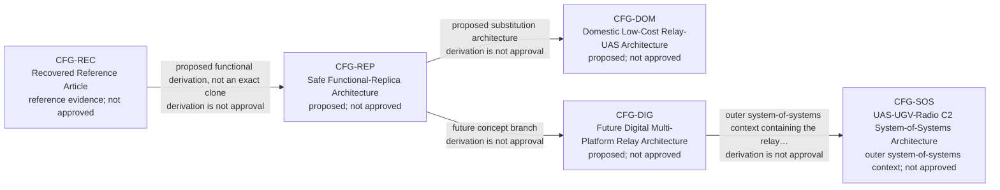

### 2. Two-boundary context

Configuration scope: `CFG-SOS outer context; CFG-REP / CFG-DOM / CFG-DIG inner constituent`.

External constituents remain independently managed. Dashed relationships are proposed or TBD.

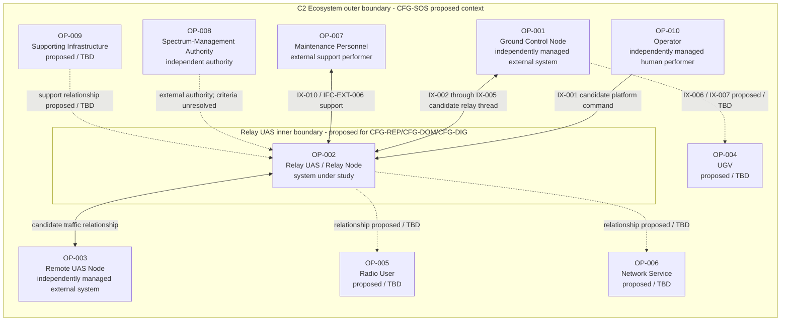

### 3. Current three-node operational connectivity

Configuration scope: `CFG-REP / CFG-DOM`.

`IX-001` is independent Relay-UAS platform command. `IX-002` through `IX-005` are relayed mission traffic.

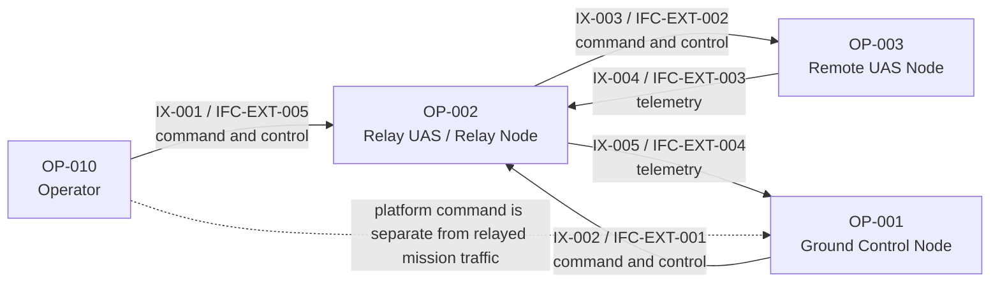

## Relay-UAS resource views

### 4A. Structure and payload mounting

Configuration scope: `CFG-REP / CFG-DOM`.

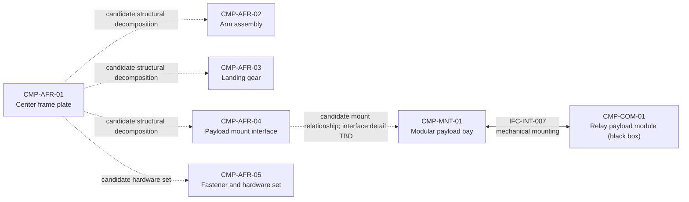

### 4B. Power and propulsion connectivity

Configuration scope: `CFG-REP / CFG-DOM`.

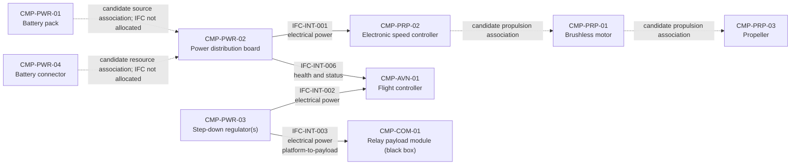

### 4C. Avionics and platform control connectivity

Configuration scope: `CFG-REP / CFG-DOM`.

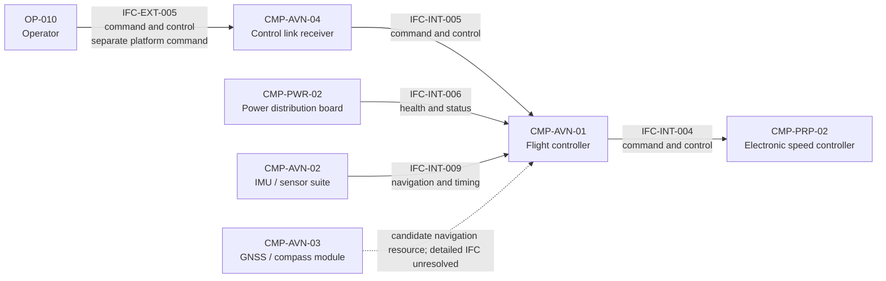

### 4D. Payload boundary and external traffic

Configuration scope: `CFG-REP / CFG-DOM`.

`IFC-INT-010` stays inside the payload black-box envelope. Only `IFC-INT-003` and `IFC-INT-007` cross from platform to payload.

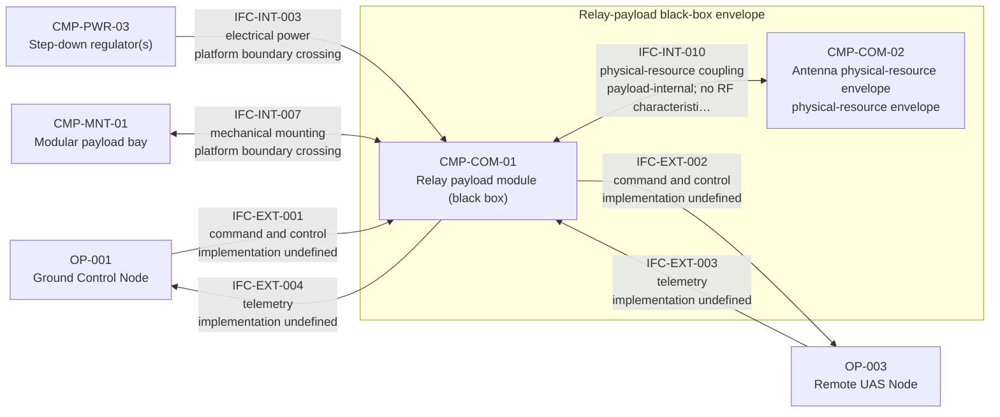

### 4E. Maintenance and configuration support

Configuration scope: `CFG-REP / CFG-DOM / CFG-DIG / CFG-SOS`.

This support/governance interface is intentionally omitted from airborne mission-traffic diagrams.

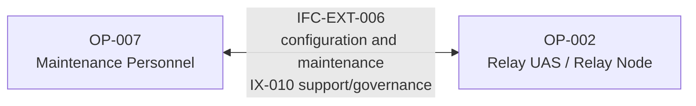

### 4F. Future digital interface delta

Configuration scope: `CFG-DIG / CFG-SOS only`.

`IFC-INT-008` is not part of the current `CFG-REP`/`CFG-DOM` two-interface payload boundary.

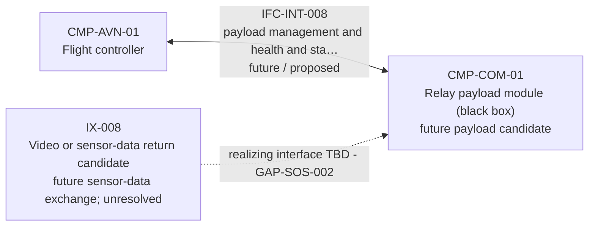

## Behavioral views

### 5. Operating-mode state

Configuration scope: `CFG-REP / CFG-DOM`.

Only transitions supported by current scenarios or requirements are shown; all remain candidate unless stated otherwise.

```mermaid
stateDiagram-v2
    %% Configuration scope: CFG-REP / CFG-DOM
    state "MODE-005 Ground Safe" as MODE_005
    state "MODE-001 Transit" as MODE_001
    state "MODE-002 Station Keeping" as MODE_002
    state "MODE-003 Relay Degraded" as MODE_003
    state "MODE-004 Return / Recovery" as MODE_004
    [*] --> MODE_005
    MODE_005 --> MODE_001: SCN-002 candidate transition
    MODE_001 --> MODE_002: SCN-002 station established; candidate
    MODE_002 --> MODE_003: SCN-007 relay function degraded
    MODE_003 --> MODE_004: SCN-007 recovery intent; candidate
    MODE_002 --> MODE_004: SCN-008 termination or REQ-FUN-005
    MODE_004 --> MODE_005: SCN-008 recovered; candidate
    note right of MODE_003
      Payload function degraded
      Platform control may remain available
      REQ-FUN-007 candidate; evidence deferred
    end note
```

### 6. Launch and positioning sequence

Configuration scope: `CFG-REP / CFG-DOM`.

```mermaid
sequenceDiagram
    %% Configuration scope: CFG-REP / CFG-DOM
    participant Operator as OP-010 Operator
    participant Receiver as CMP-AVN-04 Control receiver
    participant Flight as CMP-AVN-01 Flight-control resource
    participant Nav as CMP-AVN-02 Navigation/sensor resources
    participant Propulsion as CMP-PRP-02 Propulsion control
    participant Relay as OP-002 Relay UAS health/status
    Operator->>Receiver: IX-001 / IFC-EXT-005 platform command intent
    Receiver->>Flight: IFC-INT-005 platform control input
    Nav-->>Flight: IFC-INT-009 navigation/timing information
    Flight->>Propulsion: IFC-INT-004 candidate propulsion command
    Relay-->>Operator: IX-009 health/status (partial realization; GAP-SOS-003)
    Note over Operator,Relay: SCN-002 candidate walkthrough; no protocol, timing, or procedure defined
```

### 7. Bidirectional relay sequence

Configuration scope: `CFG-REP / CFG-DOM`.

```mermaid
sequenceDiagram
    %% Configuration scope: CFG-REP / CFG-DOM
    participant Operator as OP-010 Platform operator
    participant Platform as CMP-AVN-04 Platform command receiver
    participant Ground as OP-001 Ground control node
    participant Payload as CMP-COM-01 Relay payload black box
    participant Remote as OP-003 Remote UAS
    Operator->>Platform: IX-001 / IFC-EXT-005 separate Relay-UAS platform command
    rect rgb(245, 245, 245)
        Ground->>Payload: IX-002 / IFC-EXT-001 outbound traffic
        Payload->>Remote: IX-003 / IFC-EXT-002 outbound traffic
        Remote-->>Payload: IX-004 / IFC-EXT-003 return telemetry
        Payload-->>Ground: IX-005 / IFC-EXT-004 return telemetry
    end
    Note over Ground,Remote: SCN-003 / SCN-004 logical relay only; external paths intentionally undefined
```

### 8. Degradation and recovery sequence

Configuration scope: `CFG-REP / CFG-DOM`.

The second path terminates at explicit gaps; it does not invent a recovery behavior.

```mermaid
sequenceDiagram
    %% Configuration scope: CFG-REP / CFG-DOM
    participant Ground as OP-001 Ground control node
    participant Payload as CMP-COM-01 Relay payload black box
    participant Relay as OP-002 Relay UAS platform
    participant Operator as OP-010 Platform operator
    Payload--xGround: SCN-007 relay function loss or degradation
    Relay-->>Operator: IX-009 health/status indication (partial)
    Operator->>Relay: IX-001 / IFC-EXT-005 independent platform command
    alt Payload lost; platform remains controllable
        Note over Payload,Relay: MODE-003 Relay Degraded; CTL-004 / REQ-FUN-007 candidate
        Relay-->>Operator: transition intent toward MODE-004 Return / Recovery
    else Platform control also impaired
        Note over Relay,Operator: HAZ-001 / GAP-HAZ-001 - no modeled consequence-management behavior
        Note over Ground,Operator: GAP-VER-001 - no executed recovery evidence
    end
```

### 9. Scenario lifecycle

Configuration scope: `CFG-REP / CFG-DOM current; CFG-DIG / CFG-SOS proposed branches`.

Dashed branches are future proposals without complete activity, interface, requirement, hazard, or verification allocation.

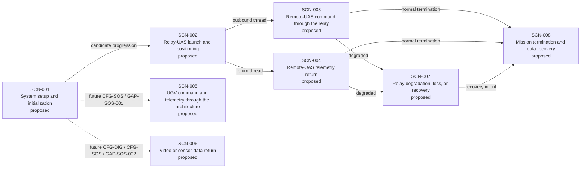

## Assurance and traceability views

### 10. Hazard-control-requirement-verification

Configuration scope: `CFG-REP / CFG-DOM`.

Verification nodes are candidate or deferred methods. They are not executed evidence and provide no approval or safety credit.

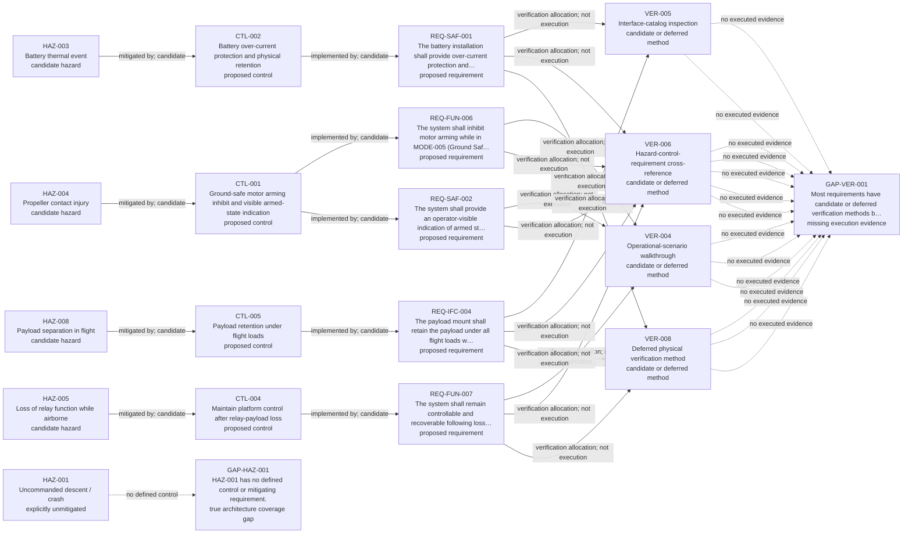

### 11. End-to-end architecture trace

Configuration scope: `CFG-REP / CFG-DOM`.

The thread is readable end to end, but candidate relationships and evidence gaps remain visible.

```mermaid
flowchart LR
    %% Configuration scope: CFG-REP / CFG-DOM
    NEED_001["NEED-001<br/>Extend command, telemetry, and permitted mission-data reach through…<br/>proposed"]
    CAP_001["CAP-001<br/>Beyond-Line-of-Sight Control<br/>proposed"]
    SCN_003["SCN-003<br/>Remote-UAS command through the relay<br/>proposed"]
    OA_004["OA-004<br/>Relay outbound traffic<br/>proposed"]
    IX_002["IX-002<br/>Remote-UAS command toward relay<br/>proposed"]
    IX_003["IX-003<br/>Remote-UAS command from relay<br/>proposed"]
    FUN_REL_01["FUN-REL-01<br/>Relay outbound traffic<br/>proposed"]
    CMP_COM_01["CMP-COM-01<br/>Relay payload module (black box)<br/>proposed"]
    IFC_EXT_001["IFC-EXT-001<br/>Ground-control outbound traffic to relay payload<br/>proposed"]
    IFC_EXT_002["IFC-EXT-002<br/>Relay-payload outbound traffic to remote UAS<br/>proposed"]
    REQ_FUN_001["REQ-FUN-001<br/>The system shall relay outbound traffic from a ground control node…<br/>proposed"]
    VER_001["VER-001<br/>Requirement and architecture analysis<br/>proposed"]
    VER_004["VER-004<br/>Operational-scenario walkthrough<br/>proposed"]
    GAP_VER_001["GAP-VER-001<br/>Most requirements have candidate or deferred verification methods b…<br/>candidate"]
    NEED_001 -->|"motivates; candidate"| CAP_001
    CAP_001 -->|"exercised by; candidate"| SCN_003
    SCN_003 -->|"uses; candidate"| OA_004
    OA_004 -->|"information exchange; candidate"| IX_002
    OA_004 -->|"information exchange; candidate"| IX_003
    IX_002 -->|"supports; candidate"| FUN_REL_01
    IX_003 -->|"supports; candidate"| FUN_REL_01
    FUN_REL_01 -->|"allocated to; candidate"| CMP_COM_01
    CMP_COM_01 -->|"external interface; candidate"| IFC_EXT_001
    CMP_COM_01 -->|"external interface; candidate"| IFC_EXT_002
    IFC_EXT_001 -->|"allocated requirement; candidate"| REQ_FUN_001
    IFC_EXT_002 -->|"allocated requirement; candidate"| REQ_FUN_001
    REQ_FUN_001 -->|"verification allocation; candidate"| VER_001
    REQ_FUN_001 -->|"verification allocation; candidate"| VER_004
    VER_001 -.->|"execution evidence unresolved"| GAP_VER_001
    VER_004 -.->|"execution evidence unresolved"| GAP_VER_001
```

### 12. Evidence and approval governance

Configuration scope: `Project governance; CFG-REC evidence semantics; all configurations remain not approved`.

Evidence supports claims; it does not approve architecture. Proposed decisions require explicit owner action.

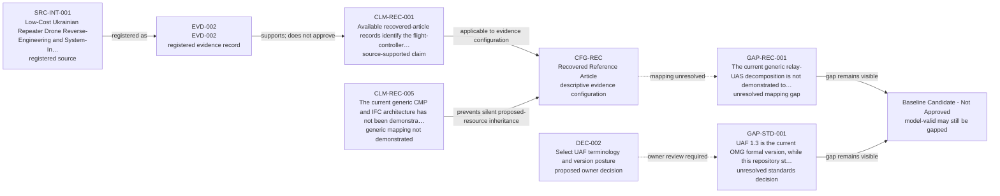

### 13. Requirement relationship example - Ground Safe arming

Configuration scope: `CFG-REP / CFG-DOM`.

A flowchart is used instead of `requirementDiagram` to stay within the most consistently rendered GitHub Mermaid subset when no pinned local parser is available.

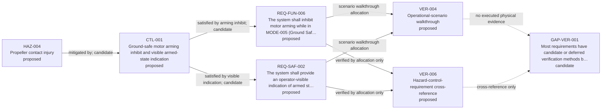

## Generated interface inventory

This inventory is generated directly from `model/interfaces.yaml`. Empty
verification cells are explicit gaps, not evidence of completion.

| ID | Endpoints | Direction | Flow class | Configurations | Maturity | Verification | Unknown attributes |
|---|---|---|---|---|---|---|---|
| IFC-INT-001 | CMP-PWR-02 to CMP-PRP-02 | a_to_b | electrical power | CFG-REP, CFG-DOM | proposed_design / proposed | VER-005, VER-008 | voltage; current; connector; protection; wiring allocation |
| IFC-INT-002 | CMP-PWR-03 to CMP-AVN-01 | a_to_b | electrical power | CFG-REP, CFG-DOM | proposed_design / proposed | VER-005, VER-008 | voltage; current; connector; power-quality envelope |
| IFC-INT-003 | CMP-PWR-03 to CMP-COM-01 | a_to_b | electrical power | CFG-REP, CFG-DOM | proposed_design / proposed | VER-005, VER-008 | voltage envelope; current envelope; connector; protection; thermal allocation |
| IFC-INT-004 | CMP-AVN-01 to CMP-PRP-02 | a_to_b | command and control | CFG-REP, CFG-DOM | proposed_design / proposed | VER-005, VER-008 | signal format; timing; connector; fault response |
| IFC-INT-005 | CMP-AVN-04 to CMP-AVN-01 | a_to_b | command and control | CFG-REP, CFG-DOM | proposed_design / proposed | VER-005, VER-008 | protocol; connector; timing; failsafe behavior |
| IFC-INT-006 | CMP-PWR-02 to CMP-AVN-01 | a_to_b | health and status | CFG-REP, CFG-DOM | proposed_design / proposed | VER-005, VER-008 | measurement set; accuracy; update rate; connector; fault indication |
| IFC-INT-007 | CMP-MNT-01 to CMP-COM-01 | bidirectional_physical | mechanical mounting | CFG-REP, CFG-DOM | proposed_design / proposed | VER-005, VER-008 | geometry; load envelope; retention margin; inspection criteria |
| IFC-EXT-001 | OP-001 to CMP-COM-01 | a_to_b | command and control | CFG-REP, CFG-DOM | proposed_design / proposed | None - explicit gap | frequency; waveform; protocol; power; data rate; message format; endpoint compatibility; verification authority |
| IFC-EXT-002 | CMP-COM-01 to OP-003 | a_to_b | command and control | CFG-REP, CFG-DOM | proposed_design / proposed | None - explicit gap | frequency; waveform; protocol; power; data rate; message format; endpoint compatibility; verification authority |
| IFC-EXT-003 | OP-003 to CMP-COM-01 | a_to_b | telemetry | CFG-REP, CFG-DOM | proposed_design / proposed | None - explicit gap | frequency; waveform; protocol; power; data rate; message format; endpoint compatibility; verification authority |
| IFC-EXT-004 | CMP-COM-01 to OP-001 | a_to_b | telemetry | CFG-REP, CFG-DOM | proposed_design / proposed | None - explicit gap | frequency; waveform; protocol; power; data rate; message format; endpoint compatibility; verification authority |
| IFC-EXT-005 | OP-010 to CMP-AVN-04 | a_to_b | command and control | CFG-REP, CFG-DOM | proposed_design / proposed | None - explicit gap | frequency; waveform; protocol; power; message format; failsafe behavior; verification authority |
| IFC-INT-008 | CMP-AVN-01 to CMP-COM-01 | bidirectional | payload management and health and status | CFG-DIG, CFG-SOS | proposed_design / proposed | VER-004, VER-005, VER-007 | adoption decision; data model; protocol; connector; timing; authority; failure response |
| IFC-INT-009 | CMP-AVN-02 to CMP-AVN-01 | a_to_b | navigation and timing | CFG-REP, CFG-DOM | engineering_inference / proposed | VER-005, VER-008 | sensor set; data format; timing; accuracy; fault detection; connector |
| IFC-INT-010 | CMP-COM-01 to CMP-COM-02 | bidirectional_physical | physical-resource coupling | CFG-REP, CFG-DOM | proposed_design / proposed | None - explicit gap | antenna count; role; placement; connector; all RF characteristics |
| IFC-EXT-006 | OP-007 to OP-002 | bidirectional | configuration and maintenance | CFG-REP, CFG-DOM, CFG-DIG, CFG-SOS | proposed_design / proposed | VER-004, VER-005, VER-007 | data set; format; transport; authorization; retention period; tool ownership |

## Validation notes

- Optional syntax validation expects Mermaid CLI `mmdc` 11.4.1 when installed locally.
- Absence of Node.js or the pinned CLI does not invalidate standard-library catalog validation.
- No generated SVG or PNG is required; GitHub-rendered Markdown is the primary artifact.
