<!-- GENERATED VIEW: DO NOT EDIT. Run python scripts/generate-mermaid-views.py -->
# Generated Architecture Views

> **Baseline Candidate - Not Approved.** These diagrams are generated from
> `system.yaml`, catalogs under `model/`, and `.seal/proof.yaml`. They have no
> independent architecture authority. Candidate, proposed, deferred, and
> unresolved labels do not imply approval or executed verification.

The diagrams deliberately omit RF implementation values, build instructions,
operating procedures, and recovered implementation detail. `CFG-REC` is shown
only as a descriptive evidence configuration and does not inherit the proposed
`CFG-REP`/`CFG-DOM` resource decomposition.

## Configuration and context views

### 1. Configuration derivation and delta

Configuration scope: `CFG-REC / CFG-REP / CFG-DOM / CFG-DIG / CFG-SOS`.

Derivation denotes lineage, not exact inheritance, equivalence, or approval. Future context is outside the current implementation baseline.

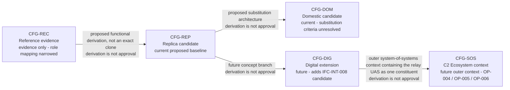

### 2. Two-boundary context

Configuration scope: `CFG-SOS outer context - CFG-REP / CFG-DOM / CFG-DIG inner constituent`.

External constituents remain independently managed. Only catalogued information exchanges are drawn; unconnected future actors remain context, not implied interfaces.

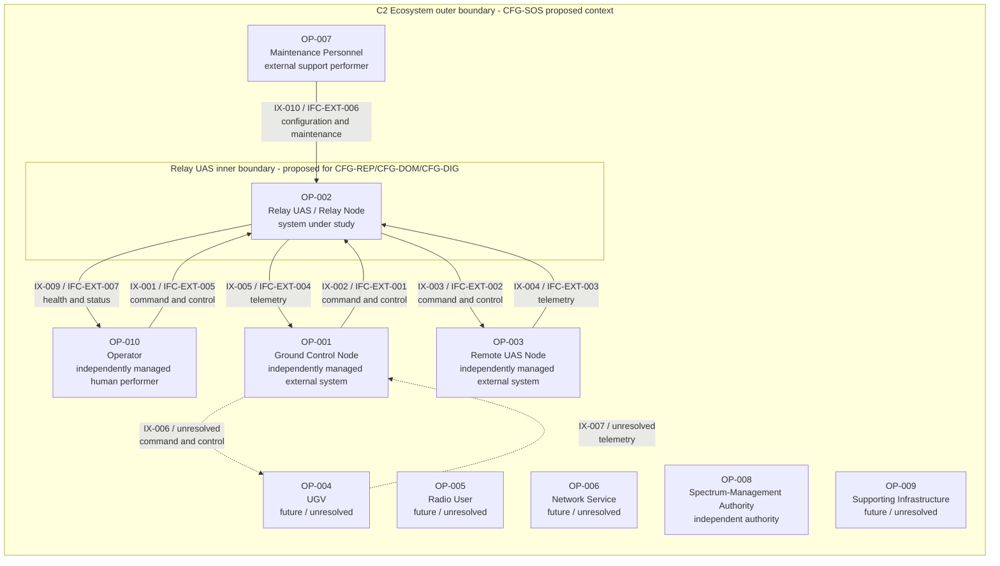

### 3. Current three-node operational connectivity

Configuration scope: `CFG-REP / CFG-DOM`.

`IX-001` is independent Relay-UAS platform command. `IX-002` through `IX-005` are relayed mission traffic.

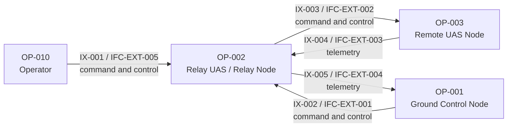

## Relay-UAS resource views

### 4A. Structure and payload mounting

Configuration scope: `CFG-REP / CFG-DOM`.

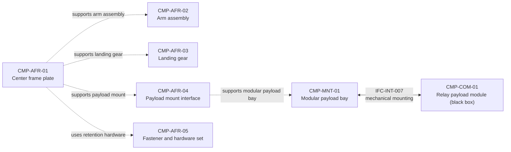

### 4B. Power and propulsion connectivity

Configuration scope: `CFG-REP / CFG-DOM`.

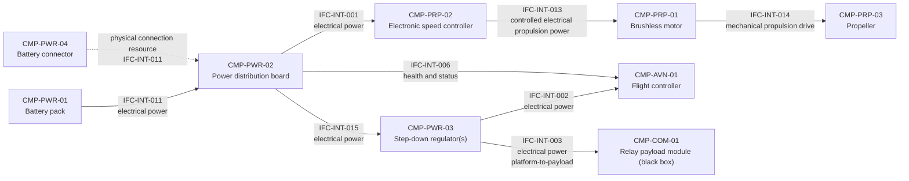

### 4C. Avionics and platform control connectivity

Configuration scope: `CFG-REP / CFG-DOM`.

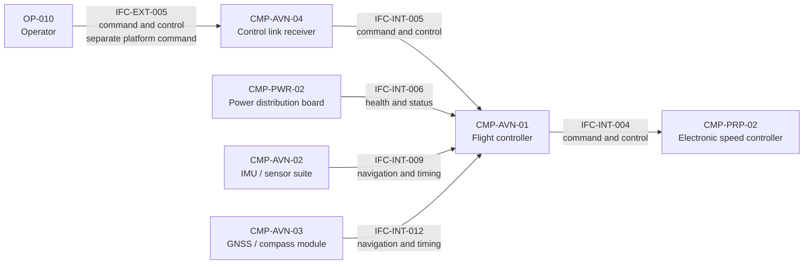

### 4D. Payload boundary and external traffic

Configuration scope: `CFG-REP / CFG-DOM`.

`IFC-INT-010` stays inside the payload black-box envelope. Only `IFC-INT-003` and `IFC-INT-007` cross from platform to payload.


### 4E. Maintenance and configuration support

Configuration scope: `CFG-REP / CFG-DOM / CFG-DIG / CFG-SOS`.

This support/governance interface is intentionally omitted from airborne mission-traffic diagrams.

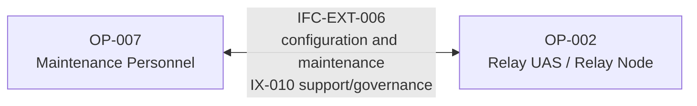

### 4F. Future digital interface delta

Configuration scope: `CFG-DIG / CFG-SOS only`.

`IFC-INT-008` is not part of the current `CFG-REP`/`CFG-DOM` two-interface payload boundary.

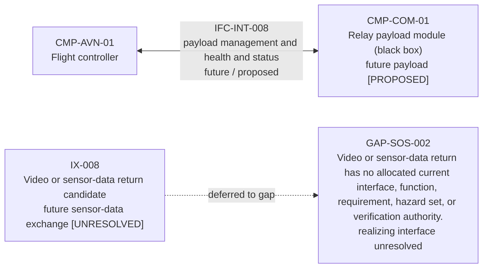

## Evidence correspondence views

### 4G. Recovered evidence to candidate role correspondence

Configuration scope: `CFG-REC informs CFG-REP / CFG-DOM - no exact inheritance`.

This is a grouped view of the controlled record-level mapping. Five recovered records remain unmatched and one remains unknown; no contradiction was found.

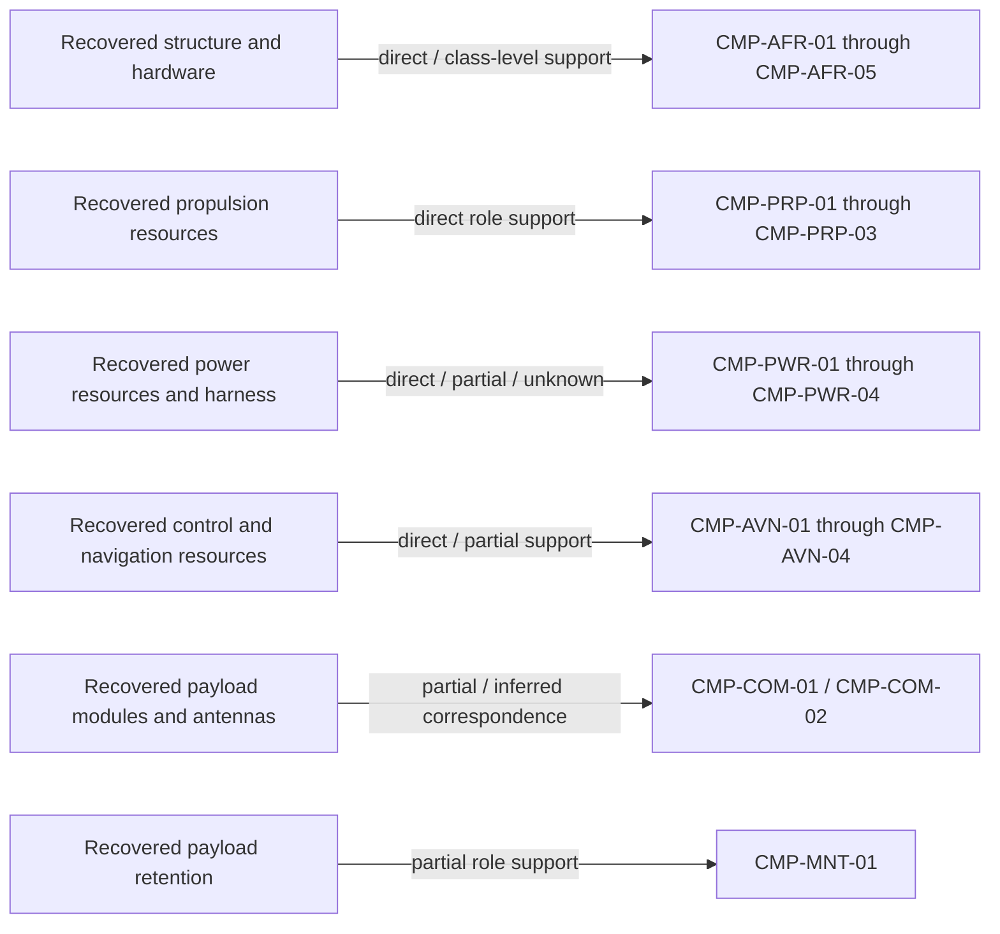

### 4H. Candidate architecture evidence coverage

Configuration scope: `CFG-REP / CFG-DOM current - CFG-DIG future interface classified separately`.

Coverage classification is evidence posture, not approval, identity, or requirement verification.

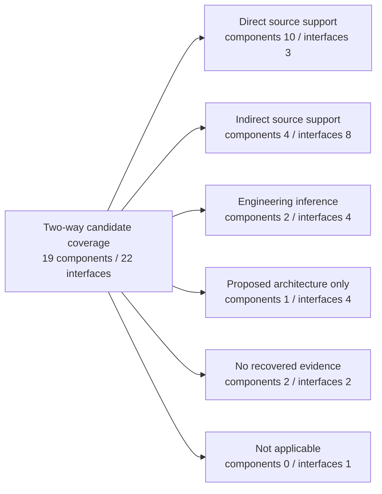

## Behavioral views

### 5. Operating-mode state

Configuration scope: `CFG-REP / CFG-DOM`.

Only transitions supported by current scenarios or requirements are shown; all remain candidate unless stated otherwise.

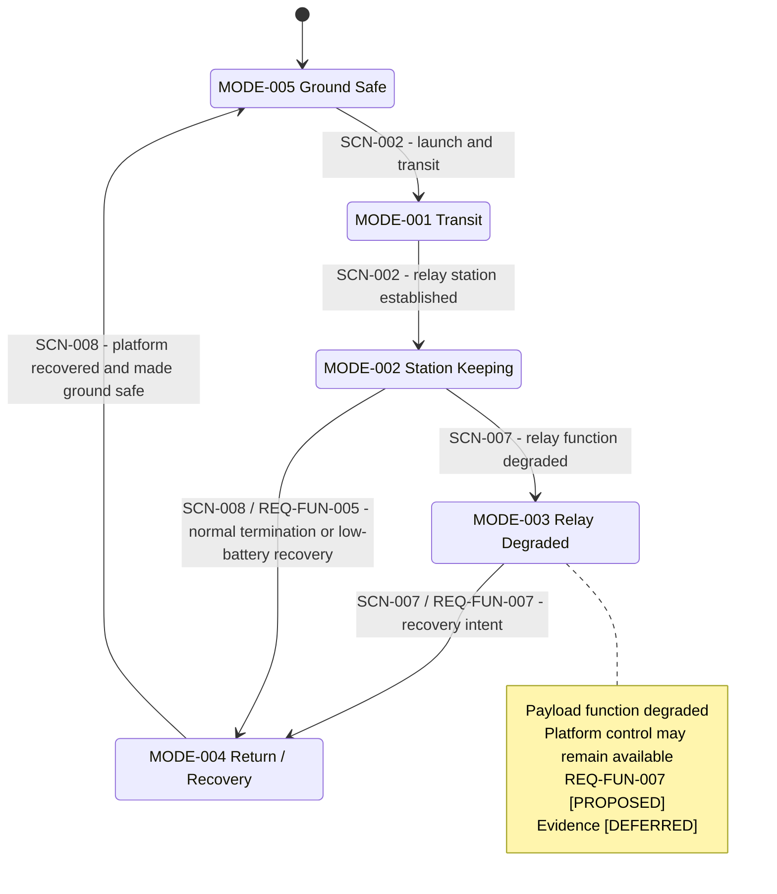

### 6. Launch and positioning sequence

Configuration scope: `CFG-REP / CFG-DOM`.

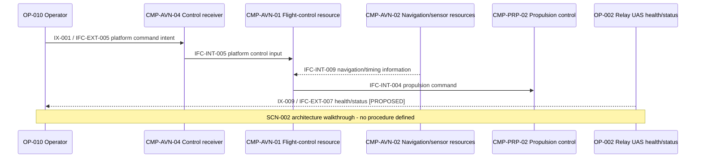

### 7. Bidirectional relay sequence

Configuration scope: `CFG-REP / CFG-DOM`.

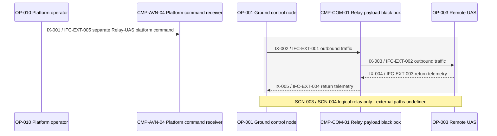

### 8. Degradation and recovery sequence

Configuration scope: `CFG-REP / CFG-DOM`.

The second path terminates at explicit gaps; it does not invent a recovery behavior.

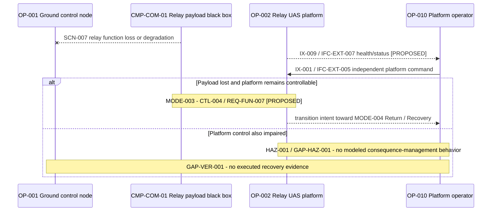

### 9. Scenario lifecycle

Configuration scope: `CFG-REP / CFG-DOM current - CFG-DIG / CFG-SOS proposed branches`.

Dashed branches are future proposals without complete activity, interface, requirement, hazard, or verification allocation.

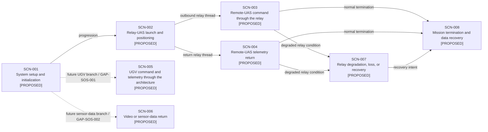

### 9A. Health/status logical thread

Configuration scope: `CFG-REP / CFG-DOM`.

The logical status purpose is proposed. Message content, transport, external authority, and physical evidence remain unresolved.

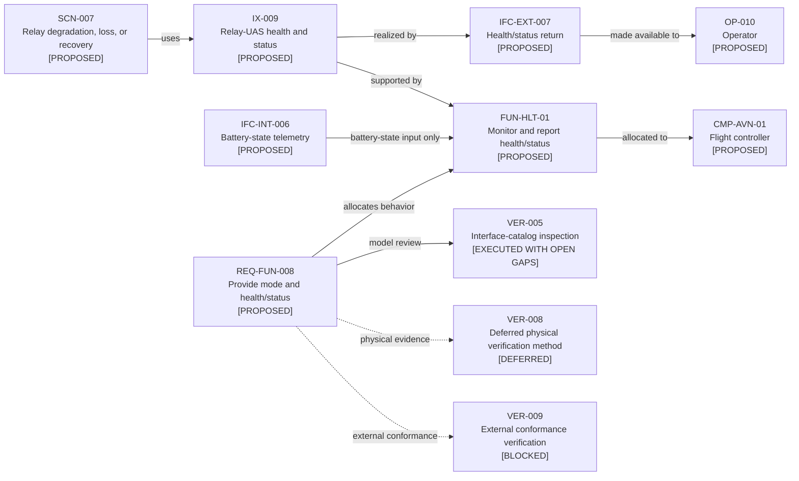

### 9B. Mass-cost-power-endurance dependency

Configuration scope: `CFG-REP / CFG-DOM`.

This is one coupled design problem. The diagram adds no values and does not resolve any trade study.

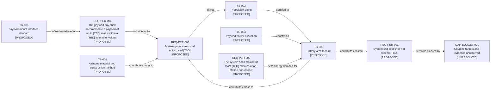

## Assurance and traceability views

### 10. Hazard-control-requirement-verification

Configuration scope: `CFG-REP / CFG-DOM`.

Executed model reviews establish trace consistency only. Deferred physical methods remain unexecuted, and no review provides approval or safety credit.

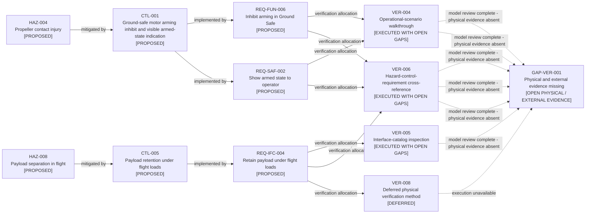

### 10A. Verification execution and remaining readiness

Configuration scope: `CFG-REP / CFG-DOM with project-scope deferrals`.

VER-001 through VER-007 have current 0.8.0 model-level evidence in EVD-013 but no new owner acceptance. EVD-008 through EVD-012 preserve the accepted 0.7.0 work package. VER-008 remains deferred and VER-009 remains blocked; neither review constitutes physical verification, external conformance, safety approval, or technical-baseline approval.

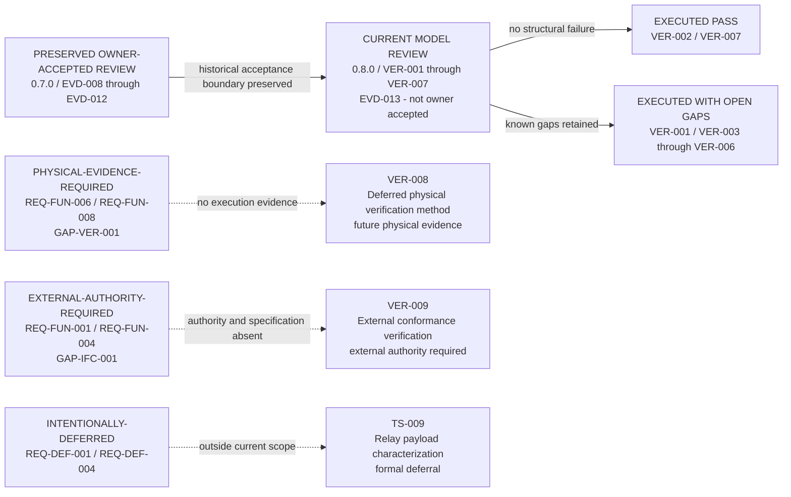

### 11. End-to-end architecture trace

Configuration scope: `CFG-REP / CFG-DOM`.

The thread is readable end to end, but candidate relationships and evidence gaps remain visible.

```mermaid
flowchart LR
    %% Configuration scope: CFG-REP / CFG-DOM
    NEED_001["NEED-001<br/>Extend mission reach<br/>[PROPOSED]"]
    CAP_001["CAP-001<br/>Beyond-Line-of-Sight Control<br/>[PROPOSED]"]
    SCN_003["SCN-003<br/>Remote-UAS command through the relay<br/>[PROPOSED]"]
    OA_004["OA-004<br/>Relay outbound traffic<br/>[PROPOSED]"]
    IX_002["IX-002<br/>Remote-UAS command toward relay<br/>[PROPOSED]"]
    FUN_REL_01["FUN-REL-01<br/>Relay outbound traffic<br/>[PROPOSED]"]
    CMP_COM_01["CMP-COM-01<br/>Relay payload module (black box)<br/>[PROPOSED]"]
    IFC_EXT_001["IFC-EXT-001<br/>Ground-control outbound traffic to relay payload<br/>[PROPOSED]"]
    REQ_FUN_001["REQ-FUN-001<br/>Relay outbound traffic<br/>[PROPOSED]"]
    VER_001["VER-001<br/>Requirement and architecture analysis<br/>[EXECUTED WITH OPEN GAPS]"]
    VER_009["VER-009<br/>External conformance verification<br/>[BLOCKED]"]
    GAP_IFC_001["GAP-IFC-001<br/>External conformance authority missing<br/>[UNRESOLVED]"]
    NEED_001 -->|"motivates"| CAP_001
    CAP_001 -->|"exercised by"| SCN_003
    SCN_003 -->|"uses"| OA_004
    OA_004 -->|"information exchange"| IX_002
    IX_002 -->|"supports"| FUN_REL_01
    FUN_REL_01 -->|"allocated to"| CMP_COM_01
    CMP_COM_01 -->|"external interface"| IFC_EXT_001
    IFC_EXT_001 -->|"allocated requirement"| REQ_FUN_001
    REQ_FUN_001 -->|"model analysis"| VER_001
    REQ_FUN_001 -.->|"external conformance"| VER_009
    VER_009 -.->|"authority and evidence unresolved"| GAP_IFC_001
```

### 12. Evidence and approval governance

Configuration scope: `Project governance - CFG-REC evidence semantics - all configurations remain not approved`.

Evidence supports claims; it does not approve architecture. Proposed decisions require explicit owner action.

```mermaid
flowchart LR
    %% Configuration scope: Project governance - CFG-REC evidence semantics - all configurations remain not approved
    SRC_INT_001["SRC-INT-001<br/>Recovered-article research report<br/>registered source"]
    EVD_002["EVD-002<br/>EVD-002<br/>registered evidence record"]
    CLM_REC_001["CLM-REC-001<br/>Recovered-article flight-controller identification record<br/>source-supported claim"]
    CFG_REC["CFG-REC<br/>Reference evidence<br/>descriptive evidence configuration"]
    CLM_REC_005["CLM-REC-005<br/>Recovered-to-generic model reconciliation<br/>controlled role mapping demonstrated"]
    GAP_REC_001["GAP-REC-001<br/>Role mapping complete - exact equivalence unresolved<br/>narrowed - exact equivalence unresolved"]
    DEC_002["DEC-002<br/>Select UAF terminology and version posture<br/>proposed owner decision"]
    GAP_STD_001["GAP-STD-001<br/>UAF version decision unresolved<br/>unresolved standards decision"]
    BASELINE["Baseline Candidate - Not Approved<br/>model-valid may still be gapped"]
    SRC_INT_001 -->|"registered as"| EVD_002
    EVD_002 -->|"supports - does not approve"| CLM_REC_001
    CLM_REC_001 -->|"applicable to evidence configuration"| CFG_REC
    CLM_REC_005 -->|"records two-way role correspondence"| CFG_REC
    CFG_REC -.->|"complete reconstruction unresolved"| GAP_REC_001
    DEC_002 -.->|"owner review required"| GAP_STD_001
    GAP_REC_001 -->|"gap remains visible"| BASELINE
    GAP_STD_001 -->|"gap remains visible"| BASELINE
```

## Generated interface inventory

This inventory is generated directly from `model/architecture.yaml`. Model-review
allocation is distinct from real-world external conformance and execution evidence.

| ID | Endpoints | Direction | Flow class | Configurations | Recovered evidence | Maturity | Model review | External conformance | Unknown attributes |
|---|---|---|---|---|---|---|---|---|---|
| IFC-INT-001 | CMP-PWR-02 to CMP-PRP-02 | a_to_b | electrical power | CFG-REP, CFG-DOM | DIRECT_SOURCE_SUPPORT | proposed_design / proposed | VER-005, VER-008 | not an external conformance interface | voltage; current; connector; protection; wiring allocation |
| IFC-INT-002 | CMP-PWR-03 to CMP-AVN-01 | a_to_b | electrical power | CFG-REP, CFG-DOM | INDIRECT_SOURCE_SUPPORT | proposed_design / proposed | VER-005, VER-008 | not an external conformance interface | voltage; current; connector; power-quality envelope |
| IFC-INT-003 | CMP-PWR-03 to CMP-COM-01 | a_to_b | electrical power | CFG-REP, CFG-DOM | INDIRECT_SOURCE_SUPPORT | proposed_design / proposed | VER-005, VER-008 | not an external conformance interface | voltage envelope; current envelope; connector; protection; thermal allocation |
| IFC-INT-004 | CMP-AVN-01 to CMP-PRP-02 | a_to_b | command and control | CFG-REP, CFG-DOM | ENGINEERING_INFERENCE | proposed_design / proposed | VER-005, VER-008 | not an external conformance interface | signal format; timing; connector; fault response |
| IFC-INT-005 | CMP-AVN-04 to CMP-AVN-01 | a_to_b | command and control | CFG-REP, CFG-DOM | INDIRECT_SOURCE_SUPPORT | proposed_design / proposed | VER-005, VER-008 | not an external conformance interface | protocol; connector; timing; failsafe behavior |
| IFC-INT-006 | CMP-PWR-02 to CMP-AVN-01 | a_to_b | health and status | CFG-REP, CFG-DOM | ENGINEERING_INFERENCE | proposed_design / proposed | VER-005, VER-008 | not an external conformance interface | measurement set; accuracy; update rate; connector; fault indication |
| IFC-INT-007 | CMP-MNT-01 to CMP-COM-01 | bidirectional_physical | mechanical mounting | CFG-REP, CFG-DOM | DIRECT_SOURCE_SUPPORT | proposed_design / proposed | VER-005, VER-008 | not an external conformance interface | geometry; load envelope; retention margin; inspection criteria |
| IFC-EXT-001 | OP-001 to CMP-COM-01 | a_to_b | command and control | CFG-REP, CFG-DOM | PROPOSED_ARCHITECTURE_ONLY | proposed_design / proposed | VER-005, VER-007 | external_authority_and_execution_evidence_required | frequency; waveform; protocol; power; data rate; message format; endpoint compatibility; verification authority |
| IFC-EXT-002 | CMP-COM-01 to OP-003 | a_to_b | command and control | CFG-REP, CFG-DOM | PROPOSED_ARCHITECTURE_ONLY | proposed_design / proposed | VER-005, VER-007 | external_authority_and_execution_evidence_required | frequency; waveform; protocol; power; data rate; message format; endpoint compatibility; verification authority |
| IFC-EXT-003 | OP-003 to CMP-COM-01 | a_to_b | telemetry | CFG-REP, CFG-DOM | ENGINEERING_INFERENCE | proposed_design / proposed | VER-005, VER-007 | external_authority_and_execution_evidence_required | frequency; waveform; protocol; power; data rate; message format; endpoint compatibility; verification authority |
| IFC-EXT-004 | CMP-COM-01 to OP-001 | a_to_b | telemetry | CFG-REP, CFG-DOM | ENGINEERING_INFERENCE | proposed_design / proposed | VER-005, VER-007 | external_authority_and_execution_evidence_required | frequency; waveform; protocol; power; data rate; message format; endpoint compatibility; verification authority |
| IFC-EXT-005 | OP-010 to CMP-AVN-04 | a_to_b | command and control | CFG-REP, CFG-DOM | INDIRECT_SOURCE_SUPPORT | proposed_design / proposed | VER-005, VER-007 | external_authority_and_execution_evidence_required | frequency; waveform; protocol; power; message format; failsafe behavior; verification authority |
| IFC-INT-008 | CMP-AVN-01 to CMP-COM-01 | bidirectional | payload management and health and status | CFG-DIG, CFG-SOS | NOT_APPLICABLE | proposed_design / proposed | VER-004, VER-005, VER-007 | not an external conformance interface | adoption decision; data model; protocol; connector; timing; authority; failure response |
| IFC-INT-009 | CMP-AVN-02 to CMP-AVN-01 | a_to_b | navigation and timing | CFG-REP, CFG-DOM | NO_RECOVERED_EVIDENCE | engineering_inference / proposed | VER-005, VER-008 | not an external conformance interface | sensor set; data format; timing; accuracy; fault detection; connector |
| IFC-INT-010 | CMP-COM-01 to CMP-COM-02 | bidirectional_physical | physical-resource coupling | CFG-REP, CFG-DOM | DIRECT_SOURCE_SUPPORT | proposed_design / proposed | VER-005 | not an external conformance interface | antenna count; role; placement; connector; all RF characteristics |
| IFC-EXT-006 | OP-007 to OP-002 | bidirectional | configuration and maintenance | CFG-REP, CFG-DOM, CFG-DIG, CFG-SOS | PROPOSED_ARCHITECTURE_ONLY | proposed_design / proposed | VER-005, VER-007 | external_authority_and_execution_evidence_required | data set; format; transport; authorization; retention period; tool ownership |
| IFC-EXT-007 | CMP-AVN-01 to OP-010 | a_to_b | health and status | CFG-REP, CFG-DOM | PROPOSED_ARCHITECTURE_ONLY | proposed_design / proposed | VER-004, VER-005, VER-007 | external_authority_and_execution_evidence_required | minimum status set; format; transport; update behavior; endpoint compatibility; conformance authority |
| IFC-INT-011 | CMP-PWR-01 to CMP-PWR-02 | a_to_b | electrical power | CFG-REP, CFG-DOM | INDIRECT_SOURCE_SUPPORT | proposed_design / proposed | VER-005, VER-008 | not an external conformance interface | voltage; current; polarity; protection; connector implementation; physical routing |
| IFC-INT-012 | CMP-AVN-03 to CMP-AVN-01 | a_to_b | navigation and timing | CFG-REP, CFG-DOM | NO_RECOVERED_EVIDENCE | engineering_inference / proposed | VER-005, VER-008 | not an external conformance interface | data format; timing; accuracy; fault detection; connector |
| IFC-INT-013 | CMP-PRP-02 to CMP-PRP-01 | a_to_b | controlled electrical propulsion power | CFG-REP, CFG-DOM | INDIRECT_SOURCE_SUPPORT | proposed_design / proposed | VER-005, VER-008 | not an external conformance interface | electrical characteristics; connector; wiring; fault response |
| IFC-INT-014 | CMP-PRP-01 to CMP-PRP-03 | a_to_b | mechanical propulsion drive | CFG-REP, CFG-DOM | INDIRECT_SOURCE_SUPPORT | proposed_design / proposed | VER-005, VER-008 | not an external conformance interface | attachment method; rotation direction; torque envelope; retention criteria |
| IFC-INT-015 | CMP-PWR-02 to CMP-PWR-03 | a_to_b | electrical power | CFG-REP, CFG-DOM | INDIRECT_SOURCE_SUPPORT | proposed_design / proposed | VER-005, VER-008 | not an external conformance interface | voltage; current; connector; protection; branch allocation |

## Validation notes

- Optional syntax validation expects Mermaid CLI `mmdc` 11.4.1 when installed locally.
- Absence of Node.js or the pinned CLI does not invalidate standard-library catalog validation.
- No generated SVG or PNG is required; GitHub-rendered Markdown is the primary artifact.
