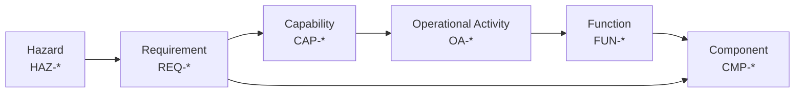

# Traceability

Cross-reference matrices linking every ID in the model. This file is the join table —
it holds no new information, only relationships between elements defined elsewhere.

**Source of truth:** components/functions/interfaces live in `architecture.md`,
requirements in `requirements.md`, capabilities and activities in `uaf-views.md`,
hazards in `hazard-analysis.md`. If a matrix here disagrees with a source file, the
source file wins and this file is stale.

## Thread Overview

The end-to-end thread this model is built to demonstrate:

## Matrix 1 — Capability to Operational Activity

| CAP ID | Capability | Operational Activities |
|---|---|---|
| CAP-001 | Beyond-Line-of-Sight Control | OA-004, OA-005 |
| CAP-002 | Terrain-Masked Operation | OA-002, OA-003 |
| CAP-003 | Contested-Spectrum Resilience | TODO — see note below |
| CAP-004 | Low-Cost Attritable Fielding | TODO |

> **CAP-003 note.** This capability has no allocated activity or function in the
> current model, because the mechanisms that would provide it live entirely inside
> the deferred payload (TS-009). Left deliberately unallocated rather than
> papered over — an unallocated capability is a real finding, not a formatting gap.

## Matrix 2 — Operational Activity to Function to Component

| OA ID | Activity | FUN ID | CMP ID(s) |
|---|---|---|---|
| OA-001 | Maintain flight | FUN-FLT-01 | CMP-AVN-01, CMP-PRP-01..03 |
| OA-002 | Transit to station | FUN-FLT-02, FUN-CMD-01 | CMP-AVN-01, CMP-AVN-03, CMP-AVN-04 |
| OA-003 | Hold station | FUN-FLT-03 | CMP-AVN-01 |
| OA-004 | Relay outbound traffic | FUN-REL-01 | CMP-COM-01 |
| OA-005 | Relay return traffic | FUN-REL-02 | CMP-COM-01 |
| OA-006 | Return / recover | FUN-FLT-04, FUN-PWR-02 | CMP-AVN-01, CMP-PWR-02 |

## Matrix 3 — Requirement to Capability to Component

| REQ ID | Traces Up (CAP) | Traces Down (CMP / FUN) | Verify | Status |
|---|---|---|---|---|
| REQ-FUN-001 | CAP-001 | FUN-REL-01 / CMP-COM-01 | A | TODO |
| REQ-FUN-002 | CAP-001 | FUN-REL-02 / CMP-COM-01 | A | TODO |
| REQ-FUN-003 | CAP-002 | FUN-FLT-03 / CMP-AVN-01 | A | TODO |
| REQ-FUN-004 | — | FUN-CMD-01 / CMP-AVN-04 | A | TODO |
| REQ-FUN-005 | CAP-004 | FUN-FLT-04 / CMP-AVN-01 | D `Deferred` | TODO |
| REQ-PER-001 | CAP-004 | All | A | TODO |
| REQ-PER-002 | CAP-001 | CMP-PWR-01 | A `Deferred` | TODO |
| REQ-PER-003 | CAP-004 | All | I | TODO |
| REQ-PER-004 | — | CMP-MNT-01 | I | TODO |
| REQ-IFC-001 | CAP-004 | CMP-MNT-01 / IFC-INT-007 | I | TODO |
| REQ-IFC-002 | — | CMP-PWR-03 / IFC-INT-003 | T `Deferred` | TODO |
| REQ-CON-001 | CAP-004 | All | I | TODO |
| REQ-CON-002 | CAP-004 | CMP-AVN-01 | I | TODO |
| REQ-CON-003 | — | All | I | TODO |
| REQ-CON-004 | CAP-002 | CMP-AVN-03, FUN-FLT-03 | A | TODO |
| REQ-FUN-006 | — | FUN-PWR-01 / CMP-AVN-01 | D | TODO |
| REQ-FUN-007 | CAP-004 | FUN-FLT-01, FUN-FLT-04 | D `Deferred` | TODO |
| REQ-PER-005 | CAP-004 | All | D `Deferred` | TODO |
| REQ-IFC-003 | — | CMP-COM-01 | I | TODO |
| REQ-IFC-004 | — | CMP-MNT-01 / IFC-INT-007 | T `Deferred` | TODO |
| REQ-SAF-001 | — | CMP-PWR-01, CMP-PWR-02 | I `Deferred` | TODO |
| REQ-SAF-002 | — | CMP-AVN-01 | D | TODO |

## Matrix 4 — Hazard to Mitigating Requirement

| HAZ ID | Hazard | Mitigating REQ | Residual |
|---|---|---|---|
| HAZ-001 | Uncommanded descent / crash | TODO | TODO |
| HAZ-002 | Flyaway | REQ-FUN-005 | TODO |
| HAZ-003 | Battery thermal event | REQ-SAF-001 | TODO |
| HAZ-004 | Propeller contact injury | REQ-SAF-002 | TODO |
| HAZ-005 | Loss of relay function airborne | TODO | TODO |
| HAZ-006 | Station drift | REQ-FUN-003 | TODO |
| HAZ-007 | Battery depletion before recovery | REQ-FUN-005 | TODO |
| HAZ-008 | Payload separation in flight | REQ-IFC-001 | TODO |

## Matrix 5 — Interface to Requirement

| IFC ID | Type | Requirement | Defined? |
|---|---|---|---|
| IFC-INT-001..007 | Internal | REQ-IFC-001, REQ-IFC-002 | Partial |
| IFC-EXT-001..004 | External RF | REQ-DEF-001 | **No — TS-009** |
| IFC-EXT-005 | External RF | TODO | **No — TS-008** |

## Coverage Gaps

Known holes, stated plainly. A model that hides these is less useful than one that
lists them.

| Gap | Where | Disposition |
|---|---|---|
| CAP-003 has no allocated function | Matrix 1 | Inherent — mechanism lives in deferred payload |
| All external RF interfaces undefined | Matrix 5 | Intentional — TS-009 out of scope |
| HAZ-003 mitigation (REQ-SAF-001) not yet verified | Matrix 4 | Expected at this maturity — verification method is `I` `Deferred` |
| Most verification statuses empty | Matrix 3 | Expected at this maturity |
| Budgets not rolled up | `architecture.md` | Needs component data from TS-001..003 |

## Consistency Checks

Candidate CI checks over these tables:

- [ ] Every `REQ-` in `requirements.md` appears in Matrix 3
- [ ] Every `CMP-`/`FUN-`/`IFC-` referenced here exists in `architecture.md`
- [ ] Every `CAP-` has at least one allocated `OA-` *or* an explicit note explaining why not
- [ ] Every `HAZ-` has a mitigating `REQ-` or is explicitly marked unmitigated
- [ ] No duplicate IDs within a prefix
- [ ] No ID referenced that is not defined somewhere
