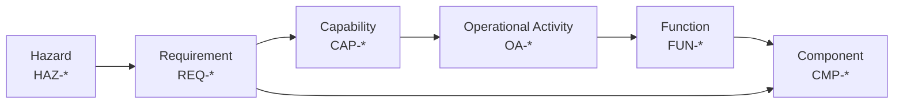

# Traceability

Cross-reference matrices linking every ID in the model. This file is the join table —
it holds no new information, only relationships between elements defined elsewhere.

**Source of truth:** `system.yaml` is the model manifest. The YAML catalogs referenced
by that manifest are the authoritative structured data. This file remains a legacy
human-readable cross-reference and preserves known gaps; the generated
[`reports/baseline-traceability.md`](reports/baseline-traceability.md) is the current
derived matrix, and [`reports/architecture-views.md`](reports/architecture-views.md)
contains generated diagrams. If this file and a structured catalog disagree, the
structured catalog governs and the difference must be recorded as a reconciliation
issue.

> **Baseline Candidate - Not Approved.** The matrices below are retained for context
> and retain unresolved or incomplete relationships documented in
> [`model/traceability.yaml`](model/traceability.yaml).

## Thread Overview

The end-to-end thread this model is built to demonstrate:

## Matrix 1 — Capability to Operational Activity

| CAP ID | Capability | Operational Activities |
|---|---|---|
| CAP-001 | Beyond-Line-of-Sight Control | OA-004, OA-005 |
| CAP-002 | Terrain-Masked Operation | OA-002, OA-003 |
| CAP-003 | Contested-Spectrum Resilience | Unresolved - GAP-TRC-001; see note below |
| CAP-004 | Low-Cost Attritable Fielding | No dedicated OA; expected at current maturity - GAP-TRC-002 |

> **CAP-003 note.** This capability has no allocated activity or function in the
> current model, because the mechanisms that would provide it live entirely inside
> the deferred payload (TS-009). Left deliberately unallocated rather than
> papered over — an unallocated capability is a real finding, not a formatting gap.
>
> **CAP-004 note.** Affordability and attritability are currently cross-cutting
> lifecycle constraints rather than a mission activity. No dedicated `OA-` is
> allocated until the model owner decides whether fielding needs its own activity.

## Matrix 2 — Operational Activity to Function to Component

| OA ID | Activity | FUN ID | CMP ID(s) |
|---|---|---|---|
| OA-001 | Maintain flight | FUN-FLT-01 | CMP-AVN-01, CMP-PRP-01..03 |
| OA-002 | Transit to station | FUN-FLT-02, FUN-CMD-01 | CMP-AVN-01, CMP-AVN-03, CMP-AVN-04 |
| OA-003 | Hold station | FUN-FLT-03 | CMP-AVN-01 |
| OA-004 | Relay outbound traffic | FUN-REL-01 | CMP-COM-01 |
| OA-005 | Relay return traffic | FUN-REL-02 | CMP-COM-01 |
| OA-006 | Return / recover | FUN-FLT-04, FUN-PWR-02 | CMP-AVN-01, CMP-PWR-02 |

## Matrix 3 — Requirement to Capability to Component

| REQ ID | Traces Up (CAP) | Traces Down (CMP / FUN) | Verify | Status |
|---|---|---|---|---|
| REQ-FUN-001 | CAP-001 | FUN-REL-01 / CMP-COM-01 | A | Candidate; analysis not executed |
| REQ-FUN-002 | CAP-001 | FUN-REL-02 / CMP-COM-01 | A | Candidate; analysis not executed |
| REQ-FUN-003 | CAP-002 | FUN-FLT-03 / CMP-AVN-01 | A | Candidate; evidence deferred |
| REQ-FUN-004 | — | FUN-CMD-01 / CMP-AVN-04 | A | Candidate; analysis not executed |
| REQ-FUN-005 | CAP-004 | FUN-FLT-04 / CMP-AVN-01 | D `Deferred` | Deferred physical evidence |
| REQ-PER-001 | CAP-004 | All | A | Candidate; unresolved value |
| REQ-PER-002 | CAP-001 | CMP-PWR-01 | A `Deferred` | Candidate; unresolved value |
| REQ-PER-003 | CAP-004 | All | I | Candidate; unresolved value |
| REQ-PER-004 | — | CMP-MNT-01 | I | Candidate; unresolved value |
| REQ-IFC-001 | CAP-004 | CMP-MNT-01 / IFC-INT-007 | I | Candidate; inspection not executed |
| REQ-IFC-002 | — | CMP-PWR-03 / IFC-INT-003 | T `Deferred` | Deferred physical evidence |
| REQ-CON-001 | CAP-004 | All | I | Candidate; inspection not executed |
| REQ-CON-002 | CAP-004 | CMP-AVN-01 | I | Candidate; inspection not executed |
| REQ-CON-003 | — | Proposed designs; project scope | I | Scope control; not applicable to CFG-REC |
| REQ-CON-004 | CAP-002 | CMP-AVN-03, FUN-FLT-03 | A | Candidate; analysis not executed |
| REQ-FUN-006 | — | FUN-PWR-01 / CMP-AVN-01 | D | Candidate analysis only; no physical evidence |
| REQ-FUN-007 | CAP-004 | FUN-FLT-01, FUN-FLT-04 | D `Deferred` | Deferred physical evidence |
| REQ-PER-005 | CAP-004 | All | D `Deferred` | Deferred physical evidence |
| REQ-IFC-003 | — | CMP-COM-01 / IFC-INT-003 / IFC-INT-007 | I | Candidate; wording reconciled |
| REQ-IFC-004 | — | CMP-MNT-01 / IFC-INT-007 | T `Deferred` | Deferred physical evidence |
| REQ-SAF-001 | — | CMP-PWR-01, CMP-PWR-02 | I `Deferred` | Deferred physical evidence |
| REQ-SAF-002 | — | CMP-AVN-01 | D | Candidate analysis only; no physical evidence |
| REQ-DEF-001 | CAP-001 | CMP-COM-01 / IFC-EXT-001..004 | Deferred | Deferred — TS-009 |
| REQ-DEF-002 | CAP-001 | CMP-COM-01 | Deferred | Deferred — TS-009 |
| REQ-DEF-003 | — | External regulatory authority | External | Deferred |
| REQ-DEF-004 | CAP-003 | Unallocated | Deferred | Deferred — TS-009 |
| REQ-DEF-005 | — | External compliance authority | External | Deferred |

## Matrix 4 — Hazard to Mitigating Requirement

| HAZ ID | Hazard | Mitigating REQ | Residual |
|---|---|---|---|
| HAZ-001 | Uncommanded descent / crash | **Unmitigated** | GAP-HAZ-001 |
| HAZ-002 | Flyaway | CTL-003 / REQ-FUN-005 | Candidate; unverified - GAP-VER-001 |
| HAZ-003 | Battery thermal event | CTL-002 / REQ-SAF-001 | Candidate; unverified - GAP-VER-001 |
| HAZ-004 | Propeller contact injury | CTL-001 / REQ-FUN-006 / REQ-SAF-002 | VER-004 and VER-006 candidate analysis only; no physical evidence |
| HAZ-005 | Loss of relay function airborne | CTL-004 / REQ-FUN-007 `Partial` | Candidate; physical evidence deferred |
| HAZ-006 | Station drift | REQ-FUN-003 | Candidate; unverified - GAP-VER-001 |
| HAZ-007 | Battery depletion before recovery | CTL-003 / REQ-FUN-005 | Candidate; unverified - GAP-VER-001 |
| HAZ-008 | Payload separation in flight | CTL-005 / REQ-IFC-004 | VER-008 physical verification deferred; REQ-IFC-001 is supporting standardization only |

> **HAZ-001 note.** No requirement in the current architecture manages the
> consequences of an in-flight power, control, or structural failure — there is no
> redundancy, no structural margin requirement, and (see Open Questions in
> `hazard-analysis.md`) no flight termination or geofence function to fall back on.
> Left explicitly unmitigated rather than closed with a requirement the architecture
> does not support. TS-011 (recovery approach) is the closest open trade study and
> may eventually produce a mitigating requirement, but has not yet.
>
> **HAZ-005 note.** REQ-FUN-007 mitigates the platform-safety half of this hazard —
> MODE-003 keeps the aircraft controllable and recoverable after losing payload
> function — but does not restore the relay function itself. The mission-loss
> consequence ("remote UAS may be stranded") remains unmitigated; the payload is a
> black box (TS-009) and no in-scope requirement reaches inside it.

## Matrix 5 — Interface to Requirement

| Interface scope | IDs | Configuration / disposition | Human-readable authority |
|---|---|---|---|
| Current platform internal | IFC-INT-001, IFC-INT-002, IFC-INT-003, IFC-INT-004, IFC-INT-005, IFC-INT-006, IFC-INT-007, IFC-INT-009 | CFG-REP / CFG-DOM; candidate | `architecture.md` current-candidate table |
| Payload black-box internal | IFC-INT-010 | CFG-REP / CFG-DOM; not a platform crossing; no verification allocation | `architecture.md` payload-internal table |
| Future digital | IFC-INT-008 | CFG-DIG / CFG-SOS only; proposed | `architecture.md` future-digital table |
| Current external traffic and command | IFC-EXT-001, IFC-EXT-002, IFC-EXT-003, IFC-EXT-004, IFC-EXT-005 | CFG-REP / CFG-DOM; implementation intentionally undefined; GAP-IFC-001 / GAP-IFC-002 | `architecture.md` external table |
| Support / governance | IFC-EXT-006 | CFG-REP / CFG-DOM / CFG-DIG / CFG-SOS; proposed | `architecture.md` support table |

## Coverage Gaps

Known holes, stated plainly. A model that hides these is less useful than one that
lists them.

| Gap | Where | Disposition |
|---|---|---|
| CAP-003 has no allocated function | Matrix 1 | Inherent — mechanism lives in deferred payload |
| All external RF interfaces undefined | Matrix 5 | Intentional — TS-009 out of scope |
| HAZ-003 mitigation (REQ-SAF-001) not yet verified | Matrix 4 | Expected at this maturity — verification method is `I` `Deferred` |
| HAZ-001 unmitigated | Matrix 4 | **Real gap** — no redundancy, structural margin, or flight-termination requirement exists; TS-011 is the closest open trade study |
| HAZ-005 mitigation (REQ-FUN-007) covers platform safety only, not the relay/mission function | Matrix 4 | **Real gap** — payload is a black box (TS-009); no in-scope requirement restores relay function |
| HAZ-009 has no hazard defined | Hazard Log | Reserved ID, not yet populated — no basis in the model to define one without inventing a hazard |
| Most verification statuses empty | Matrix 3 | Expected at this maturity |
| Budgets not rolled up — mass/cost/endurance are a coupled loop (TS-002/TS-003), not three independent gaps, and the loop may not close favorably at every candidate endurance target | `architecture.md` | **Real, substantive gap** — not just blocked on missing component data; see TS-002/TS-003 finding |

## Consistency Checks

Candidate CI checks over these tables:

- [ ] Every `REQ-` in `requirements.md` appears in Matrix 3
- [ ] Every `CMP-`/`FUN-`/`IFC-` referenced here exists in `architecture.md`
- [ ] Every `CAP-` has at least one allocated `OA-` *or* an explicit note explaining why not
- [ ] Every `HAZ-` has a mitigating `REQ-` or an explicit unmitigated/not-applicable disposition
- [ ] No duplicate IDs within a prefix
- [ ] No ID referenced that is not defined somewhere
