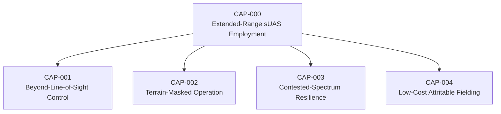
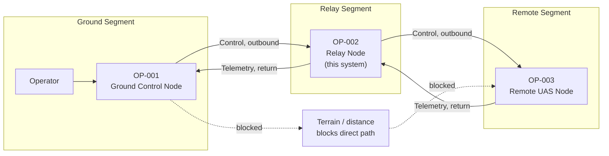
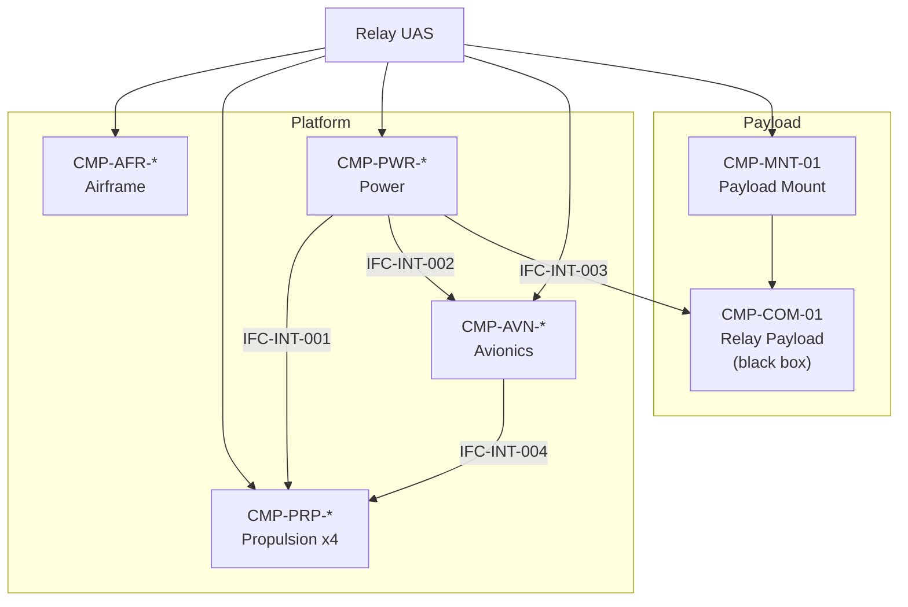

# UAF Architecture Views

Strategic, Operational, and Resources viewpoints. UAF viewpoint names are given with
their approximate DoDAF 2.02 equivalents for readers more familiar with that
framework.

## Viewpoint Selection

| UAF Viewpoint | View | DoDAF Equivalent | Purpose |
|---|---|---|---|
| Strategic | Taxonomy | CV-2 | Capability decomposition |
| Strategic | Capability/Resource mapping | CV-6 | Gap identification |
| Operational | Concept | OV-1 | Three-node relay concept |
| Operational | Activity model | OV-5b | Activity decomposition and allocation |
| Resources | Structure | SV-1 | Component interfaces |
| Resources | Functionality | SV-4 | Function-to-component allocation |

---

## Strategic Viewpoint

### St-Tx: Capability Taxonomy

| CAP ID | Capability | Operational Need |
|---|---|---|
| CAP-000 | Extended-Range sUAS Employment | TODO |
| CAP-001 | Beyond-Line-of-Sight Control | TODO |
| CAP-002 | Terrain-Masked Operation | TODO |
| CAP-003 | Contested-Spectrum Resilience | TODO — keep qualitative; no EW technique detail |
| CAP-004 | Low-Cost Attritable Fielding | TODO |

### St-Cr: Capability to Approach Mapping (Gap Analysis)

Satisfaction ratings are qualitative: **Full** / **Partial** / **None**. Do not
introduce numeric performance figures — this model does not substantiate them.

| Approach | CAP-001 | CAP-002 | CAP-003 | CAP-004 |
|---|---|---|---|---|
| Dedicated relay UAS (reference approach) | TODO | TODO | TODO | TODO |
| Tethered aerostat relay (reference approach) | TODO | TODO | TODO | TODO |
| Multi-mission sUAS w/ secondary relay role (baseline) | TODO | TODO | TODO | TODO |
| **This concept** | TODO | TODO | TODO | TODO |

<!-- STUB: reference approaches should be described generically — the shape of the
     approach, not a catalog of specific fielded systems or vendor performance
     claims. Cite open sources in README references instead. -->

**Identified gap:** TODO — state the under-served intersection in one or two
sentences and note that it is a hypothesis this study explores, not a finding.

---

## Operational Viewpoint

### Op-Tx: Operational Concept (OV-1 equivalent)

| OP ID | Performer | Description | In System Boundary |
|---|---|---|---|
| OP-001 | Ground Control Node | TODO | No |
| OP-002 | Relay Node | The system under study | **Yes** |
| OP-003 | Remote UAS Node | TODO | No |

**Narrative:** TODO — describe the concept in 1–2 paragraphs. Note explicitly that
information exchanges are labeled by *class* (control, telemetry) and carry no
frequency, bandwidth, or protocol attributes.

### Op-Pr: Operational Activity Model (OV-5b equivalent)

| OA ID | Activity | Input | Output | Performer | Functions |
|---|---|---|---|---|---|
| OA-001 | Maintain flight | Attitude, operator input | Stable flight | OP-002 | FUN-FLT-01 |
| OA-002 | Transit to station | Station location | Position at station | OP-002 | FUN-FLT-02, FUN-CMD-01 |
| OA-003 | Hold station | Position | Sustained relay geometry | OP-002 | FUN-FLT-03 |
| OA-004 | Relay outbound traffic | Ground transmission | Retransmission toward remote | OP-002 | FUN-REL-01 |
| OA-005 | Relay return traffic | Remote transmission | Retransmission toward ground | OP-002 | FUN-REL-02 |
| OA-006 | Return / recover | Battery state, command | Platform recovered | OP-002 | FUN-FLT-04, FUN-PWR-02 |

---

## Resources Viewpoint

### Rs-Sr: Resource Structure (SV-1 equivalent)

See `architecture.md` for the full interface table.

### Rs-Pr: Resource Functionality (SV-4 equivalent)

Function-to-component allocation is maintained in
[`architecture.md`](architecture.md#function-allocation) as the single source of
truth. This view exists to satisfy the viewpoint; do not duplicate the table here.

---

## Notes on Framework Choice

<!-- STUB: short rationale for UAF over plain SysML or plain DoDAF, since a reader
     landing on this repo will reasonably ask. -->

TODO
