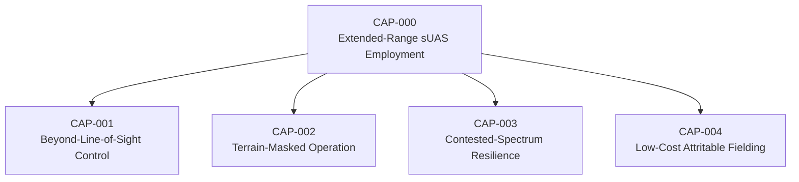
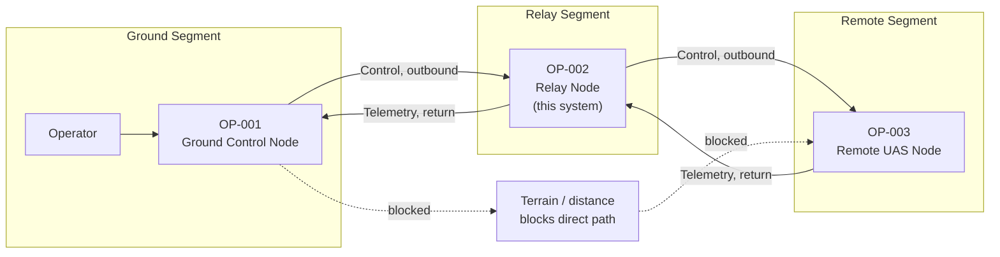
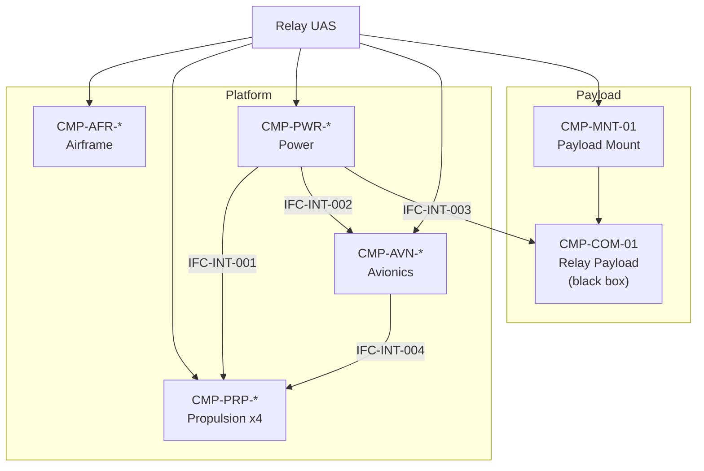

# UAF Architecture Views

Strategic, Operational, and Resources viewpoints. UAF viewpoint names are given with
their approximate DoDAF 2.02 equivalents for readers more familiar with that
framework.

## Viewpoint Selection

| UAF Viewpoint | View | DoDAF Equivalent | Purpose |
|---|---|---|---|
| Strategic | Taxonomy | CV-2 | Capability decomposition |
| Strategic | Capability/Resource mapping | CV-6 | Gap identification |
| Operational | Concept | OV-1 | Three-node relay concept |
| Operational | Activity model | OV-5b | Activity decomposition and allocation |
| Resources | Structure | SV-1 | Component interfaces |
| Resources | Functionality | SV-4 | Function-to-component allocation |

---

## Strategic Viewpoint

### St-Tx: Capability Taxonomy

| CAP ID | Capability | Operational Need |
|---|---|---|
| CAP-000 | Extended-Range sUAS Employment | Employ a small UAS at operationally useful distance from its operator. Parent capability; decomposed rather than directly allocated. |
| CAP-001 | Beyond-Line-of-Sight Control | Maintain operator control and telemetry when the remote UAS is past the range at which a direct link closes. |
| CAP-002 | Terrain-Masked Operation | Maintain control and telemetry when terrain, structures, or vegetation obstruct the direct path, independent of range. |
| CAP-003 | Contested-Spectrum Resilience | Retain link function when the electromagnetic environment is degraded or actively contested. Stated qualitatively; no mechanism is specified or implied. |
| CAP-004 | Low-Cost Attritable Fielding | Deliver the above at a unit cost and logistics footprint that make platform loss an acceptable operating outcome rather than a mission-ending one. |

CAP-001 and CAP-002 are separated deliberately. They are often collapsed into "extend
range," but they have different causes and different solutions: CAP-001 is a
distance problem that altitude and relay geometry address directly, while CAP-002 is
a geometry problem that can bind at very short range in complex terrain. A design
tuned only for CAP-001 may not deliver CAP-002.

### St-Cr: Capability to Approach Mapping (Gap Analysis)

Satisfaction ratings are qualitative: **Full** / **Partial** / **None**. No numeric
performance figures appear here, because nothing in this model substantiates any.

Reference approaches are characterised generically — by the shape of the approach, not
by cataloguing specific fielded systems or repeating vendor performance claims.

| Approach | CAP-001 | CAP-002 | CAP-003 | CAP-004 |
|---|---|---|---|---|
| Dedicated airborne relay platform | Full | Full | Partial | Partial |
| Tethered / captive aerostat relay | Partial | Partial | Partial | Partial |
| Multi-mission sUAS with secondary relay role (baseline) | Partial | Partial | Partial | None |
| **This concept** (intended) | Full | Full | None | Full |

**Reading the rows.**

- *Dedicated airborne relay platform.* Satisfies both link capabilities well, since
  altitude and repositioning address distance and geometry together. Rated Partial on
  CAP-004 because a purpose-built airframe is not automatically a cheap one — the
  approach permits low cost but does not guarantee it.
- *Tethered / captive aerostat relay.* Partial on CAP-001 and CAP-002 because the node
  cannot be repositioned once emplaced; it serves the geometry it was sited for and no
  other. Long dwell is its advantage, mobility its limitation.
- *Multi-mission sUAS with secondary relay role.* Partial on the link capabilities —
  it can perform the mission but was not sized for it, so relay duty consumes a
  platform priced for harder work. Rated None on CAP-004 for the same reason: unit cost
  is set by the primary mission, so loss during a relay sortie is never cheap.
- *This concept.* Ratings are **intended**, not demonstrated. They express design
  targets that the rest of this model exists to test. CAP-003 is rated None, not
  Partial, because every mechanism that would provide resilience lives inside the
  deferred payload (TS-009) — claiming even partial satisfaction would be asserting
  something the architecture does not contain.

**Identified gap.** The under-served intersection is CAP-001 and CAP-002 achieved
*simultaneously with* CAP-004 — relay geometry that can be repositioned, at a unit
cost low enough that losing the node is tolerable. Each existing approach concedes one
side of that intersection: dedicated platforms may or may not be cheap, aerostats
trade mobility for dwell, and multi-mission platforms are capable but expensive per
sortie.

This is a hypothesis the study explores, not a finding it reports. Two things would
falsify it. First, if the endurance-versus-cost loop in TS-003 closes unfavourably,
a platform cheap enough to be attritable may not hold station long enough to be
useful, and the intersection is empty for physical reasons rather than institutional
ones. Second, the gap may be real but not worth closing — if relay sorties are rare
enough, accepting the cost of a multi-mission platform is the rational answer and a
dedicated airframe is a solution to a problem no one has.

---

## Operational Viewpoint

### Op-Tx: Operational Concept (OV-1 equivalent)

| OP ID | Performer | Description | In System Boundary |
|---|---|---|---|
| OP-001 | Ground Control Node | Originates control traffic and consumes returned telemetry. Independently operated; this model does not specify it. | No |
| OP-002 | Relay Node | The system under study. Holds position between the other two nodes and retransmits in both directions. | **Yes** |
| OP-003 | Remote UAS Node | The system being relayed for. Independently operated; its link tolerance is an input to this design, not an output of it. | No |

**Narrative.** The direct path between OP-001 and OP-003 does not close — because of
distance (CAP-001), obstruction (CAP-002), or both. OP-002 is positioned so that two
shorter, unobstructed paths exist where one long or blocked path did not, and
retransmits traffic in both directions across that break.

Three properties of this arrangement shape the architecture. The relay is
**bidirectional**, so outbound control and return telemetry are modeled as separate
activities (OA-004, OA-005) and separate functions, even if one payload serves both.
The relay is **positional** — its value comes from where it is, which is why station
keeping (FUN-FLT-03) is a mission function and not merely a flight-control detail. And
the relay is **transparent**: OP-002 forwards traffic without interpreting it, which is
what permits the payload to remain a black box while the platform architecture
proceeds.

Information exchanges are labeled by class — control, telemetry — and carry no
frequency, bandwidth, protocol, or waveform attributes anywhere in this model.

### Op-Pr: Operational Activity Model (OV-5b equivalent)

| OA ID | Activity | Input | Output | Performer | Functions |
|---|---|---|---|---|---|
| OA-001 | Maintain flight | Attitude state, operator input | Stable, controllable flight | OP-002 | FUN-FLT-01 |
| OA-002 | Transit to station | Commanded station location | Platform at station | OP-002 | FUN-FLT-02, FUN-CMD-01 |
| OA-003 | Hold station | Position state | Sustained relay geometry | OP-002 | FUN-FLT-03 |
| OA-004 | Relay outbound traffic | Transmission from OP-001 | Retransmission toward OP-003 | OP-002 | FUN-REL-01 |
| OA-005 | Relay return traffic | Transmission from OP-003 | Retransmission toward OP-001 | OP-002 | FUN-REL-02 |
| OA-006 | Return and recover | Battery state, operator command | Platform recovered or landed | OP-002 | FUN-FLT-04, FUN-PWR-02 |

OA-004 and OA-005 are the mission; OA-001 through OA-003 and OA-006 exist to put the
mission somewhere useful and bring the airframe back. That asymmetry is worth keeping
visible — most of the platform's mass, cost, and failure modes serve activities that
are not the mission.

---

## Resources Viewpoint

### Rs-Sr: Resource Structure (SV-1 equivalent)

The payload subgraph connects to the platform through two edges only —
`IFC-INT-003` (power) and the `CMP-MNT-01` containment relationship carrying
`IFC-INT-007` (mechanical). That narrow coupling is the architectural expression of
the black-box decision, and it is what allows TS-009 to remain deferred without
blocking work on the rest of the system. See `architecture.md` for the full interface
table.

### Rs-Pr: Resource Functionality (SV-4 equivalent)

Function-to-component allocation is maintained in
[`architecture.md`](architecture.md#function-allocation) as the single source of
truth. This view exists to satisfy the viewpoint; the table is deliberately not
duplicated here.

---

## Notes on Framework Choice

UAF was chosen over plain SysML and over DoDAF 2.02, for a reader who will reasonably
ask why.

Plain SysML models structure well but has no native vocabulary for capability or
operational context. The capability gap argument — the reason this concept exists —
would have to live in prose alongside the model rather than inside it, with nothing
enforcing that the two stay consistent.

DoDAF has that vocabulary, but in tool form it tends to produce a catalogue of view
products that reference each other loosely, kept in step by hand. It is also a
framework built for programs of record, and adopting its full apparatus here would
imply an acquisition context this project does not have.

UAF is the OMG standard that superseded DoDAF and MODAF, and it is a SysML profile
rather than a separate product set. The capability elements and the structural
elements live in one model with real relationships between them, so the thread from
CAP-001 down to a component is a queryable trace rather than a claim in a document.
Its viewpoints also map closely onto DoDAF's, so the views here can be relabeled for a
DoDAF-literate audience without rework.

The practical consequence for this repository: the markdown is authored so that every
ID maps onto a UAF element type when the model is transcribed into MagicDraw — `CAP-`
to Capabilities, `OA-` to Operational Activities, `OP-` to Operational Performers,
`CMP-` to Resource elements, `IFC-` to Interfaces.
